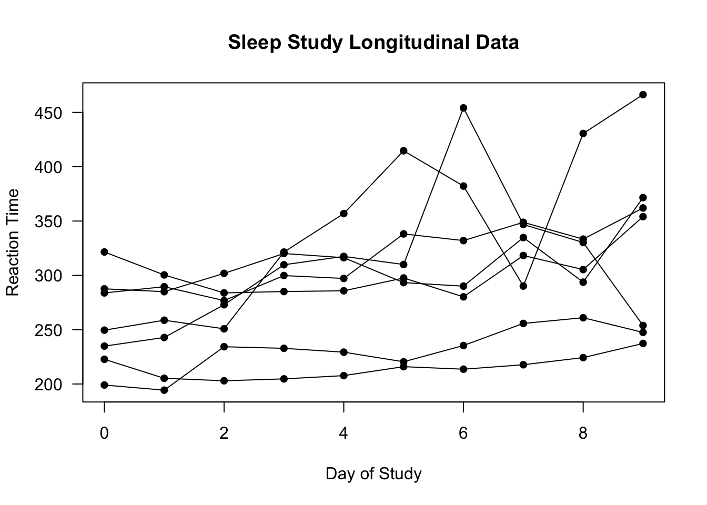

# Mixed Models for Longitudinal Data Analysis {#mixed-models}


---
  
## Methods for Analyzing Longitudinal Data {#sec:methods-overview}

* **Longitudinal data** refers to data that:
    + Has multiple individuals/subjects.  
    
    + Each individual has multiple observations that were taken across time. 

* We will denote the outcomes of interest with $Y_{ij}$.
    + $Y_{ij}$ - outcome for individual $i$ at time $t_{ij}$.
    
    + The $i^{th}$ individual has $n_{i}$ observations: $Y_{i1}, \ldots, Y_{in_{i}}$.

---



* The above figure shows an example of outcomes from a longitudinal study (the **sleepstudy** data in the **lme4** package).
   
* In the **sleepstudy** data:   

    + The time points of observation $t_{ij}$ are the same for each individual $i$. So, we can say $t_{ij} = t_{j}$ for all $i$.

    + The outcome $Y_{ij}$ is the **reaction time** for the $i^{th}$ individual at time point $t_{j}$.

    + The 10 time points are $(t_{1}, \ldots, t_{10}) = (0, 1, \ldots, 9)$.
    
    


---

* Most of the well-known methods for analyzing longitudinal
data can be classified (see @diggle2013) into one of the three following
categories: 
    + **Random effects/mixed models**, 
    + **Marginal models**, 
    + **Transition models**

* **Random effects/Mixed Models**
    + "Random effects" are added to the regression model describing
    the outcomes for each individual.
    
* **Marginal models**
    + Regression coefficients have a "population average" interpretation.

    + Only mean of $Y_{ij}$ and correlation structure of $(Y_{i1}, \ldots, Y_{in_{i}})$ is
    modeled. 
    
    + Generalized estimating equations (GEEs) are used for estimating model parameters.
    

* **Transition models**


## Mixed Models for Continuous Outcomes

* If each $Y_{ij}$ is a **continuous outcome** and we were to 
build a regression model without any random effects, we might assume something like:
\begin{equation}
Y_{ij} = \beta_{0} + \mathbf{x}_{ij}^{T}\boldsymbol{\beta} + e_{ij}
(\#eq:fixed-reg-model)
\end{equation}

* $\mathbf{x}_{ij} = (x_{i1}, \ldots, x_{ip_{i}})$ is the vector
of covariates for individual $i$ at time $j$.

---

* The regression model \@ref(eq:fixed-reg-model) assumes the same
linear model $\beta_{0} + \mathbf{x}_{ij}^{T}\boldsymbol{\beta}$ holds for all individuals in the study.

* This often ignores  


## Advantages of using random effects

* BLUPs

* Automatically accounts for within-subject correlation 

* Flexibility of regression plus "regularization" 

## Generalized linear mixed models (GLMMs)

* Generalized linear models (GLMs) are used to handle "non-continuous" data
that can't be reasonably modeled with a Gaussian distribution.

* The most common scenarios where you would use GLMs in practice
are **binary**, **count**, and perhaps multinomial outcomes.

* With a generalized linear mixed model (GLMM), you assume that
a GLM holds conditional on the value of the random effects.

### GLMMs with Binary Outcomes

* Under the GLM framework, the usual approach for handling binary outcomes is **logistic regression**.

* The assumptions underying logistic regression are:
    + The outcomes are **independent**
    
    + Each outcome follows a **Bernoulli** distribution.
    
    + The **log-odds parameter** is assumed to be a linear combination of the covariates.

----
    
* With the GLMM version of logistic regression, we will make almost the same assumptions as the regular GLM
version of logistic regression. 
    + The main difference is that each assumption in the GLMM will be **conditional** on the values of the random effects.

* To be specific, for longitudinal binary outcomes $Y_{ij}$,
the  GLMM version of logistic regression assumes the following:
    1. **Conditional** on the vector of random effects $\mathbf{u}_{i}$
\begin{equation}
Y_{i1}, \ldots, Y_{in_{i}}|\mathbf{u}_{i}  \textrm{ are independent }
\end{equation}
    
    2. **Conditional** on $\mathbf{u}_{i}$, each $Y_{ij}$ has a Bernoulli distribution
\begin{equation}
Y_{ij}|\mathbf{u}_{i} \sim \textrm{Bernoulli}\big( p_{ij}(\mathbf{u}_{i}) \big)
\end{equation}
so that $p_{ij}( \mathbf{u}_{i} ) = P(Y_{ij} = 1| \mathbf{u}_{i})$.

    3. The "**conditional**" log-odds term $\log\{ p_{ij}(\mathbf{u}_{i})/[1 - p_{ij}(\mathbf{u}_{i})] \}$
is a linear combination of the covariates and the random effects vector $\mathbf{u}_{i}$:
\begin{equation}
\textrm{logit}\{ p_{ij}(\mathbf{u}_{i}) \} = \log\Big( \frac{ p_{ij}(\mathbf{u}_{i})}{ 1 - p_{ij}(\mathbf{u}_{i}) } \Big)
= \beta_{0} + \mathbf{x}_{ij}^{T}\boldsymbol{\beta} + \mathbf{z}_{ij}^{T}\mathbf{u}_{i}
\end{equation}

    4. As with a linear mixed model, we assume that the random-effects vector $\mathbf{u}_{i}$ has a **multivariate normal distribution** with mean zero and covariance matrix $\boldsymbol{\Sigma}_{\tau}$
    \begin{equation}
        \mathbf{u}_{i} \sim \textrm{Normal}( \mathbf{0}, \boldsymbol{\Sigma}_{\tau})
    \end{equation}
    
    
    
### GLMMs with Count Outcomes

* For **count** outcomes, responses are assumed to follow a Poisson or a negative binomial distribution
and the log of the mean is modeled with a linear regression.

* Count data $Y_{ij}|u_{i} \sim \textrm{Poisson}(\mu_{ij})$
\begin{equation}
\log( \mu_{ij} ) = \beta_{0} + \mathbf{x}_{ij}^{T}\boldsymbol{\beta} + \mathbf{z}_{i}^{T}\mathbf{u}_{i}
\end{equation}

## Fitting Linear Mixed Models (LMMs) and GLMMs in **R**

* The **lme4** package is probably the most general package
for fitting LMMs and GLMMs.


```r
library(lme4)
```

### Fitting LMMs with the sleepstudy data

* To start off, let's use the **sleepstudy** longitudinal data in **lme4**
and look at the data from the first two individuals in this data.


```r
data(sleepstudy) 
dim(sleepstudy) # 18 individuals, each with 10 observations
```

```
## [1] 180   3
```

```r
sleepstudy[1:20,] # Data from the subjects with ids: 308 and 309
```

```
##    Reaction Days Subject
## 1  249.5600    0     308
## 2  258.7047    1     308
## 3  250.8006    2     308
## 4  321.4398    3     308
## 5  356.8519    4     308
## 6  414.6901    5     308
## 7  382.2038    6     308
## 8  290.1486    7     308
## 9  430.5853    8     308
## 10 466.3535    9     308
## 11 222.7339    0     309
## 12 205.2658    1     309
## 13 202.9778    2     309
## 14 204.7070    3     309
## 15 207.7161    4     309
## 16 215.9618    5     309
## 17 213.6303    6     309
## 18 217.7272    7     309
## 19 224.2957    8     309
## 20 237.3142    9     309
```

* The **sleepstudy** data is an example of longitudinal data stored in **long format** 
(as opposed to "wide" format).
    + In **long format**, each row of the dataset corresponds to an observation from one individual at one time point.

---

* The **lmer** function in **lme4** fits linear mixed models. 
    + This has many of the same features as the **lm** function in **R**.

* To fit an LMM with **lmer**, the main thing to do is to specify
the "X" part of the model (i.e., the fixed effects) and the "Z" part of the 
model (i.e., the random effects).

* The "X" part of the model is done using 
the exact same "formula notation" used in the **lm** function.

* The "Z" part of the model is done using the following type of syntax:

```r
(formula | group_var)
```

* `group_var` is the "grouping variable" used for the random effects
    + This would be the variable telling you which 

#### LMM with a single, random intercept for each subject

* Let's fit an LMM where there is a fixed slope for time 
and only a random intercept for each `Subject`
\begin{equation}
Y_{ij} = \beta_{0} + \beta_{1}t_{j} + u_{i} + e_{ij}
(\#eq:lmm-intercept-sleep)
\end{equation}

* For the "X" part of this model, we use `Reaction ~ Days`.
   + This gives us a fixed intercept and a fixed slope for the `Days` variable.

* For the "Z" part of this model, we just add `(1|Subject)`.
   + This says that there is only a random intercept within the grouping variable `Subject`.
   
* Putting these two together, we can fit the LMM \@ref(eq:lmm-intercept-sleep) using the following code:

```r
lmm.sleep.intercept <- lmer(Reaction ~ Days + (1|Subject), data = sleepstudy)
```

---

* You can always use the `model.matrix` method on
the fitted `lmer` object to check that the "X" and "Z" matrices 
correspond to the model you want.

* Let's look at the first 5 rows of the "X" matrix from `lmm.sleep.intercept`

```r
x.mat <- model.matrix(lmm.sleep.intercept)
## This design matrix should have an intercept column
## and a column which stores the "Days" variable
x.mat[1:5,]
```

```
##   (Intercept) Days
## 1           1    0
## 2           1    1
## 3           1    2
## 4           1    3
## 5           1    4
```

* Let's look at the first 20 rows of the "Z" matrix from `lmm.intercept`

```r
## Use argument type = "random" to get random-effects design matrix
z.mat <- model.matrix(lmm.sleep.intercept, type="random")
z.mat[1:20,] # The . values in zmat correspond to zeros
```

```
## 20 x 18 sparse Matrix of class "dgCMatrix"
```

```
##    [[ suppressing 18 column names '308', '309', '310' ... ]]
```

```
##                                       
## 1  1 . . . . . . . . . . . . . . . . .
## 2  1 . . . . . . . . . . . . . . . . .
## 3  1 . . . . . . . . . . . . . . . . .
## 4  1 . . . . . . . . . . . . . . . . .
## 5  1 . . . . . . . . . . . . . . . . .
## 6  1 . . . . . . . . . . . . . . . . .
## 7  1 . . . . . . . . . . . . . . . . .
## 8  1 . . . . . . . . . . . . . . . . .
## 9  1 . . . . . . . . . . . . . . . . .
## 10 1 . . . . . . . . . . . . . . . . .
## 11 . 1 . . . . . . . . . . . . . . . .
## 12 . 1 . . . . . . . . . . . . . . . .
## 13 . 1 . . . . . . . . . . . . . . . .
## 14 . 1 . . . . . . . . . . . . . . . .
## 15 . 1 . . . . . . . . . . . . . . . .
## 16 . 1 . . . . . . . . . . . . . . . .
## 17 . 1 . . . . . . . . . . . . . . . .
## 18 . 1 . . . . . . . . . . . . . . . .
## 19 . 1 . . . . . . . . . . . . . . . .
## 20 . 1 . . . . . . . . . . . . . . . .
```

* The `.` values in `z.mat` are just zeros.

* Notice that each `Subject` has its own "intercept" column. 
   + This what we want - each `Subject` has its own intercept.
    
---

* Let's look at the **estimated parameters** from the LMM
with random intercepts using `summary`


```r
summary(lmm.sleep.intercept)
```

```
## Linear mixed model fit by REML ['lmerMod']
## Formula: Reaction ~ Days + (1 | Subject)
##    Data: sleepstudy
## 
## REML criterion at convergence: 1786.5
## 
## Scaled residuals: 
##     Min      1Q  Median      3Q     Max 
## -3.2257 -0.5529  0.0109  0.5188  4.2506 
## 
## Random effects:
##  Groups   Name        Variance Std.Dev.
##  Subject  (Intercept) 1378.2   37.12   
##  Residual              960.5   30.99   
## Number of obs: 180, groups:  Subject, 18
## 
## Fixed effects:
##             Estimate Std. Error t value
## (Intercept) 251.4051     9.7467   25.79
## Days         10.4673     0.8042   13.02
## 
## Correlation of Fixed Effects:
##      (Intr)
## Days -0.371
```

* The estimated fixed-effects intercept is $\hat{\beta}_{0} = 251.4$,
and the estimated fixed-effects slope is $\hat{\beta}_{1} = 10.5$.

* The estimated variance of the random intercept is $\hat{\tau}^{2} = 1378.2$
(standard deviation is $\hat{\tau} = 37.1$).
    + i.e., it is estimated that $u_{i} \sim \textrm{Normal}(0, 1378.2)$.

#### LMM with both a random intercept and slope for each subject

* Now, let's fit an LMM where there is a fixed slope for time 
and both a random intercept and slope for each `Subject`
\begin{equation}
Y_{ij} = \beta_{0} + \beta_{1}t_{j} + u_{i0} + u_{i1}t_{j} + e_{ij}
(\#eq:lmm-slope-sleep)
\end{equation}

* This is done with `lmer` using the following code:

```r
lmm.sleep.slope <- lmer(Reaction ~ Days + (Days|Subject), data = sleepstudy)
```

* Again, let's check the "X" and "Z" matrices from 
`lmm.sleep.slope` to double-check that everything makes sense

```r
x.mat2 <- model.matrix(lmm.sleep.slope)
## This design matrix should be the same as that from lmm.sleep.intercept
x.mat2[1:5,]
```

```
##   (Intercept) Days
## 1           1    0
## 2           1    1
## 3           1    2
## 4           1    3
## 5           1    4
```

* First 20 rows of the "Z" matrix from `lmm.sleep.slope`:

```r
## Use argument type = "random" to get random-effects design matrix
z.mat2 <- model.matrix(lmm.sleep.slope, type="random")
z.mat2[1:20,] # The . values in zmat2 correspond to zeros
```

```
## 20 x 36 sparse Matrix of class "dgCMatrix"
```

```
##    [[ suppressing 36 column names '308', '308', '309' ... ]]
```

```
##                                                                           
## 1  1 . . . . . . . . . . . . . . . . . . . . . . . . . . . . . . . . . . .
## 2  1 1 . . . . . . . . . . . . . . . . . . . . . . . . . . . . . . . . . .
## 3  1 2 . . . . . . . . . . . . . . . . . . . . . . . . . . . . . . . . . .
## 4  1 3 . . . . . . . . . . . . . . . . . . . . . . . . . . . . . . . . . .
## 5  1 4 . . . . . . . . . . . . . . . . . . . . . . . . . . . . . . . . . .
## 6  1 5 . . . . . . . . . . . . . . . . . . . . . . . . . . . . . . . . . .
## 7  1 6 . . . . . . . . . . . . . . . . . . . . . . . . . . . . . . . . . .
## 8  1 7 . . . . . . . . . . . . . . . . . . . . . . . . . . . . . . . . . .
## 9  1 8 . . . . . . . . . . . . . . . . . . . . . . . . . . . . . . . . . .
## 10 1 9 . . . . . . . . . . . . . . . . . . . . . . . . . . . . . . . . . .
## 11 . . 1 . . . . . . . . . . . . . . . . . . . . . . . . . . . . . . . . .
## 12 . . 1 1 . . . . . . . . . . . . . . . . . . . . . . . . . . . . . . . .
## 13 . . 1 2 . . . . . . . . . . . . . . . . . . . . . . . . . . . . . . . .
## 14 . . 1 3 . . . . . . . . . . . . . . . . . . . . . . . . . . . . . . . .
## 15 . . 1 4 . . . . . . . . . . . . . . . . . . . . . . . . . . . . . . . .
## 16 . . 1 5 . . . . . . . . . . . . . . . . . . . . . . . . . . . . . . . .
## 17 . . 1 6 . . . . . . . . . . . . . . . . . . . . . . . . . . . . . . . .
## 18 . . 1 7 . . . . . . . . . . . . . . . . . . . . . . . . . . . . . . . .
## 19 . . 1 8 . . . . . . . . . . . . . . . . . . . . . . . . . . . . . . . .
## 20 . . 1 9 . . . . . . . . . . . . . . . . . . . . . . . . . . . . . . . .
```

* Note that the two columns for each `Subject` in `z.mat2` 
are of the form $(1, t_{j})$, which is what we want.

---

* Let's look at the **estimated parameters** from `lmm.sleep.slope`

```r
summary(lmm.sleep.slope)
```

```
## Linear mixed model fit by REML ['lmerMod']
## Formula: Reaction ~ Days + (Days | Subject)
##    Data: sleepstudy
## 
## REML criterion at convergence: 1743.6
## 
## Scaled residuals: 
##     Min      1Q  Median      3Q     Max 
## -3.9536 -0.4634  0.0231  0.4634  5.1793 
## 
## Random effects:
##  Groups   Name        Variance Std.Dev. Corr
##  Subject  (Intercept) 612.10   24.741       
##           Days         35.07    5.922   0.07
##  Residual             654.94   25.592       
## Number of obs: 180, groups:  Subject, 18
## 
## Fixed effects:
##             Estimate Std. Error t value
## (Intercept)  251.405      6.825  36.838
## Days          10.467      1.546   6.771
## 
## Correlation of Fixed Effects:
##      (Intr)
## Days -0.138
```

* The estimated fixed-effects intercept is $\hat{\beta}_{0} = 251.4$,
and the estimated fixed-effects slope is $\hat{\beta}_{1} = 10.5$.

* The estimated standard deviation and correlation of the random effects are
    + Estimated standard deviation of $u_{i0}$ is $24.7$.

    + Estimated standard deviation of $u_{i1}$ is $5.9$.
    
    + Estimated correlation between $u_{i0}$ and $u_{i1}$ is $0.07$.

---
