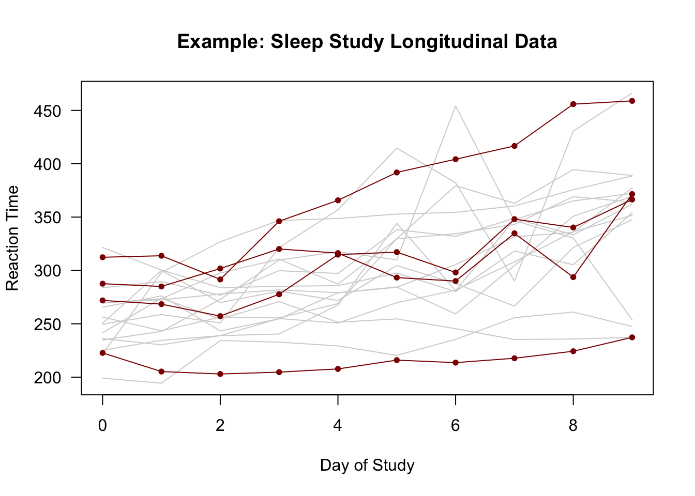
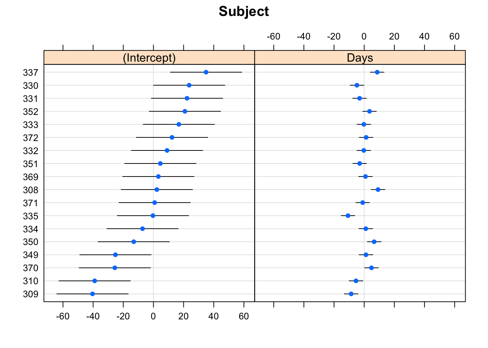
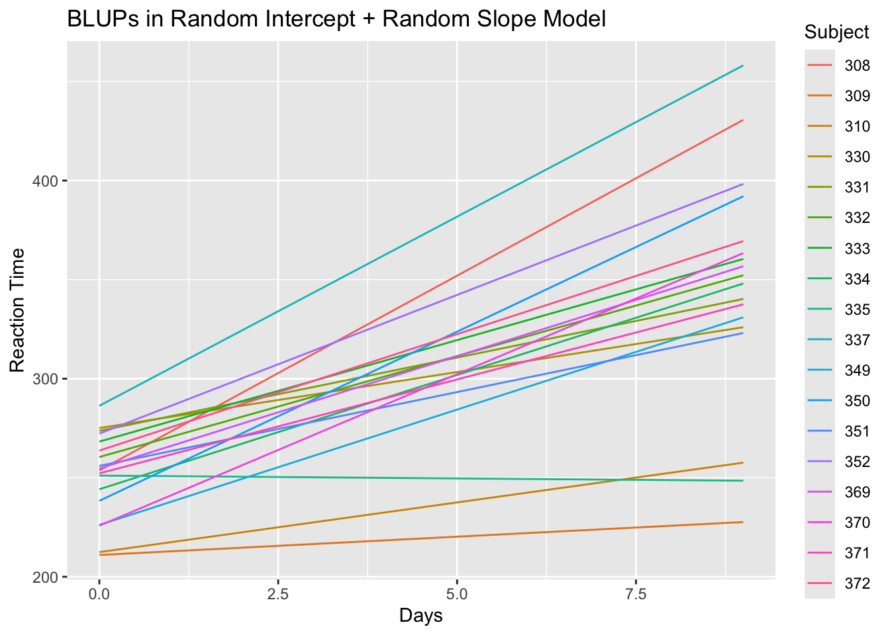
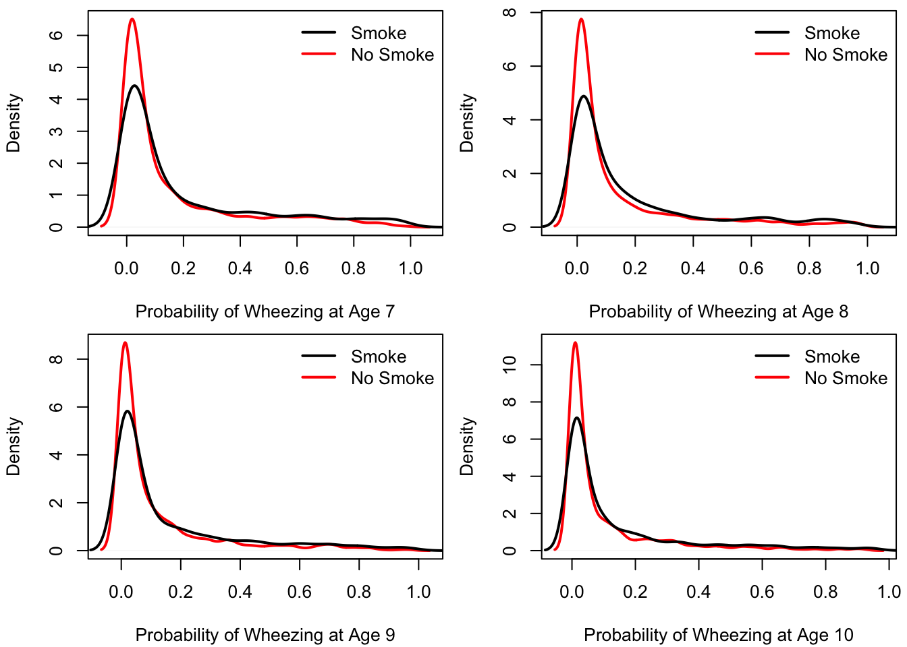

# Mixed Models for Longitudinal Data Analysis {#mixed-models}

------------------------------------------------------------------------

## Methods for Analyzing Longitudinal Data {#sec:methods-overview}

-   **Longitudinal data** refers to data that:

    -   Has **multiple** individuals.

    -   Each individual has **multiple observations** over time.

-   We will denote the outcomes of interest with $Y_{ij}$.

    -   $Y_{ij}$ - outcome for individual $i$ at time $t_{ij}$.

    -   The $i^{th}$ individual has $n_{i}$ observations:
        $Y_{i1}, \ldots, Y_{in_{i}}$.

    -   There will be $m$ individuals in the study (so
        $1 \leq i \leq m$).

    -   $\mathbf{x}_{ij} = (x_{ij1}, \ldots, x_{ijp})$ is the vector of
        covariates for individual $i$ at time $t_{ij}$.
        
    -   Note that the vector $\mathbf{x}_{ij}$ will often include the time point $t_{ij}$ as a covariate.

-   **Note:** For your project, you may have to do some **data processing**
    of the data to get it into the form $(Y_{ij}, \mathbf{x}_{ij})$, for
    $j = 1,\ldots,n_{i}$.

    -   For example, although the data that you analyze for the project
        look at certain variables over time, they could be recorded
        **"asynchronously"** in some way.

    -   This means meaning that the outcomes $Y_{ij}$ and the covariates $\mathbf{x}_{ij}$
        are not **exactly matched** in time.

    -   For example, on a given day, you may observe $Y_{ij}$ at times 9:00,
        10:00, and 11:00, but observe the covariate of interest at 9:17,
        9:53, and 11:08.

    -   Or, your outcome $Y_{ij}$ may only be observed once per week,
        while the covariates of interest are measured multiple times per
        week.

    -   We will discuss some ways of organizing asynchronous
        longitudinal data later in the class.

------------------------------------------------------------------------

<div class="figure">

<p class="caption">(\#fig:unnamed-chunk-1)Plots of individual-specific trajectories from the sleepstudy data with the trajectories of 4 individuals highlighted.</p>
</div>

-   The above figure shows an example of outcomes from a longitudinal
    study (the `sleepstudy` data in the `lme4` package).

-   In the `sleepstudy` data:

    -   The observation time points of observation $t_{ij}$ are the same for each
        individual $i$. So, we can say $t_{ij} = t_{j}$ for all $i$.

    -   The outcome $Y_{ij}$ is the **reaction time** for the $i^{th}$
        individual at time point $t_{j}$.

    -   The 10 time points are
        $(t_{1}, \ldots, t_{10}) = (0, 1, \ldots, 9)$.
        
    -   There are $m = 18$ individuals in the study.
    
    -   Each individual is observed at $10$ time points. So, $n_{i} = 10$ for every $i$.

------------------------------------------------------------------------

-   Most of the well-known regression-based methods for analyzing
    longitudinal data can be classified (see @diggle2013) into one of
    the three following categories:
    -   **Random effects/mixed models**,
    -   **Marginal models**,
    -   **Transition models**
-   **Random effects/Mixed Models**
    -   **"Random effects"** are added to the regression model
        describing the outcomes for each individual.

    -   These "random regression coefficients" are viewed as a **sample**
        from some distribution.
-   **Marginal models**
    -   Regression coefficients have a **"population average"**
        interpretation.

    -   Only mean of $Y_{ij}$ and correlation structure of
        $(Y_{i1}, \ldots, Y_{in_{i}})$ are modeled.

    -   **Generalized estimating equations** (GEEs) are often used for
        estimating model parameters.
-   **Transition models**
    -   Choose a probability model for the distribution of $Y_{ij}$ given
        the value of the outcome at the previous time point $Y_{ij-1}$.

## Mixed Models for Continuous Outcomes

-   If each $Y_{ij}$ is a **continuous outcome** and we were to build a
    regression model without any random effects, we might assume
    something like: 
    \begin{equation}
    Y_{ij} = \beta_{0} + \mathbf{x}_{ij}^{T}\boldsymbol{\beta} + e_{ij}
    (\#eq:fixed-reg-model)
    \end{equation}

-   $\mathbf{x}_{ij} = (x_{ij1}, \ldots, x_{ijp})$ is the vector of
    covariates for individual $i$ at time $t_{ij}$.

-   The vector $\mathbf{x}_{ij}$ could contain individual information
    such as smoking status or age.

    -   $\mathbf{x}_{ij}$ could also contain some of the actual time
        points: $t_{ij}, t_{ij-1}, ...$ or transformations of these time
        points.

------------------------------------------------------------------------

-   The regression model \@ref(eq:fixed-reg-model) assumes the same mean
    function $\beta_{0} + \mathbf{x}_{ij}^{T}\boldsymbol{\beta}$ holds
    for all individuals that have the same value of $\mathbf{x}_{ij}$.

-   It is often reasonable to assume that the regression coefficients
    **vary** across individuals.

    -   This can often better account for **heterogeneity** across
        individuals.

-   The figure below shows **3 different regression lines** from the
    `sleepstudy` data.

    -   Each regression line was estimated using only data from one
        individual.

<div class="figure">

<p class="caption">(\#fig:unnamed-chunk-2)Separately estimated regression lines for 3 subjects in the sleepstudy data.</p>
</div>

------------------------------------------------------------------------

-   Figure 1.1 suggests there is some heterogeneity in the
    **relationship** between **study day** and **response time** across
    individuals.

-   The response time of **Subject 309** changes very little over time.

-   For **Subject 308**, there is a more clear positive association
    between response time and day of study.

------------------------------------------------------------------------

-   For the **sleepstudy** data, a linear regression for **reaction
    time** vs. **study day** which assumes that
    1.  Expected response time is a linear function of study day,
    2.  All individuals have the same regression coefficients,

would have the form: \begin{equation}
Y_{ij} = \beta_{0} + \beta_{1} t_{j} + e_{ij}
\end{equation}

-   If we allowed each individual to have his/her **own intercept and
    slope**, we could instead consider the following model
    \begin{equation}
    Y_{ij} = \beta_{0} + \beta_{1} t_{j} + u_{i0} + u_{i1}t_{j} + e_{ij}
    (\#eq:mixed-sleep)
    \end{equation}

-   $\beta_{0} + u_{i0}$ - **intercept** for individual $i$.

-   $\beta_{1} + u_{i1}$ - **slope** for individual $i$.

------------------------------------------------------------------------

-   If we assume $(u_{i0}, u_{i1})$ are sampled from some distribution,
    $u_{i0}$ and $u_{i1}$ are referred to as **random effects**.

-   Typically, it is assumed that $(u_{i0}, u_{i1})$ are sampled from a
    multivariate normal distribution with mean zero: \begin{equation}
    (u_{i0}, u_{i1}) \sim \textrm{Normal}( \mathbf{0}, \boldsymbol{\Sigma}_{\tau} )
    \end{equation}

-   Model \@ref(eq:mixed-sleep) is called a **mixed model** because it
    contains both **fixed effects** $(\beta_{0}, \beta_{1})$ and
    **random effects** $(u_{i0}, u_{i1})$.

------------------------------------------------------------------------

-   More generally, a **linear mixed model** (LMM) for longitudinal data
    will have the form: \begin{equation}
    Y_{ij} = \beta_{0} + \mathbf{x}_{ij}^{T}\boldsymbol{\beta} + \mathbf{z}_{ij}^{T}\mathbf{u}_{i} + e_{ij}
    (\#eq:lmm-generalform)
    \end{equation}
    -   $\boldsymbol{\beta}$ - vector of fixed effects
    -   $\mathbf{u}_{i}$ - vector of random effects
-   If we stack the responses into a long vector $\mathbf{Y}$ and random
    effects into a long vector $\mathbf{u}$
    -   $\mathbf{Y} = (Y_{11}, Y_{12}, ...., Y_{mn_{m}})$ - this vector
        has length $\sum_{k=1}^{m} n_{k}$
    -   $\mathbf{u} = (u_{10}, u_{11}, ...., u_{mq})$ - this vector has
        length $m \times (q + 1)$.
-   Then, we can write the general form \@ref(eq:lmm-generalform) of the
    LMM as \begin{equation}
    \mathbf{Y} = \mathbf{X}\tilde{\boldsymbol{\beta}} + \mathbf{Z}\mathbf{u} + \mathbf{e}
    \end{equation}
    -   $i^{th}$ row of $\mathbf{X}$ is $(1, \mathbf{x}_{ij}^{T})$.
    -   $i^{th}$ row of $\mathbf{Z}$ is $\mathbf{z}_{ij}^{T}$.
    -   $\tilde{\boldsymbol{\beta}} = (\beta_{0}, \boldsymbol{\beta})$.
-   Constructing an LMM can be thought of as choosing the desired
    "$\mathbf{X}$" and "$\mathbf{Z}$" matrices.

## Advantages of using random effects

### Within-subject correlation

-   Using an LMM automatically accounts for the "**within-subject**"
    correlation.

    -   That is, the correlation between two observations from the **same individual**.

-   This correlation arises because observations on the same individual
    "share" **common random effects**.

-   The correlation between the $j^{th}$ and $k^{th}$ observation from
    individual $i$ is \begin{equation}
    \textrm{Corr}(Y_{ij}, Y_{ik}) = \frac{ \mathbf{z}_{ij}^{T}\boldsymbol{\Sigma}_{\tau}\mathbf{z}_{ik}  }{ \sqrt{\sigma^{2} + \mathbf{z}_{ij}^{T}\boldsymbol{\Sigma}_{\tau}\mathbf{z}_{ij}}\sqrt{\sigma^{2} + \mathbf{z}_{ik}^{T}\boldsymbol{\Sigma}_{\tau}\mathbf{z}_{ik}}}
    \end{equation}

------------------------------------------------------------------------

-   When using **only a random intercept**, the correlation between
    $Y_{ij}$ and $Y_{ik}$ is \begin{equation}
    \textrm{Corr}(Y_{ij}, Y_{ik}) = \frac{ \sigma_{u}^{2}  }{ \sigma^{2} + \sigma_{u}^{2} }
    \end{equation}
    -   In this case, $\mathbf{z}_{ij} = 1$ and
        $u_{i} \sim \textrm{Normal}(0, \sigma_{u}^{2})$
    -   $\sigma^{2}$ is the variance of the residual term $e_{ij}$
-   For longitudinal data, one criticism of the **random intercept model**
    is that the within-subject correlation **does not vary** across
    time.

### Inference about Heterogeneity - Variance of Random Effects

-   One of the goals of the data analysis may be to characterize the
    **heterogeneity** in the relationship between the outcome and some
    of the covariates across individuals.

-   Looking at the **estimates of the variance** of the random effects
    is one way of addressing this goal.

-   An estimate of $\textrm{Var}( u_{ih} )$ "substantially greater than
    zero" is an indication that there is variability in the regression
    coefficient corresponding to $u_{ih}$ across individuals.

------------------------------------------------------------------------

-   For example, with the random intercept and slope model for the
    `sleepstudy` data 
    \begin{equation}
    Y_{ij} = \beta_{0} + \beta_{1}t_{j} + u_{i0} + u_{i1}t_{j} + e_{ij}
    \end{equation}

-   If $\textrm{Var}( u_{i1} )$ is "large", this implies that the
    response to additional days of sleep deprivation **varies
    considerably** across individuals.

    -   The response time of some individuals is not impacted much by
        additional days of little sleep.

    -   Some individuals respond strongly to additional days of little
        sleep.

```{=html}
<!--* When interpreting the estimated values of the random-effects variances, 
one thing you could report is the variation explained -->
```
### Best Linear Unbiased Prediction

-   You may want to estimate or **"predict"** the mean
    function/trajectory of a given individual.

-   This means you want to estimate/predict the following quantity:
    \begin{equation}
    \beta_{0} + \mathbf{x}_{ij}^{T}\boldsymbol{\beta} + \mathbf{z}_{ij}^{T}\mathbf{u}_{i}
    \end{equation}

-   The "Best Linear Unbiased Predictor" (BLUP) of this is
    \begin{equation}
    \textrm{BLUP}(\beta_{0} + \mathbf{x}_{ij}^{T}\boldsymbol{\beta} + \mathbf{z}_{ij}^{T}\mathbf{u}_{i}) = \beta_{0} + \mathbf{x}_{ij}^{T}\boldsymbol{\beta} + \mathbf{z}_{ij}^{T}E(\mathbf{u}_{i}|Y_{i1}, \ldots, Y_{in_{i}})
    \end{equation}

------------------------------------------------------------------------

-   I would think of the values of
    $\textrm{BLUP}(\beta_{0} + \mathbf{x}_{ij}^{T}\boldsymbol{\beta} + \mathbf{z}_{ij}^{T}\mathbf{u}_{i})$
    (for different values of $j$) as an estimate of the "true
    trajectory" (i.e., the true mean) of the $i^{th}$ individual.

-   The observed longitudinal outcomes from individual $i$ are a "noisy
    estimate" of that individual's true trajectory.

-   The BLUPs are more stable **"shrinkage" estimates** of the
    trajectory of individual $i$.

    -   These are called shrinkage estimates because often shrinks the
        estimate that would be obtained using only data from individual
        $i$ towards the "overall" estimate
        $\mathbf{x}_{ij}^{T}\boldsymbol{\beta}$.

------------------------------------------------------------------------

-   For example, if we had the intercept-only model
    $Y_{ij} = \beta_{0} + u_{i} + e_{ij}$, the value of the BLUPs is
    \begin{equation}
    \textrm{BLUP}(\beta_{0} + u_{i}) = \frac{n_{i}\sigma_{u}^{2}}{\sigma^{2} + n_{i}\sigma_{u}^{2} }\bar{Y}_{i.} + \Big(1 -  \frac{n_{i}\sigma_{u}^{2}}{\sigma^{2} + n_{i}\sigma_{u}^{2} }\Big)\bar{Y}_{..}
    \end{equation}

-   $\bar{Y}_{i.}$ is the sample mean from individual-$i$ data

    -   $\bar{Y}_{i.}$ would be the estimate of the intercept if we only
        looked at data from the $i^{th}$ individual.

-   $\bar{Y}_{..}$ - overall mean

    -   $\bar{Y}_{..}$ would be the estimate of the intercept if we
        ignored variation in intercepts across individuals.

------------------------------------------------------------------------

-   You can also think of
    $\textrm{BLUP}(\beta_{0} + \mathbf{x}_{ij}^{T}\boldsymbol{\beta} + \mathbf{z}_{ij}^{T}\mathbf{u}_{i})$
    as a prediction of what the observed trajectory for individual $i$
    would be if that individual were in a future study under the same
    conditions.

-   Say $Y_{i1}', \ldots, Y_{in_{i}}'$ are the observations for
    individual $i$ in a future study.

-   The outcomes in the future study are determined by \begin{equation}
    Y_{ij}' = \beta_{0} + \mathbf{x}_{ij}^{T}\boldsymbol{\beta} + \mathbf{z}_{ij}^{T}\mathbf{u}_{i} + e_{ij}'
    \end{equation}

-   The expectation of $Y_{ij}'$ given the observed data in our
    longitudinal study is \begin{eqnarray}
    E(Y_{ij}'|Y_{i1}, \ldots, Y_{in_{i}}) &=& \beta_{0} + \mathbf{x}_{ij}^{T}\boldsymbol{\beta} + \mathbf{z}_{ij}^{T}E(\mathbf{u}_{i}|Y_{i1}, \ldots, Y_{in_{i}})  \nonumber \\
    &=& \textrm{BLUP}(\beta_{0} + \mathbf{x}_{ij}^{T}\boldsymbol{\beta} + \mathbf{z}_{ij}^{T}\mathbf{u}_{i}) \nonumber
    \end{eqnarray}

## Generalized linear mixed models (GLMMs)

-   **Generalized linear models** (GLMs) are used to handle
    data (often **"non-continuous"**) that can't be reasonably modeled with a Gaussian distribution.

-   The most common scenarios where you would use GLMs in practice are
    **binary**, **count**, and **multinomial** outcomes.

-   With a generalized linear mixed model (GLMM), you assume that a GLM
    holds **conditional** on the value of the random effects.

### GLMMs with Binary Outcomes

-   Under the GLM framework, the usual approach for handling binary
    outcomes is **logistic regression**.

-   The assumptions underlying logistic regression are:

    -   The outcomes are **independent**

    -   Each outcome follows a **Bernoulli** distribution.

    -   The **log-odds parameter** is assumed to be a linear combination
        of the covariates.

------------------------------------------------------------------------

-   With the **GLMM version of logistic regression**, we will make almost
    the same assumptions as the regular GLM version of logistic
    regression.
    -   The main difference is that each assumption in the GLMM will be
        **conditional** on the values of the random effects.
-   To be specific, for longitudinal binary outcomes $Y_{ij}$, the GLMM
    version of logistic regression assumes the following:
    1.  **Conditional** on the vector of random effects $\mathbf{u}_{i}$
        \begin{equation}
        Y_{i1}, \ldots, Y_{in_{i}}|\mathbf{u}_{i}  \textrm{ are independent }
        \end{equation}

    2.  **Conditional** on $\mathbf{u}_{i}$, each $Y_{ij}$ has a
        Bernoulli distribution \begin{equation}
        Y_{ij}|\mathbf{u}_{i} \sim \textrm{Bernoulli}\big\{ p_{ij}(\mathbf{u}_{i}) \big\}
        \end{equation} so that
        $p_{ij}( \mathbf{u}_{i} ) = P(Y_{ij} = 1| \mathbf{u}_{i})$.

    3.  The "**conditional**" log-odds term
        $\log\{ p_{ij}(\mathbf{u}_{i})/[1 - p_{ij}(\mathbf{u}_{i})] \}$
        is a linear combination of the covariates and the random effects
        vector $\mathbf{u}_{i}$: \begin{equation}
        \textrm{logit}\{ p_{ij}(\mathbf{u}_{i}) \} = \log\Big( \frac{ p_{ij}(\mathbf{u}_{i})}{ 1 - p_{ij}(\mathbf{u}_{i}) } \Big)
        = \beta_{0} + \mathbf{x}_{ij}^{T}\boldsymbol{\beta} + \mathbf{z}_{ij}^{T}\mathbf{u}_{i}
        \end{equation}

    4.  As with a linear mixed model, we assume that the random-effects
        vector $\mathbf{u}_{i}$ has a **multivariate normal
        distribution** with mean zero and covariance matrix
        $\boldsymbol{\Sigma}_{\tau}$ \begin{equation}
         \mathbf{u}_{i} \sim \textrm{Normal}( \mathbf{0}, \boldsymbol{\Sigma}_{\tau})
          \end{equation}

### GLMMs with Count Outcomes

-   For **count** outcomes, responses are typically assumed to follow a
    **Poisson** distribution and sometimes a **negative binomial**
    distribution - conditional on the values of the random effects.

-   For the Poisson model, we assume
    $Y_{ij}|\mathbf{u}_{i} \sim \textrm{Poisson}\{ \mu_{ij}( \mathbf{u}_{i} ) \}$,
    \begin{equation}
    E(Y_{ij}| \mathbf{u}_{i}) = \mu_{ij}(\mathbf{u}_{i})  \qquad 
    \textrm{Var}( Y_{ij}| \mathbf{u}_{i} ) = \mu_{ij}(\mathbf{u}_{i})
    \end{equation}

-   One common problem with the Poisson distribution is
    **overdispersion** (i.e., variance is greater than the mean).

    -   The variance of the Poisson equals the mean.

    -   While the **marginal** variance will not equal the mean in a
        GLMM, requiring the conditional means and variances to be equal
        could lead to a poor fit.

-   For the **negative binomial** model, we assume\
    $Y_{ij}|\mathbf{u}_{i} \sim \textrm{NB}\{ \mu_{ij}( \mathbf{u}_{i}) , \phi \}$,
    \begin{equation}
    E(Y_{ij}| \mathbf{u}_{i}) = \mu_{ij}(\mathbf{u}_{i})  \qquad 
    \textrm{Var}( Y_{ij}| \mathbf{u}_{i} ) = \mu_{ij}(\mathbf{u}_{i}) + \phi\mu_{ij}^{2}(\mathbf{u}_{i})
    \end{equation}

    -   $\phi$ is often referred to as the overdispersion parameter.

------------------------------------------------------------------------

-   With a GLMM model for **count data**, it is typical to model the
    **log** of the conditional mean $\mu_{ij}(\mathbf{u}_{i})$ with a
    linear regression: \begin{equation}
    \log\{ \mu_{ij}(\mathbf{u}_{i}) \} = \beta_{0} + \mathbf{x}_{ij}^{T}\boldsymbol{\beta} + \mathbf{z}_{ij}^{T}\mathbf{u}_{i}
    \end{equation}

-   Again, for the Poisson GLMM, the usual assumption for the random
    effects is that \begin{equation}
          \mathbf{u}_{i} \sim \textrm{Normal}( \mathbf{0}, \boldsymbol{\Sigma}_{\tau})
    \end{equation}

## Fitting Linear Mixed Models (LMMs) and Generalized Linear Mixed models (GLMMs) in **R**

-   The **lme4** package is probably the most general package for
    fitting LMMs and GLMMs.


```r
library(lme4)
```

-   With **Python**, you can use the `mixedlm` function from the
    `statmodels` module to fit linear mixed models.

### Fitting LMMs with the sleepstudy data

-   To start off, let's use the `sleepstudy` longitudinal data in `lme4`
    and look at the data from the first two individuals in this data.


```r
data(sleepstudy) 
dim(sleepstudy) # 18 individuals, each with 10 observations
```

```
## [1] 180   3
```

```r
sleepstudy[1:20,] # Data from the subjects with ids: 308 and 309
```

```
##    Reaction Days Subject
## 1  249.5600    0     308
## 2  258.7047    1     308
## 3  250.8006    2     308
## 4  321.4398    3     308
## 5  356.8519    4     308
## 6  414.6901    5     308
## 7  382.2038    6     308
## 8  290.1486    7     308
## 9  430.5853    8     308
## 10 466.3535    9     308
## 11 222.7339    0     309
## 12 205.2658    1     309
## 13 202.9778    2     309
## 14 204.7070    3     309
## 15 207.7161    4     309
## 16 215.9618    5     309
## 17 213.6303    6     309
## 18 217.7272    7     309
## 19 224.2957    8     309
## 20 237.3142    9     309
```

-   The **sleepstudy** data is an example of longitudinal data stored in
    **long format** (as opposed to "wide" format).
    -   In **long format**, each row of the dataset corresponds to an
        observation from one individual at one time point.

------------------------------------------------------------------------

-   The `lmer` function in `lme4` fits linear mixed models.

    -   This has many of the same features as the **lm** function in
        **R**.

-   To fit an LMM with `lmer`, the main thing to do is to specify the
    **"X" part** of the model (i.e., the fixed effects) and the **"Z"
    part** of the model (i.e., the random effects).

-   The "X" part of the model is done using the exact same **"formula
    notation"** used in the `lm` function.

-   The "Z" part of the model is done using the following type of
    syntax:


```r
(formula | group_var)
```

-   `group_var` is the **"grouping variable"** used for the random effects
    -   For longitudinal data, this would be the variable which
        identifies **each individual**.

    -   For example, this might be an identifier variable which stores a
        separate id for each person.

#### LMM with a single, random intercept for each subject

-   Let's fit an LMM where there is a fixed slope for time and only a
    random intercept for each `Subject` 
    \begin{equation}
    Y_{ij} = \beta_{0} + \beta_{1}t_{j} + u_{i} + e_{ij}
    (\#eq:lmm-intercept-sleep)
    \end{equation}

-   For the **"X" part** of this model, we use `Reaction ~ Days`.

    -   This gives us a fixed intercept and a fixed slope for the `Days`
        variable.

-   For the **"Z" part** of this model, we just add `(1|Subject)`.

    -   This says that there is **only a random intercept** within the
        grouping variable `Subject`.

-   Putting these two together, we can fit the LMM
    \@ref(eq:lmm-intercept-sleep) using the following code:


```r
lmm.sleep.intercept <- lmer(Reaction ~ Days + (1|Subject), data = sleepstudy)
```

------------------------------------------------------------------------

-   You can always use the `model.matrix` method on the fitted `lmer`
    object to **check that the "X" and "Z" matrices** correspond to the
    model you want.

-   Let's look at the **first 5 rows** of the "X" matrix from
    `lmm.sleep.intercept`


```r
x.mat <- model.matrix(lmm.sleep.intercept)
## This design matrix should have an intercept column
## and a column which stores the "Days" variable
x.mat[1:5,]
```

```
##   (Intercept) Days
## 1           1    0
## 2           1    1
## 3           1    2
## 4           1    3
## 5           1    4
```

-   Let's look at the **first 20 rows** of the "Z" matrix from
    `lmm.intercept`


```r
## Use argument type = "random" to get random-effects design matrix
z.mat <- model.matrix(lmm.sleep.intercept, type="random")
z.mat[1:20,] # The . values in zmat correspond to zeros
```

```
## 20 x 18 sparse Matrix of class "dgCMatrix"
```

```
##   [[ suppressing 18 column names '308', '309', '310' ... ]]
```

```
##                                       
## 1  1 . . . . . . . . . . . . . . . . .
## 2  1 . . . . . . . . . . . . . . . . .
## 3  1 . . . . . . . . . . . . . . . . .
## 4  1 . . . . . . . . . . . . . . . . .
## 5  1 . . . . . . . . . . . . . . . . .
## 6  1 . . . . . . . . . . . . . . . . .
## 7  1 . . . . . . . . . . . . . . . . .
## 8  1 . . . . . . . . . . . . . . . . .
## 9  1 . . . . . . . . . . . . . . . . .
## 10 1 . . . . . . . . . . . . . . . . .
## 11 . 1 . . . . . . . . . . . . . . . .
## 12 . 1 . . . . . . . . . . . . . . . .
## 13 . 1 . . . . . . . . . . . . . . . .
## 14 . 1 . . . . . . . . . . . . . . . .
## 15 . 1 . . . . . . . . . . . . . . . .
## 16 . 1 . . . . . . . . . . . . . . . .
## 17 . 1 . . . . . . . . . . . . . . . .
## 18 . 1 . . . . . . . . . . . . . . . .
## 19 . 1 . . . . . . . . . . . . . . . .
## 20 . 1 . . . . . . . . . . . . . . . .
```

-   The `.` values in `z.mat` are just zeros.

-   Notice that each `Subject` has its own "intercept" column.

    -   This what we want - each `Subject` has its own intercept.

------------------------------------------------------------------------

-   Let's look at the **estimated parameters** from the LMM with random
    intercepts using `summary`


```r
summary(lmm.sleep.intercept)
```

```
## Linear mixed model fit by REML ['lmerMod']
## Formula: Reaction ~ Days + (1 | Subject)
##    Data: sleepstudy
## 
## REML criterion at convergence: 1786.5
## 
## Scaled residuals: 
##     Min      1Q  Median      3Q     Max 
## -3.2257 -0.5529  0.0109  0.5188  4.2506 
## 
## Random effects:
##  Groups   Name        Variance Std.Dev.
##  Subject  (Intercept) 1378.2   37.12   
##  Residual              960.5   30.99   
## Number of obs: 180, groups:  Subject, 18
## 
## Fixed effects:
##             Estimate Std. Error t value
## (Intercept) 251.4051     9.7467   25.79
## Days         10.4673     0.8042   13.02
## 
## Correlation of Fixed Effects:
##      (Intr)
## Days -0.371
```

-   The **estimated fixed-effects** intercept is $\hat{\beta}_{0} = 251.4$,
    and the estimated fixed-effects slope is $\hat{\beta}_{1} = 10.5$.

-   The **estimated variance** of the random intercept is
    $\hat{\tau}^{2} = 1378.2$ (standard deviation is
    $\hat{\tau} = 37.1$).

    -   i.e., it is estimated that
        $u_{i} \sim \textrm{Normal}(0, 1378.2)$.

#### LMM with both a random intercept and slope for each subject

-   Now, let's fit an LMM where there is a fixed slope for time and both
    a random intercept and slope for each `Subject` \begin{equation}
    Y_{ij} = \beta_{0} + \beta_{1}t_{j} + u_{i0} + u_{i1}t_{j} + e_{ij}
    (\#eq:lmm-slope-sleep)
    \end{equation}

-   This is done with `lmer` using the following code:


```r
lmm.sleep.slope <- lmer(Reaction ~ Days + (Days|Subject), data = sleepstudy)
```

-   Again, let's check the "X" and "Z" matrices from `lmm.sleep.slope`
    to double-check that everything makes sense


```r
x.mat2 <- model.matrix(lmm.sleep.slope)
## This design matrix should be the same as that from lmm.sleep.intercept
x.mat2[1:5,]
```

```
##   (Intercept) Days
## 1           1    0
## 2           1    1
## 3           1    2
## 4           1    3
## 5           1    4
```

-   First 20 rows of the "Z" matrix from `lmm.sleep.slope`:


```r
## Use argument type = "random" to get random-effects design matrix
z.mat2 <- model.matrix(lmm.sleep.slope, type="random")
z.mat2[1:20,] # The . values in zmat2 correspond to zeros
```

```
## 20 x 36 sparse Matrix of class "dgCMatrix"
```

```
##   [[ suppressing 36 column names '308', '308', '309' ... ]]
```

```
##                                                                           
## 1  1 . . . . . . . . . . . . . . . . . . . . . . . . . . . . . . . . . . .
## 2  1 1 . . . . . . . . . . . . . . . . . . . . . . . . . . . . . . . . . .
## 3  1 2 . . . . . . . . . . . . . . . . . . . . . . . . . . . . . . . . . .
## 4  1 3 . . . . . . . . . . . . . . . . . . . . . . . . . . . . . . . . . .
## 5  1 4 . . . . . . . . . . . . . . . . . . . . . . . . . . . . . . . . . .
## 6  1 5 . . . . . . . . . . . . . . . . . . . . . . . . . . . . . . . . . .
## 7  1 6 . . . . . . . . . . . . . . . . . . . . . . . . . . . . . . . . . .
## 8  1 7 . . . . . . . . . . . . . . . . . . . . . . . . . . . . . . . . . .
## 9  1 8 . . . . . . . . . . . . . . . . . . . . . . . . . . . . . . . . . .
## 10 1 9 . . . . . . . . . . . . . . . . . . . . . . . . . . . . . . . . . .
## 11 . . 1 . . . . . . . . . . . . . . . . . . . . . . . . . . . . . . . . .
## 12 . . 1 1 . . . . . . . . . . . . . . . . . . . . . . . . . . . . . . . .
## 13 . . 1 2 . . . . . . . . . . . . . . . . . . . . . . . . . . . . . . . .
## 14 . . 1 3 . . . . . . . . . . . . . . . . . . . . . . . . . . . . . . . .
## 15 . . 1 4 . . . . . . . . . . . . . . . . . . . . . . . . . . . . . . . .
## 16 . . 1 5 . . . . . . . . . . . . . . . . . . . . . . . . . . . . . . . .
## 17 . . 1 6 . . . . . . . . . . . . . . . . . . . . . . . . . . . . . . . .
## 18 . . 1 7 . . . . . . . . . . . . . . . . . . . . . . . . . . . . . . . .
## 19 . . 1 8 . . . . . . . . . . . . . . . . . . . . . . . . . . . . . . . .
## 20 . . 1 9 . . . . . . . . . . . . . . . . . . . . . . . . . . . . . . . .
```

-   Note that the two columns for each `Subject` in `z.mat2` are of the
    form $(1, t_{j})$, which is what we want.

------------------------------------------------------------------------

-   Let's look at the **estimated parameters** from `lmm.sleep.slope`


```r
summary(lmm.sleep.slope)
```

```
## Linear mixed model fit by REML ['lmerMod']
## Formula: Reaction ~ Days + (Days | Subject)
##    Data: sleepstudy
## 
## REML criterion at convergence: 1743.6
## 
## Scaled residuals: 
##     Min      1Q  Median      3Q     Max 
## -3.9536 -0.4634  0.0231  0.4634  5.1793 
## 
## Random effects:
##  Groups   Name        Variance Std.Dev. Corr
##  Subject  (Intercept) 612.10   24.741       
##           Days         35.07    5.922   0.07
##  Residual             654.94   25.592       
## Number of obs: 180, groups:  Subject, 18
## 
## Fixed effects:
##             Estimate Std. Error t value
## (Intercept)  251.405      6.825  36.838
## Days          10.467      1.546   6.771
## 
## Correlation of Fixed Effects:
##      (Intr)
## Days -0.138
```

-   The estimated fixed-effects coefficients are
    $\hat{\beta}_{0} = 251.4$, and $\hat{\beta}_{1} = 10.5$
    respectively.

-   The estimated standard deviation and correlation of the random
    effects are

    -   Estimated standard deviation of $u_{i0}$ is $24.7$.

    -   Estimated standard deviation of $u_{i1}$ is $5.9$.

    -   Estimated correlation between $u_{i0}$ and $u_{i1}$ is $0.07$.

------------------------------------------------------------------------

-   Rather than always printing out the entire summary, you can directly
    extract the estimates of the fixed effects with `coef`:


```r
coef( summary(lmm.sleep.slope) )
```

```
##              Estimate Std. Error   t value
## (Intercept) 251.40510   6.824597 36.838090
## Days         10.46729   1.545790  6.771481
```

-   To directly extract the estimates of the variance (or standard
    deviation) of the random effects, you can use:


```r
VarCorr( lmm.sleep.slope )
```

```
##  Groups   Name        Std.Dev. Corr 
##  Subject  (Intercept) 24.7407       
##           Days         5.9221  0.066
##  Residual             25.5918
```

------------------------------------------------------------------------

**Interpreting the estimated variance of the random effects**

-   One way to think about the magnitude of the variance
    components is to look at the 5th and 95th percentiles of the random
    effects distribution.
    -   For example, if you only have a random intercept term, then
        roughly $90\%$ of individuals will have an intercept that falls
        in the interval
        $[\hat{\beta}_{0} - 1.64\hat{\sigma}_{u0}, \hat{\beta}_{0} + 1.64\hat{\sigma}_{u0}]$.

    -   If you have a random slope term, then roughly $90\%$ of
        individuals will have an intercept that falls in the interval
        $[\hat{\beta}_{1} - 1.64\hat{\sigma}_{u1}, \hat{\beta}_{1} + 1.64\hat{\sigma}_{u1}]$.
-   Another idea for helping to interpret the magnitude of the random
    effects is to plot many random trajectories for specific choices of
    the covariate vector $\mathbf{x}_{i}$ (if the $\mathbf{x}_{i}$ vary
    across individuals).
    -   For example, in the **sleepstudy** data, you could plot
        $\hat{\beta}_{0} + u_{i0} + \hat{\beta}_{1}t_{j} + u_{i1}t_{j}$
        where the pairs $(u_{i0}, u_{i1})$ are generated from the
        estimated joint Normal distribution.


```r
Sigma.hat <- VarCorr( lmm.sleep.slope )$Subject # This is the random-effects 
                                                # covariance matrix
ndraws <- 100
Sigma.hat.sqrt <- chol(Sigma.hat)
beta.hat <- coef( summary(lmm.sleep.slope) )[,1]  # estimated fixed effects
print(beta.hat)
```

```
## (Intercept)        Days 
##   251.40510    10.46729
```

```r
plot(sleepstudy$Days, sleepstudy$Reaction, type="n", xlab="Days", ylab="Response", 
     las=1, main="sleepstudy: Variation in subject-specific trajectories")
for(k in 1:ndraws) {
   uvec.draw <- Sigma.hat.sqrt%*%rnorm(2)  # draw random (ui0, ui1) pair
   trajectory <- beta.hat[1] + uvec.draw[1] + (0:9)*(beta.hat[2] + uvec.draw[2])
   lines(0:9, trajectory)
}
```

<div class="figure">

<p class="caption">(\#fig:unnamed-chunk-16)Random trajectories for sleepstudy data using the estimated intercept and slope random-effects variances.</p>
</div>

<!-- * You may also find it useful to report it in terms of "variance explained" by thinking of the vari -->

### Model Comparison of LMMs using anova

-   The `anova` function can directly compare **nested** linear mixed
    models that are fit by `lmer`.
    -   That is, where one larger model contains all of the components
        of the smaller model.
-   To use `anova`, you should include the argument `REML = FALSE` so
    `lmer` uses maximum likelihood estimation.

------------------------------------------------------------------------

-   As an example, let's compare the following two models on the
    `sleelpstudy` data
    -   **Model M0:** Only has an intercept as a fixed effect and a
        random intercept for each person.
    -   **Model M1:** Has an intercept and slope as the fixed effects
        and a random intercept for each person.
-   Let's first fit these models using `REML = FALSE`:


```r
M0 <- lmer(Reaction ~ 1 + (1|Subject), data = sleepstudy, REML=FALSE)
M1 <- lmer(Reaction ~ Days + (1|Subject), data = sleepstudy, REML=FALSE)
```

-   Running `anova(M0, M1)` will perform a chi-square test comparing
    these two models.
    -   `anova(M0, M1)` also reports an **AIC** and **BIC** measure.


```r
anova(M0, M1)
```

```
## Data: sleepstudy
## Models:
## M0: Reaction ~ 1 + (1 | Subject)
## M1: Reaction ~ Days + (1 | Subject)
##    npar    AIC    BIC  logLik deviance  Chisq Df Pr(>Chisq)    
## M0    3 1916.5 1926.1 -955.27   1910.5                         
## M1    4 1802.1 1814.8 -897.04   1794.1 116.46  1  < 2.2e-16 ***
## ---
## Signif. codes:  0 '***' 0.001 '**' 0.01 '*' 0.05 '.' 0.1 ' ' 1
```

-   We can see that the chi-square statistic is very large.
    -   There is strong evidence in favor of model **M1** over **M0**.

------------------------------------------------------------------------

-   Now, suppose we want to compare the following two models
    -   **Model M1:** Has an intercept and slope as the fixed effects
        and a random intercept for each person.
    -   **Model M2:** Has an intercept and slope as the fixed effects
        and a random intercept **and slope** for each person.
-   To compare **M1** with **M2**, let's fit **M2** with `REML = FALSE`:


```r
M2 <- lmer(Reaction ~ Days + (Days|Subject), data = sleepstudy, REML=FALSE)
```

-   Now, use `anova(M1, M2)` to compare these models directly


```r
anova(M1, M2)
```

```
## Data: sleepstudy
## Models:
## M1: Reaction ~ Days + (1 | Subject)
## M2: Reaction ~ Days + (Days | Subject)
##    npar    AIC    BIC  logLik deviance  Chisq Df Pr(>Chisq)    
## M1    4 1802.1 1814.8 -897.04   1794.1                         
## M2    6 1763.9 1783.1 -875.97   1751.9 42.139  2  7.072e-10 ***
## ---
## Signif. codes:  0 '***' 0.001 '**' 0.01 '*' 0.05 '.' 0.1 ' ' 1
```

-   Based on the chi-square statistic and associated p-value, there is
    strong evidence favoring **M2** over **M1**.

### Extracting BLUPs in lme4

-   To get the "BLUPs" the intercepts and slopes $\textrm{BLUP}(u_{i0})$
    and $\textrm{BLUP}(u_{i1})$, use `ranef`


```r
blups.slope <- ranef( lmm.sleep.slope )
```

-   To plot these, use `dotplot` (you will need to load the `lattice`
    package first)


```r
library(lattice)
dotplot(blups.slope)
```

```
## $Subject
```



```r
## This plots subjects sorted by individual-specific estimates of intercepts
```

------------------------------------------------------------------------

-   To extract the "predicted" random effects into a `DataFrame` use


```r
ranef.df <- as.data.frame( blups.slope)
head(ranef.df)
```

```
##    grpvar        term grp    condval   condsd
## 1 Subject (Intercept) 308   2.258551 12.07086
## 2 Subject (Intercept) 309 -40.398738 12.07086
## 3 Subject (Intercept) 310 -38.960409 12.07086
## 4 Subject (Intercept) 330  23.690620 12.07086
## 5 Subject (Intercept) 331  22.260313 12.07086
## 6 Subject (Intercept) 332   9.039568 12.07086
```

-   This returns a data frame of the BLUPs for each random effect along
    with a "standard error" for each BLUP.

------------------------------------------------------------------------

-   What we discussed earlier in Section 1.3, were the BLUPs for
    $\mathbf{x}_{ij}^{T}\boldsymbol{\beta} + \mathbf{z}_{ij}\mathbf{u}_{i}$
    not just the individual components of $\mathbf{u}_{i}$.

-   For this random intercept and slope model, this is
    $\textrm{BLUP}(\beta_{0} + \beta_{1}t_{j} + u_{i0} + u_{i1}t_{j})$

-   These are obtained by using the `fitted` method


```r
blup.full <- fitted( lmm.sleep.slope )  # Should be a vector of length 180
```

-   If we plot
    $\textrm{BLUP}(\beta_{0} + \beta_{1}t_{j} + u_{i0} + u_{i1}t_{j})$
    as a function of time for all individuals, it will look like the
    following:


```r
library(ggplot2)
# First add the BLUPs to the sleepstudy data as a separate variable
sleepstudy$blups <- blup.full

# Now plot BLUPs vs. study data for each subject
ggplot(sleepstudy, aes(x=Days, y=blups, group=Subject)) +
  geom_line(aes(color=Subject)) + 
  labs(title = "BLUPs in Random Intercept + Random Slope Model",
       y = "Reaction Time")
```



------------------------------------------------------------------------

### Fitting Binary GLMMs using the Ohio data

-   To use the **ohio** data, we will first load the **geepack** R
    package:


```r
library(geepack)
```

-   This dataset has 2148 observations from 537 individuals


```r
data(ohio)
head(ohio, 12) # look at first 12 rows of ohio
```

```
##    resp id age smoke
## 1     0  0  -2     0
## 2     0  0  -1     0
## 3     0  0   0     0
## 4     0  0   1     0
## 5     0  1  -2     0
## 6     0  1  -1     0
## 7     0  1   0     0
## 8     0  1   1     0
## 9     0  2  -2     0
## 10    0  2  -1     0
## 11    0  2   0     0
## 12    0  2   1     0
```

-   The outcome of interest in **ohio** is "wheezing status": 1 - yes,
    0 - no.

    -   The **resp** variable contains wheezing status.

-   The **id** variable contains the unique identifier for each
    individual.

-   The **age** in the **ohio** dataset is the time variable.

    -   The age variable is recorded as: (**age in years** - 9).

    -   Each individual starts the study at 7 years of age.

-   The **smoke** variable is an indicator of maternal smoking at the
    starting year of the study.

------------------------------------------------------------------------

-   In **lme4**, fitting a GLMM with binary responses can be done with
    the **glmer** function.

-   The **glmer** function has the following syntax:


```r
glmer(formula, data, family)
```

-   The `formula` argument uses the same syntax as `lmer`

-   When handling binary outcomes, you need to specify the family
    argument as: `family = binomial`.

------------------------------------------------------------------------

-   Just exploring this data by looking at the raw proportions, it
    appears that
    -   probability of wheezing **decreases** as age increases (within
        each level of smoking)
    -   maternal smoking **increases** the probability of wheezing at
        each age


```r
library(dplyr)
prop_summary_ohio <- ohio %>% 
                     group_by(smoke, age) %>% 
                     summarize( prop_wheeze = mean(resp) )
prop_summary_ohio
```

```
## # A tibble: 8 × 3
## # Groups:   smoke [2]
##   smoke   age prop_wheeze
##   <int> <int>       <dbl>
## 1     0    -2       0.16 
## 2     0    -1       0.149
## 3     0     0       0.143
## 4     0     1       0.106
## 5     1    -2       0.166
## 6     1    -1       0.209
## 7     1     0       0.187
## 8     1     1       0.139
```

-   So, we are probably going to want to include both **age** and
    **smoke** in our model.

#### A Random Intercept Model

-   Let's use a GLMM to explore the relationship between wheezing status
    and the:
    -   **age** of the child
    -   maternal **smoking status**
-   A GLMM for wheezing status which has age and smoking status as fixed
    effects and random individual-specific intercepts can be expressed
    as

```{=tex}
\begin{equation}
\textrm{logit}\{ p_{ij}(u_{i}) \}  = \beta_{0} + \beta_{age}\textrm{age}_{ij}
+ \beta_{smk}\textrm{smoke}_{i} + u_{i} 
(\#eq:ohio-intercept)
\end{equation}
```
-   Model \@ref(eq:ohio-intercept) can be fit with the following code


```r
# id is the grouping variable
ohio.intercept <- glmer(resp ~ age + smoke + (1 | id), data = ohio, family = binomial)
```


```r
coef(summary(ohio.intercept))
```

```
##               Estimate Std. Error    z value     Pr(>|z|)
## (Intercept) -3.3739539 0.27497502 -12.270038 1.311914e-34
## age         -0.1767645 0.06796698  -2.600741 9.302258e-03
## smoke        0.4147806 0.28704052   1.445024 1.484510e-01
```


```r
VarCorr(ohio.intercept)
```

```
##  Groups Name        Std.Dev.
##  id     (Intercept) 2.3432
```

------------------------------------------------------------------------

-   For a binary GLMM, the **estimated standard deviation** for the
    random intercept can be a little hard to interpret, though this
    value seems rather large to me.

-   One way to report this is to look at the **variation** in
    $p_{ij}(u_{i})$ for different values of **age** and **smoking
    status**.

    -   For this purpose, you could report the interval
        $\textrm{expit}\big(\hat{\beta}_{0} + \hat{\beta}_{age}\times \textrm{age} + \hat{\beta}_{smk}\times \textrm{smoke} \pm 1.64\hat{\sigma}_{u0} \big)$,
        where $\textrm{expit}(x) = 1/(1 + e^{-x})$

-   One way to interpret the variation **visually** is to randomly
    generate many values of $p_{ij}( u_{i} )$ using the estimated
    distribution of $u_{i}$ to simulate the values of $u_{i}$.

    -   This can help us to get a sense of how much **variability**
        there is in wheezing probability **across individuals**.

-   To do this, I simulated values of $p_{ij}( u_{i} )$ for each
    combination of age/smoking status and plotted the results in 8
    densities in 4 panels.

    -   It would probably be better to use some sort of bounded density
        estimator for these plots.


```r
beta.hat <- coef(summary(ohio.intercept))[,1]
n <- 1000
pneg2.smoke <- plogis(rnorm(n,sd=2.34) + beta.hat[1] - 2*beta.hat[2] + beta.hat[3]) #age -2 with smoke
pneg2 <- plogis(rnorm(n, sd=2.34) + beta.hat[1] - 2*beta.hat[2]) #age -2 w/o smoke
pneg1.smoke <- plogis(rnorm(n,sd=2.34) + beta.hat[1] - 1*beta.hat[2] + beta.hat[3]) #age -1 with smoke
pneg1 <- plogis(rnorm(n, sd=2.34) + beta.hat[1] - 1*beta.hat[2]) # age -1 w/o smoke
p0.smoke <- plogis(rnorm(n, sd=2.34) + beta.hat[1] + beta.hat[3]) # age 0 with smoke
p0 <- plogis(rnorm(n, sd=2.34) + beta.hat[1]) # age 0 w/o smoke
p1.smoke <- plogis(rnorm(n,sd=2.34) + beta.hat[1] + beta.hat[2] + beta.hat[3]) # age 1 with smoke
p1 <- plogis(rnorm(n, sd=2.34) + beta.hat[1] + beta.hat[2]) # age 1 w/o smoke

par(mfrow=c(2,2), mar=c(4.1, 4.1, .5, .5))
plot(density(pneg2), lwd=2, xlab = "Probability of Wheezing at Age 7", main="", col="red")
d <- density(pneg2.smoke)
lines(d$x, d$y, lwd=2)
legend("topright", legend = c("Smoke", "No Smoke"), col=c("black", "red"), bty='n', lwd=2)
plot(density(pneg1), lwd=2, xlab = "Probability of Wheezing at Age 8", main="", col="red")
d <- density(pneg1.smoke)
lines(d$x, d$y, lwd=2)
legend("topright", legend = c("Smoke", "No Smoke"), col=c("black", "red"), bty='n', lwd=2)
plot(density(p0), lwd=2, xlab = "Probability of Wheezing at Age 9", main="", col="red")
d <- density(p0.smoke)
lines(d$x, d$y, lwd=2)
legend("topright", legend = c("Smoke", "No Smoke"), col=c("black", "red"), bty='n', lwd=2)
plot(density(p1), lwd=2, xlab = "Probability of Wheezing at Age 10", main="", col="red")
d <- density(p1.smoke)
lines(d$x, d$y, lwd=2)
legend("topright", legend = c("Smoke", "No Smoke"), col=c("black", "red"), bty='n', lwd=2)
```

<div class="figure">

<p class="caption">(\#fig:unnamed-chunk-33)Distribution of Wheezing probability across individuals for different values of age and smoking status</p>
</div>

------------------------------------------------------------------------

## Exercises

* For these exercises, you will use the `actg_trial` dataset. This dataset
was obtained from https://content.sph.harvard.edu/fitzmaur/ala2e/cd4-data.txt.
    + I also placed this dataset in a file named `actg_trial.csv` inside the Data folder on Canvas.
    


* When you load the dataset into R, it should look like the following

```r
head( actg_trial, 10)
```

```
##    SubjectID Treatment     Age Sex    Week      CD4
## 1          1         2 36.4271   1  0.0000 3.135494
## 2          1         2 36.4271   1  7.5714 3.044522
## 3          1         2 36.4271   1 15.5714 2.772589
## 4          1         2 36.4271   1 23.5714 2.833213
## 5          1         2 36.4271   1 32.5714 3.218876
## 6          1         2 36.4271   1 40.0000 3.044522
## 7          2         4 47.8467   1  0.0000 3.068053
## 8          2         4 47.8467   1  8.0000 3.891820
## 9          2         4 47.8467   1 16.0000 3.970292
## 10         2         4 47.8467   1 23.0000 3.610918
```

* This longitudinal dataset has 5036 observations with the following 6 variables:
    + SubjectID - subject identifier 
    + Treatment - treatment received (4 possible treatments) 
    + Age - age in years at baseline
    + Sex - 1=M, 0=F
    + Week - time in weeks from baseline 
    + CD4 - this is the natural logarithm of the CD4 count + 1
    
### Questions

* How many individuals are in the trial?

* What are the smallest and largest values of $n_{i}$ in this data set?

* Ignoring the longitudinal correlation, try fitting the linear model
\begin{equation}
Y_{ij} = \beta_{1} + \gamma_{1}t_{ij} + \sum_{j=2}^{4}\beta_{j}I(Trtment = j) + \sum_{j=2}^{4}\gamma_{j}t_{ij}I(Trtment = j) + e_{ij}
(\#eq:linearmod-exercise)
\end{equation}
where $Y_{ij}$ is the value of `CD4` of subject $i$ at time $t_{ij}$ and 
where $t_{i1}, ..., t_{in_{i}}$ are the values of the `Week` variable for person $i$.

* For model \@ref(eq:linearmod-exercise), what is the interpretation of $\beta_{1}$, $\beta_{2}$, $\beta_{3}$, $\beta_{4}$?

* What are the interpretations of $\beta_{2} - \beta_{1}$, $\beta_{3} - \beta_{1}$, and $\beta_{4} - \beta_{1}$? If this is a randomized trial, what do you expect the values of $\beta_{2} - \beta_{1}$, $\beta_{3} - \beta_{1}$, $\beta_{4} - \beta_{1}$ will be?

* In model \@ref(eq:linearmod-exercise), what is the interpretation of $\gamma_{1}$?

* In model \@ref(eq:linearmod-exercise), what term represents the change in CD4 from time 0 to 24 weeks for those assigned to treatment 2? What is the standard error for this term?

------------------------------------------------------------------------

* Now account for longitudinal correlation by fitting a mixed model to the `actg_trial` dataset.
Try fitting the following mixed model
\begin{equation}
Y_{ij} = u_{i} + \beta_{1} + \gamma_{1}t_{ij} + \sum_{j=2}^{4}\beta_{j}I(Trtment = j) + \sum_{j=2}^{4}\gamma_{j}t_{ij}I(Trtment = j) + e_{ij},
\end{equation}
where $u_{i}$ is a subject-specific random intercept term?

* For this model, what is the dimension of the "Z matrix" returned by `lmer`?

* How do the estimates $\beta_{1}$, $\beta_{2}$, $\beta_{3}$, $\beta_{4}$ compare
with the model which did not have any random effects?


* Now, try fitting a mixed effects model with random intercepts and slopes using lmer:
\begin{equation}
Y_{ij} = u_{i0} + u_{i1}t_{ij} + \beta_{1} + \gamma_{1}t_{ij} + \sum_{j=2}^{4}\beta_{j}I(Trtment = j) + \sum_{j=2}^{4}\gamma_{j}t_{ij}I(Trtment = j) + e_{ij}
\end{equation}

* Use the `anova` function to perform a likelihood ratio test of the random 
intercept vs. the random intercept + slope model.


