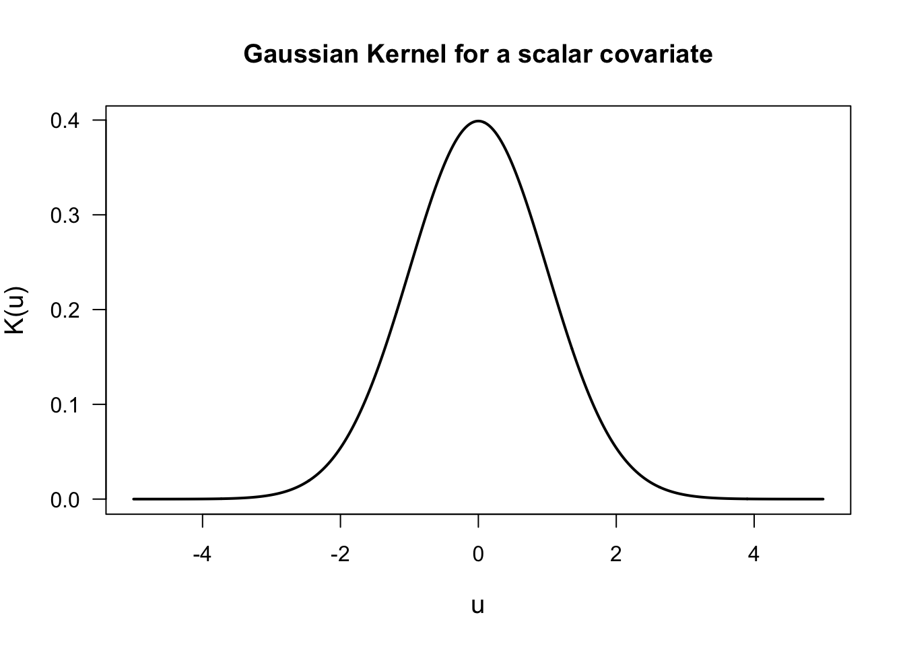

# Nonparametric Regression with Longitudinal Data {#nonpar-regression}


## Notation

* For **longitudinal data**, we will again use the following **notation**: 
    + Individual $i$ has observations for both the outcome and the covariates at times $t_{i1}, \ldots, t_{in_{i}}$
   
    + $Y_{ij}$ is the outcome for individual $i$ at time $t_{ij}$.
    
    + $\mathbf{x}_{ij}$ is the vector of covariates at time $t_{ij}$.
    
    + The $i^{th}$ individual has $n_{i}$ observations: $Y_{i1}, \ldots, Y_{in_{i}}$.
    
    + There will be $m$ individuals in the study (so $1 \leq i \leq m$).


* A general regression model relating $Y_{ij}$ and $\mathbf{x}_{ij}$ is the following:
\begin{equation}
Y_{ij} = \mu( \mathbf{x}_{ij} ) + \varepsilon_{ij}  \nonumber
\end{equation}

* Here, $\mu(\mathbf{x}_{ij}) = E(Y_{ij}| \mathbf{x}_{ij})$  is the "mean function".

* In **nonparametric approaches** to estimating $\mu(\cdot)$, we will try to estimate $\mu(\mathbf{x})$ without
making any strong assumptions about the form of $\mu( \mathbf{x} )$.

* Basically, in a nonparametric approach, there is not a fixed set of parameters describing 
the mean function that does not change as the sample size grows.


## Kernel Smoothing

### Description of Kernel Regression

* With **kernel regression**, we estimate the mean function $\mu(\mathbf{x})$ at $\mathbf{x}$
by taking a weighted **"local average"** of the $Y_{ij}$ around $\mathbf{x}$.

* Specifically, the **kernel regression estimate** of $\mu(\cdot)$ at a point $\mathbf{x}$ can be expressed as
\begin{equation}
\hat{\mu}( \mathbf{x} ) = \sum_{i=1}^{m}\sum_{j=1}^{n_{i}} w_{ij}(\mathbf{x})Y_{ij} 
\end{equation}

* The **"weights"** at the point $\mathbf{x}$ are given by
\begin{equation}
w_{ij}(\mathbf{x}) = \frac{ K\Big( \frac{\mathbf{x} - \mathbf{x}_{ij}}{ h_{n} }\Big) }{ \sum_{i=1}^{m}\sum_{j=1}^{n_{i}} K\Big( \frac{\mathbf{x} - \mathbf{x}_{ij}}{ h_{n} }\Big)  }
(\#eq:nw-weights)
\end{equation}

* When using the weights \@ref(eq:nw-weights), $\hat{\mu}(\mathbf{x})$ is known as the **Nadaraya-Watson** esitmator.

---

* The function $K(\cdot)$ in \@ref(eq:nw-weights) is referred to as the **"kernel function"**.

* The **kernel function** $K(\cdot)$ is: 
   + A smooth nonnegative function 
   + Symmetric around $0$ 
   + Has a mode at $0$ and decays the further you go away from $0$

* A common choice of $K(\cdot)$ is the **Gaussian kernel**
\begin{equation}
K(\mathbf{u}) = \exp\Big\{ - \frac{||\mathbf{u}||^{2}}{2} \Big\}
\end{equation}



---

* Observations where $\mathbf{x}_{ij}$ is **"close"** to $\mathbf{x}$ will be given 
a larger weight $w_{ij}(\mathbf{x})$ because $||\mathbf{x} - \mathbf{x}_{ij}||^{2}$ will be small.

* Similarly, observations where $\mathbf{x}_{ij}$ is **"far away"** from $\mathbf{x}$ will be given 
a smaller weight $w_{ij}(\mathbf{x})$ because $||\mathbf{x} - \mathbf{x}_{ij}||^{2}$ will be small.

--- 

* The term $h_{n} > 0$ is referred to as the **bandwidth**.

* The **bandwidth** determines how many observations have 
a strong impact on the value of $\hat{\mu}( \mathbf{x} )$.

* If the bandwidth $h_{n}$ is **small**, observations close to $\mathbf{x}$ will largely
determine the value of $\hat{\mu}(\mathbf{x})$.

* If the bandwidth $h_{n}$ is **large**, the value of $\hat{\mu}(\mathbf{x})$ will be more heavily influenced 
by a larger number of observations.

---

* Kernel regression estimates with a **smaller bandwidth** will be more "wiggly" and **non-smooth**.

* Kernel regression estimates with a **larger bandwidth** will be more **smooth**.

### Kernel Regression in the sleepstudy data

* Again, let's look at the **sleepstudy** data from the **lme4** package.

* The **sleepstudy** data had 18 participants with **reaction time**
measured across 10 days.


```r
library(lme4)
```

```
## Loading required package: Matrix
```

```r
data(sleepstudy)
head(sleepstudy)
```

```
##   Reaction Days Subject
## 1 249.5600    0     308
## 2 258.7047    1     308
## 3 250.8006    2     308
## 4 321.4398    3     308
## 5 356.8519    4     308
## 6 414.6901    5     308
```


---

* We can estimate the **marginal mean function** for the **sleepstudy** data by using a **GEE**. 

* We will assume that reaction time is a **linear function** of time on study: 
    + That is, we will assume that $\mu(t) = \beta_{0} + \beta_{1} t$.

```r
library(geepack)
## Use AR(1) correlation structure
sleep.gee <- geeglm(Reaction ~ Days, data=sleepstudy, id=Subject, corstr="ar1") 
```

* To get the value of the estimated **regression function**, we can use the first
$10$ fitted values (because the fitted values for each subject are the same as the overall mean function)

```r
## Estimated mean function at each time point
gee.regfn <- sleep.gee$fitted.values[1:10,1] 

### Now plot the estimated mean function
plot(sleepstudy$Days, sleepstudy$Reaction, las=1, ylab="Reaction Time", xlab="Days",
     main="Sleepstudy: GEE estimate of Mean Function", type="n")
points(sleepstudy$Days, sleepstudy$Reaction, pch=16, cex=0.8)
lines(0:9, gee.regfn, lwd=2, col="red")
```


---

* To find a kernel regression estimate of the mean function, you can use the **ksmooth** function in **R**.

* One thing to note is that **ksmooth** only works for a scalar covariate.

* Using a **bandwidth** of $0.5$ and a **Gaussian kernel**, we can find the kernel regression estimate of the mean function 
with the following **R** code:

```r
sleep.kernel <- ksmooth(sleepstudy$Days, sleepstudy$Reaction, kernel="normal",
                        bandwidth = 0.5)
```

* This will return a list with an "x vector" and a "y vector".

* The `x` vector will be the vector of points at which the regression function
is estimated. The `y` vector will be a vector containing the estimated values of the regression function.

---

* Let's **plot** the estimated mean function to see what it looks like:

```r
plot(sleepstudy$Days, sleepstudy$Reaction, las=1, ylab="Reaction Time", xlab="Days",
     main="Sleepstudy: Kernel Regression with Bandwidth = 0.5", type="n")
points(sleepstudy$Days, sleepstudy$Reaction, pch=16, cex=0.8)
lines(sleep.kernel$x, sleep.kernel$y, lwd=2, col="red")
```


* This **bandwidth** looks too small. There are clear "near jumps" in between 
some of the days.   

* We can try a **bandwidth** of $1$ to see if we can smooth this out a bit.

```r
sleep.kernel.bw1 <- ksmooth(sleepstudy$Days, sleepstudy$Reaction, kernel="normal",
                        bandwidth = 1)

plot(sleepstudy$Days, sleepstudy$Reaction, las=1, ylab="Reaction Time", xlab="Days",
     main="Sleepstudy: Kernel Regression with Bandwidth = 1", type="n")
points(sleepstudy$Days, sleepstudy$Reaction, pch=16, cex=0.8)
lines(sleep.kernel.bw1$x, sleep.kernel.bw1$y, lwd=2, col="red")
```


### Bandwidth Selection

* The bandwidth can be chosen to get a level of smoothness that looks good visually.

* For example, when observations are only collected daily like in the **sleepstudy** 
you will probably want to choose a bandwidth so that the estimated mean function
does not have obvious bumps in between days.

---

* To choose the bandwidth $h_{n} > 0$ using a formal criterion, a common approach is 
to use **leave-one-out** cross-validation.

* In the context of **longitudinal data**, it is usually suggested that you 
leave one **subject** out at a time rather than one **observation** at a time (@rice1991).

* The reason for this is that the **subject-level leave-one-out cross-validation** score is
a good estimate of the **mean-squared prediction error** of regardless of what the 
correlation structure is for the within-subject outcomes.

* This is not the case when using **observation-level leave-one-out cross-validation**.

---

* The **subject-level leave-one-out cross-validation score** for a given bandwidth choice is
defined as
\begin{equation}
\textrm{LOOCV}(h_{n}) = \sum_{i=1}^{n}\sum_{j=1}^{m_{i}} \{ Y_{ij} - \hat{\mu}_{h_{n}}^{(-i)}(\mathbf{x}_{ij}) \}^{2}
\end{equation}

* Here, $\hat{\mu}_{h_{n}}^{(-i)}(\mathbf{x}_{ij})$ is the mean function estimate when using 
**bandwidth** $h_{n}$ and when ignoring the data from subject $i$.

### Another Example: The Bone Data

* As another example, we can use the "bone" dataset.

* This is a **longitudinal dataset** with typically 2 or 3 observations per individual.


```r
bonedat <- read.table("https://web.stanford.edu/~hastie/ElemStatLearn/datasets/bone.data", 
                      header=TRUE)
head(bonedat)
```

```
##   idnum   age gender      spnbmd
## 1     1 11.70   male 0.018080670
## 2     1 12.70   male 0.060109290
## 3     1 13.75   male 0.005857545
## 4     2 13.25   male 0.010263930
## 5     2 14.30   male 0.210526300
## 6     2 15.30   male 0.040843210
```

* For this data, the interest would be to model the mean function for bone mineral 
density (the variable `spnbmd`) as a function of `age`


---

* We can compute the leave-one-out cross-validation score for the **bone** data 
for **different** values of $h_{n}$ (here $0.1 \leq h_{n} \leq 1$) with the following code:

```r
nh <- 200
hh <- seq(.1, 1, length.out=nh)
LOOCV <- rep(0, nh)
subj.list <- unique(bonedat$idnum)
nsubj <- length(subj.list)
for(k in 1:nh) {
    ss <- 0
    for(i in 1:nsubj) {
        ind <- bonedat$idnum==subj.list[i]
        yy <- bonedat$spnbmd[-ind]
        xx <- bonedat$age[-ind]
        tmp <- ksmooth(xx, yy, kernel="normal", bandwidth = hh[k],
                       x.points=bonedat$age[ind])
        mu.hat <- tmp$y
        ss <- ss + sum((bonedat$spnbmd[ind] - mu.hat)^2)
    }
    LOOCV[k] <- ss
}
hh[which.min(LOOCV)] ## best seems to be 0.1
```

```
## [1] 0.1
```

* In this case, the best **bandwidth** was $0.1$ according to the
subject-level leave-one-out cross-validation criterion.

---

* The kernel regression estimate of the mean function with the bandwidth of $0.1$ is plotted below:


```r
bone.kernel <- ksmooth(bonedat$age, bonedat$spnbmd, kernel="normal",
                        bandwidth = 0.1, x.points=seq(9.4, 25, length.out=100))

plot(bonedat$age, bonedat$spnbmd, las=1, ylab="spnbmd", xlab="age",
     main="Bone Data: Kernel Regression with Bandwidth = 0.1", type="n")
points(bonedat$age, bonedat$spnbmd, pch=16, cex=0.8)
lines(bone.kernel$x, bone.kernel$y, lwd=2, col="red")
```


* Using a bandwidth of $1$ gives a smoother mean function estimate.


---

* The performance of kernel regression methods can degrade quickly as we move to higher dimensions.
The convergence rate of the estimated regression function to the true regression function slows substantially
as we the dimension of the covariates $\mathbf{x}_{ij}$.

* "Curse of dimensionality" - need very large datasets to have a sufficient number of observations
near a given point $\mathbf{x}$.

* Another approach when using multiple covariates is to use **generalized additive models.**

* With **generalized additive models**, the mean function is expressed 
as the sum of several univariate nonparametric functions:
\begin{equation}
\mu(\mathbf{x}) = \beta_{0} + \mu(x_{1}) + \mu(x_{2}) + \ldots + \mu(x_{p})
\end{equation}


## Regression Splines

### Overview
* Using **regression splines** is another common nonparametric approach for estimating a 
mean function.

* The most common type of spline used in the context of nonparametric regression is the **cubic spline**. 

* **Definition**: A **cubic spline** with knots $u_{1} < u_{2} < \ldots < u_{q}$ is a function $f(x)$ such that
    + $f(x)$ is a cubic function over each of the intervals $(-\infty, u_{1}], [u_{1}, u_{2}], \ldots, [u_{q-1}, u_{q}], [u_{q}, \infty)$.
    + $f(x)$, $f'(x)$, and $f''(x)$ are all continuous functions.

---

* A commonly used set of **basis functions** for the set of cubic splines with knots $u_{1} < u_{2} < \ldots < u_{q}$ is the **B-spline** basis functions.

* This means that if $\varphi_{1, B}(x), \ldots, \varphi_{q+4, B}(x)$ are the B-spline **basis functions**
for the set of cubic splines with knots $u_{1} < u_{2} < \ldots < u_{q}$, we can represent any cubic spline
estimate of the mean function as
\begin{equation}
\hat{\mu}(x) = \sum_{j=1}^{q+4} \hat{\beta}_{1}\varphi_{j, B}(x)
\end{equation}

* The nice thing about using regression splines is that they can estimated
in the same way as you would in a typical regression setting.

* The columns of the design matrix will be filled in with the values of $\varphi_{j,B}(x_{i})$.


### Regression Splines with Longitudinal Data in R

* Regression splines can be fitted in R by using the `splines` package

```r
library(splines)
```

* The `bs` function in `splines` generates the B-spline "design" matrix 

```r
bs(x, df, knots, degree)
```
* `x` - vector of covariates values. This can also just be the name of a variable when `bs` is used inside a function such as `geeglm`.
* `df` - the "degrees of freedom". For a cubic spline this is actually $q + 3$ rather than $q + 4$. If you just enter `df`, the `bs` function will pick the knots for you.
* `knots` - the vector of knots. If you don't want to pick the knots, you can just enter a number for the `df`.
* `degree` - the degree of the piecewise polynomial. Typically, `degree=3` which would be a cubic spline.

---

* You can directly use **regression splines** within the **"GEE framework"**.

* In this case, you can model the marginal mean (or part of the marginal mean function) with a spline.

---

* For example, with the **bone data**, suppose we want to fit separate curves for the male and female
groups.

* We could express the mean function $\mu(\cdot)$ as
\begin{equation}
\mu(t_{ij}) = f_{0}(t_{ij}) + A_{ij}f_{1}(t_{ij})
(\#eq:gee-bone)
\end{equation}

* $f_{0}(\cdot)$ and $f_{1}(\cdot)$ would be modeled with regression splines.

* $t_{ij}$ is the value of **age** for observation (i,j)

* $A_{ij} = 1$ if the $(i,j)$ observation corresponds to a male individual 
and $A_{ij} = 0$ if the $(i,j)$ observation corresponds to a female individual.

---

* To fit model \@ref(eq:gee-bone) using the `geepack` package, you can use the following code

```r
library(splines)
gee.bone <- geeglm(spnbmd ~ bs(age, df=6) + gender*bs(age,df=6), id=idnum, data=bonedat)
```

* We can plot the estimated mean functions by first extracting the **fitted values** for both the male and female groups:

```r
male.fitted <- gee.bone$fitted.values[bonedat$gender=="male"]
male.age <- bonedat$age[bonedat$gender=="male"]
female.fitted <- gee.bone$fitted.values[bonedat$gender=="female"]
female.age <- bonedat$age[bonedat$gender=="female"]
```

* Now, plot the fitted curves for both groups

```r
plot(bonedat$age, bonedat$spnbmd, lwd=1, xlab="age", ylab="spnbmd", 
     main="Regression Splines for the Bone Data")
points(bonedat$age[bonedat$gender=="male"], bonedat$spnbmd[bonedat$gender=="male"], 
       cex=0.8)
points(bonedat$age[bonedat$gender=="female"], bonedat$spnbmd[bonedat$gender=="female"], 
       pch=16, cex=0.8)
lines(male.age[order(male.age)], male.fitted[order(male.age)], col="red", lwd=2)
lines(female.age[order(female.age)], female.fitted[order(female.age)], col="blue", 
      lwd=2)
legend("topright", legend=c("Male", "Female"), col=c("red", "blue"), lwd=3, bty='n')
```


---
