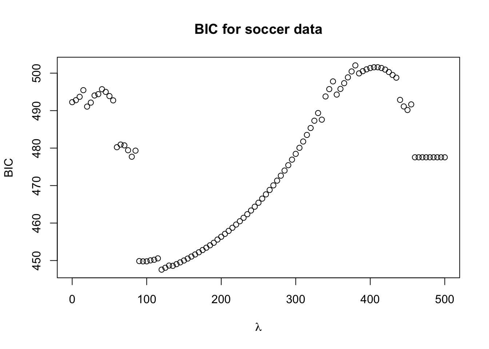

# Sparse Regression for Longitudinal Data {#glmm-lasso}


---

## Sparse regression methods

* Sparse regression methods typically involve estimating the regression 
coefficients by minimizing a **penalized** least-squares criterion.

* The most well-known sparse regression method is the **lasso**.

* With the **lasso**, the regression coefficients $\boldsymbol{\beta}$ are 
found by minimizing the following penalized least-squares criterion:
\begin{equation}
Q_{\lambda}(\boldsymbol{\beta}) = \sum_{i=1}^{n}(y_{i} - \mathbf{x}_{i}^{T}\boldsymbol{\beta})^{2} + \lambda \sum_{j=1}^{p}|\beta_{j}|
\end{equation}

---

* An advantage of the **lasso** is that many of the individual estimated regression coefficients $\hat{\beta}_{j}$
will equal zero **exactly**.

* So, you can think of the lasso as performing **variable selection**
    + The regression coefficient estimates which are non-zero will be the "selected" variables.

---

* $\lambda \geq 0$ in the $L_{1}$ penalty function $\lambda \sum_{j=1}^{p}|\beta_{j}|$ is referred to as the "tuning parameter".

* If $\lambda$ is **large enough**, **all** of the estimated regression coefficients will be equal to zero.

* If $\lambda = 0$, then the estimated regression coefficients will be the same as
the usual least-squares estimates.

* For **intermediate** values of $\lambda$, some regression coefficients will be **"selected"** with
the remaining regression coefficient estimates being set to zero.

* The value of the tuning parameter $\lambda$ is usually chosen through **cross-validation**.

* **Lasso paths**: You can plot the values of the regression coefficients for different values of $\lambda$
to get a sense of which variables are selected first.

---

* In addition to performing variable selection, the lasso also **shrinks** the regression
coefficients **towards zero**. 

*  This can improve predictive performance when the regression coefficient estimates
have **high variance**.
    + This can occur, for example, if the matrix $\mathbf{X}^{T}\mathbf{X}$ is poorly conditioned.

* Another advantage of the lasso and other penalized regression methods is 
that they can be used when the number of variables is **greater** than the 
number of observations.


  
## The Lasso with longitudinal data

**Recall our notation for longitudinal data**:

* $Y_{ij}$ - outcome for individual $i$ at time $t_{ij}$.

* $\mathbf{x}_{ij}$ - vector of covariates for individual $i$ at time $t_{ij}$.

* $\mathbf{z}_{ij}$ - vector determining form of random effects for individual $i$ at time $t_{ij}$

---

* With **penalized regression for longitudinal data**, 
the linear mixed model still assumes that
\begin{eqnarray}
Y_{ij} &=& 
\beta_{0} + \mathbf{x}_{ij}^{T}\boldsymbol{\beta} + b_{ij} + e_{ij} \nonumber \\
&=& \beta_{0} + \mathbf{x}_{ij}^{T}\boldsymbol{\beta} + \mathbf{z}_{ij}^{T}\mathbf{u}_{i} + e_{ij}
(\#eq:lmm-general)
\end{eqnarray}
    + $\boldsymbol{\beta}$ - vector of fixed effects
    + $\mathbf{u}_{i}$ - vector of random effects
    + $\mathbf{u}_{i} \sim \textrm{Normal}(0, \boldsymbol{\Sigma})$.
    + $e_{ij} \sim \textrm{Normal}(0, \sigma^{2})$.

---

* Let $\mathbf{Y}$ be the vector of responses stacked in "long form":
    + $\mathbf{Y} = (Y_{11}, Y_{12}, ...., Y_{mn_{m}})$
    
* Under the assumed linear mixed model \@ref(eq:lmm-general), we have
\begin{equation}
\mathbf{Y} \sim \textrm{Normal}(\mathbf{X}\boldsymbol{\beta}, \mathbf{V})
\end{equation}

* $\mathbf{V} = \mathbf{Z}\textrm{Cov}(\mathbf{u})\mathbf{Z}^{T} + \sigma^{2}\mathbf{I}$.
    + $\textrm{Cov}(\mathbf{u})$ is the covariance matrix for the "stacked" vector of random effects $\mathbf{u}$.
    
    + $\textrm{Cov}(\mathbf{u})$ will be a **"block diagonal"** matrix with the blocks being $\boldsymbol{\Sigma}$.

* 
\begin{equation}
\textrm{Cov}(\mathbf{u}) = 
\begin{bmatrix}
\boldsymbol{\Sigma} & \mathbf{0} & \mathbf{0} & \ldots & \mathbf{0} \\
\mathbf{0} & \boldsymbol{\Sigma} & \mathbf{0} & \ldots & \mathbf{0} \\
\mathbf{0} & \mathbf{0} & \boldsymbol{\Sigma}  & \ldots & \mathbf{0} \\
\vdots & & & \ddots & \vdots \\
\mathbf{0} & \mathbf{0} & \mathbf{0} & \ldots & \boldsymbol{\Sigma}
\end{bmatrix}
\end{equation}
---

* With the **LMM-Lasso** (@schelldorfer2011), you estimate the vector of fixed effects $\boldsymbol{\beta}$
and the parameters in $\mathbf{V}$
by minimizing the following penalized negative log-likelihood:
\begin{equation}
Q_{\lambda}(\boldsymbol{\beta}, \mathbf{V}) = \frac{1}{2}\log\det(\mathbf{V}) + \frac{1}{2}(\mathbf{Y} - \mathbf{X}\boldsymbol{\beta})^{T}\mathbf{V}^{-1}
(\mathbf{Y} - \mathbf{X}\boldsymbol{\beta}) + \lambda\sum_{j=1}^{p}\beta_{j}
\end{equation}

* In @schelldorfer2011, suggest using a Bayesian information criterion (BIC) to choose the tuning
parameter $\lambda$.

* This is defined as 
\begin{equation}
\textrm{BIC}_{\lambda} = -2 \times \textrm{log-likelihood} + \log(n) \times df_{\lambda} 
\end{equation}
    + $df_{\lambda}$ is equal to the number of non-zero regression coefficients when using $\lambda$ **plus** the 
    number of paramaters in the matrix $\mathbf{V}$.
    
## Lasso for LMMs and GLMMs in R

* One **R** package which fits linear mixed models and generalized linear mixed models
with the Lasso penalty is the **glmmLasso** package.

* There are also methods and R implementations for penalized regression with GEEs. See, 
for example, the paper: @wang2012
    + I won't cover that today.


### Soccer Data
* To briefly show how this works, we can use the **soccer** data from the **glmmLasso** package.

* This is actually not a longitudinal dataset, but it does have repeated measures. 

* This dataset has **54 observations** with **23 unique teams**.

* Each row in this dataset corresponds to data taken from a single team in a single season.

```r
library(glmmLasso)
data("soccer")
dim(soccer)  ## 54 observations and 16 variables
```

```
## [1] 54 16
```

```r
head(soccer)
```

```
##     pos            team points transfer.spendings transfer.receits yellow.card
## 338  12     1. FC Koeln     39            5150000           750000          70
## 357  13     1. FC Koeln     38           11500000           900000          70
## 324  16 1. FC Nuernberg     31            5400000          6350000          61
## 360  16 1. FC Nuernberg     31             450000          1900000          53
## 353   9 1. FSV Mainz 05     47            3000000           200000          58
## 333   7 1899 Hoffenheim     55           11950000           125000          70
##     yellow.red.card red.card unfair.score ave.unfair.score ball.possession
## 338               2        2           86             2.53           49.02
## 357               1        3           88             2.59           48.23
## 324               3        0           70             2.06           52.02
## 360               2        0           59             1.74           50.41
## 353               1        3           76             2.24           47.76
## 333               3        3           94             2.76           49.64
##     tackles capacity total.attend ave.attend sold.out
## 338   49.17    50076       853767      50222       11
## 357   48.94    50076       822102      48359        6
## 324   51.26    48548       742739      43691        2
## 360   49.61    48548       719705      42336        5
## 353   49.44    20300       342350      20138       11
## 333   50.38    30164       477414      28083       17
```

```r
length(unique(soccer$team)) ## 23 unique teams
```

```
## [1] 23
```

---

* The variable `team` represents the soccer team. 
    + Each team has 2 or 3 seasons of data.

* The variable `points` represents the total number of points scored over the course of the season.

* There are a number of other variables that may explain some of the variation in 
points scored: `ball.possession`, `tackles`, etc.

---

* We will use `points` and 10 of the other variables as the fixed-effects covariates.

* It is common in practice to **center and scale** the covariates before running the lasso:

```r
soccer[,c(4,5,9:16)] <- scale(soccer[,c(4,5,9:16)], center=TRUE, scale=TRUE)
soccer <- data.frame(soccer)
```

---

* To fit an lmm-lasso with $\lambda = 100$ and a random intercept for each team, we can use the following code


```r
lm.lambda100 <- glmmLasso(points ~ transfer.spendings + ave.unfair.score 
                                   + ball.possession + tackles 
                                   + ave.attend + sold.out, rnd = list(team=~1), 
                                  lambda=100, data = soccer)
```

* Note that the random effects model (i.e., the model for $b_{ij}$) is specified through the `rnd` argument.
    + `team = ~1` means that $b_{ij} = u_{i}$ for each $i,j$.
    
    


* To look at the summary of the parameter estimates, use `summary` 

```r
summary(lm.lambda100)
```

```
## Call:
## glmmLasso(fix = points ~ transfer.spendings + ave.unfair.score + 
##     ball.possession + tackles + ave.attend + sold.out, rnd = list(team = ~1), 
##     data = soccer, lambda = 100)
## 
## 
## Fixed Effects:
## 
## Coefficients:
##                    Estimate StdErr z.value p.value
## (Intercept)        43.74460     NA      NA      NA
## transfer.spendings  3.13598     NA      NA      NA
## ave.unfair.score    0.00000     NA      NA      NA
## ball.possession     1.00441     NA      NA      NA
## tackles             0.51338     NA      NA      NA
## ave.attend          1.55091     NA      NA      NA
## sold.out            3.54361     NA      NA      NA
## 
## Random Effects:
## 
## StdDev:
##          team
## team 2.431689
```

* All coefficient estimates are non-zero except for the "average unfariness score per match" variable

---

* If we set $\lambda = 500$, all of the coefficient estimates will be zero:

```r
lm.lambda500 <- glmmLasso(points ~ transfer.spendings + ave.unfair.score 
                                   + ball.possession + tackles 
                                   + ave.attend + sold.out, rnd = list(team=~1), 
                                   lambda=500, data = soccer)

summary(lm.lambda500)
```

```
## Call:
## glmmLasso(fix = points ~ transfer.spendings + ave.unfair.score + 
##     ball.possession + tackles + ave.attend + sold.out, rnd = list(team = ~1), 
##     data = soccer, lambda = 500)
## 
## 
## Fixed Effects:
## 
## Coefficients:
##                    Estimate StdErr z.value p.value
## (Intercept)          42.575     NA      NA      NA
## transfer.spendings    0.000     NA      NA      NA
## ave.unfair.score      0.000     NA      NA      NA
## ball.possession       0.000     NA      NA      NA
## tackles               0.000     NA      NA      NA
## ave.attend            0.000     NA      NA      NA
## sold.out              0.000     NA      NA      NA
## 
## Random Effects:
## 
## StdDev:
##          team
## team 11.88068
```


---

* We can find the value of BIC by looking at the `$bic` component of lm.lambda100

```r
lm.lambda100$bic
```

```
##           [,1]
## [1,] -122872.8
```

### Choosing the tuning parameter for the soccer data

* Because $\lambda = 500$ implies that all of the coefficient estimates are zero, we know
that the "best" value of $\lambda$ should be somewhere between $0$ and $500$.

* Let's compute the **BIC** across a grid of $\lambda$ values from $0$ to $500$ and plot the 
result

```r
lam.seq <- seq(0, 500, by=5)
BIC.values <- rep(0, length(lam.seq))
for(k in 1:length(lam.seq)) {
lm.tmp <- glmmLasso(points ~ transfer.spendings + ave.unfair.score 
                          + ball.possession + tackles 
                          + ave.attend + sold.out, rnd = list(team=~1), 
                          lambda=lam.seq[k], data = soccer)
BIC.values[k] <- lm.tmp$bic
}
plot(lam.seq, BIC.values, xlab=expression(lambda), ylab="BIC", main="BIC for soccer data")
```



* It looks like the lowest **BIC** value is in between 0 and 50. 
    + Let's plot the BIC values for a denser grid of $\lambda$ values between 0 and 50


```r
lam.seq <- seq(0, 50, by=1)
BIC.values <- rep(0, length(lam.seq))
for(k in 1:length(lam.seq)) {
  lm.tmp <- glmmLasso(points ~ transfer.spendings + ave.unfair.score 
                      + ball.possession + tackles 
                      + ave.attend + sold.out, rnd = list(team=~1), 
                      lambda=lam.seq[k], data = soccer)
  BIC.values[k] <- lm.tmp$bic
}
plot(lam.seq, BIC.values, xlab=expression(lambda), ylab="BIC", main="BIC for soccer data")
lines(lam.seq, BIC.values)
```


* The best value of $\lambda$ according to the BIC criterion is $16$:

```r
lam.seq[which.min(BIC.values)]
```

```
## [1] 16
```

---

* Let's look at the regression coefficient estimates using $\lambda = 16$

```r
lm.lambda16 <- glmmLasso(points ~ transfer.spendings + ave.unfair.score 
                                   + ball.possession + tackles 
                                   + ave.attend + sold.out, rnd = list(team=~1), 
                                   lambda=16, data = soccer)

summary(lm.lambda16)
```

```
## Call:
## glmmLasso(fix = points ~ transfer.spendings + ave.unfair.score + 
##     ball.possession + tackles + ave.attend + sold.out, rnd = list(team = ~1), 
##     data = soccer, lambda = 16)
## 
## 
## Fixed Effects:
## 
## Coefficients:
##                     Estimate StdErr z.value p.value
## (Intercept)        43.858182     NA      NA      NA
## transfer.spendings  2.779951     NA      NA      NA
## ave.unfair.score   -0.130634     NA      NA      NA
## ball.possession    -0.082063     NA      NA      NA
## tackles             0.000000     NA      NA      NA
## ave.attend          3.361656     NA      NA      NA
## sold.out            4.970522     NA      NA      NA
## 
## Random Effects:
## 
## StdDev:
##          team
## team 5.632609
```

## Cross-Validation for Longitudinal Data

* **Cross-validation** without any longitudinal or repeated-measures structure is pretty straightforward.

* For longitudinal data, the type of cross-validation can depend on the **prediction goals/context**. 

* In many cases, it makes sense to hold out **random individuals** (or groups) in each **test set**.

* In other words, each **training set** would look like the following:
\begin{equation}
\mathcal{T}_{r} = \{ \textrm{ all } (Y_{ij}, \mathbf{x}_{ij}), \textrm{such that } i \in \mathcal{S} \} 
\end{equation}
where $\mathcal{S}$ is a random subset of indeces.

---

* In cases where you are thinking of using your model for **forecasting**, it may make sense 
to use an **alternative strategy** for cross-validation.

* In this case, you may want to construct the test sets so that they only contain observations
at **"future" time points** when compared with the training set. 

---

* Let's try doing **5-fold** cross-validation with the `soccer` data.

* To do this, it's easier to just create a **team id** variable first

```r
team.labels<-data.frame(team=unique(soccer$team),team.id=as.numeric(unique(soccer$team)))
soccer <- merge(soccer, team.labels, by="team")
head(soccer)
```

```
##              team pos points transfer.spendings transfer.receits yellow.card
## 1     1. FC Koeln  12     39        -0.47350170       -0.6774385          70
## 2     1. FC Koeln  13     38        -0.08019776       -0.6624274          70
## 3 1. FC Nuernberg  16     31        -0.45801729       -0.1170267          61
## 4 1. FC Nuernberg  16     31        -0.76460855       -0.5623539          53
## 5 1. FSV Mainz 05   9     47        -0.60666760       -0.7324789          58
## 6 1899 Hoffenheim   7     55        -0.05232583       -0.7399844          70
##   yellow.red.card red.card unfair.score ave.unfair.score ball.possession
## 1               2        2    1.0002188        1.0005114      -0.2847609
## 2               1        3    1.1494227        1.1527733      -0.5154026
## 3               3        0   -0.1934125       -0.1922072       0.5910938
## 4               2        0   -1.0140340       -1.0042709       0.1210518
## 5               1        3    0.2541992        0.2645786      -0.6526198
## 6               3        3    1.5970344        1.5841821      -0.1037509
##      tackles   capacity total.attend  ave.attend   sold.out team.id
## 1 -0.5594251  0.1908255   0.52774513  0.52776771  0.9696315       1
## 2 -0.7152112  0.1908255   0.41510241  0.41510371 -0.1303706       1
## 3  0.8561964  0.1027586   0.13278238  0.13280873 -1.0103723       2
## 4 -0.2613995  0.1027586   0.05084294  0.05086578 -0.3503711       2
## 5 -0.3765458 -1.5253268  -1.29153165 -1.29154724  0.9696315       3
## 6  0.2601452 -0.9568110  -0.81106503 -0.81107731  2.2896341       4
```

* Now create each of the 5 **test sets**.

```r
set.seed(2352)
## first create the indices for the test sets
nfolds <- 5
test.groups <- sample(1:nfolds, size=23, replace=TRUE)
test.groups
```

```
##  [1] 2 5 2 5 4 3 1 4 1 2 3 5 3 1 5 2 1 4 3 2 4 5 4
```

```r
## test.groups == k means that the observation will be in the kth test set
## For such a small dataset, you may want to randomly generate the
## test sets so that they all have the same size.
```

---

* Now, compute cross-validation estimates of the **mean-squared error** over a grid of $\lambda$ values


```r
lam.seq <- seq(0, 200, by=5)
MSE <- matrix(0, nfolds, length(lam.seq))
for(j in 1:length(lam.seq)) {
    
    for(k in 1:nfolds) {
       soccer.test <- soccer[test.groups==k,]
       soccer.train <- soccer[test.groups!=k,]
       
       tmp.lm <- glmmLasso(points ~ transfer.spendings + ave.unfair.score 
                 + ball.possession + tackles 
                 + ave.attend + sold.out, rnd = list(team=~1),
                 lambda=lam.seq[j], data = soccer.train)
       
       predicted.values <- predict(tmp.lm, newdata=soccer.test)
       MSE[k,j] <- mean((predicted.values - soccer.test$points)^2)
    }
}
plot(lam.seq, colMeans(MSE), xlab=expression(lambda), ylab="MSE", main="5-fold
     cross-validation for the soccer data")
lines(lam.seq, colMeans(MSE))
```


* According to the cross-validation estimates of prediction error, the 
best value of $\lambda$ is roughly $80$. 

## GLMM-Lasso with Binary Outcomes

* You can use `glmmLasso` with **binary outcomes** by adding the `family=binomial()` argument.

* As a quick example, let's look at the `ohio` data from the `geepack` package.

```r
library(geepack)
data(ohio)
head(ohio)
```

```
##   resp id age smoke
## 1    0  0  -2     0
## 2    0  0  -1     0
## 3    0  0   0     0
## 4    0  0   1     0
## 5    0  1  -2     0
## 6    0  1  -1     0
```

* For the `glmmLasso` function, you do need to make sure the "id variable" is a factor.

```r
ohio$id <- factor(ohio$id) 
```

* Let's now fit a penalized generalized linear mixed model with $\lambda = 10$:

```r
ohio.fit10 <- glmmLasso(smoke ~ resp + age, family=binomial(), rnd = list(id=~1),
                      lambda=10, data = ohio)
```

* It looks like the **wheeze status** variable was selected while the **age** variable was not.

```r
summary(ohio.fit10)
```

```
## Call:
## glmmLasso(fix = smoke ~ resp + age, rnd = list(id = ~1), data = ohio, 
##     lambda = 10, family = binomial())
## 
## 
## Fixed Effects:
## 
## Coefficients:
##             Estimate StdErr z.value p.value
## (Intercept) -1.03844     NA      NA      NA
## resp         0.10501     NA      NA      NA
## age          0.00000     NA      NA      NA
## 
## Random Effects:
## 
## StdDev:
##          id
## id 2.674618
```

---
