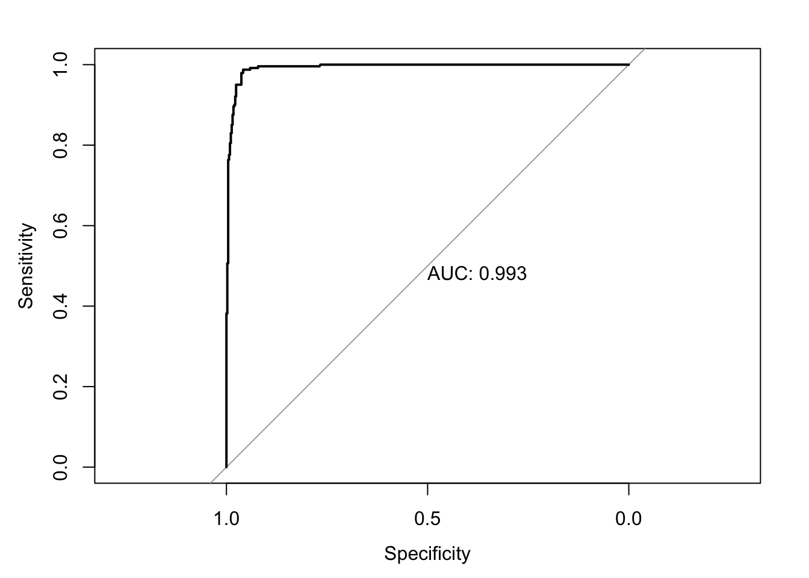

# Risk Prediction and Validation (Part I) {#risk-prediction}


---

## Risk Prediction/Stratification

* For **binary outcomes**, a **risk prediction** is related 
to the predicted probability that an individual has or will develop
a certain condition/trait.

* **Examples** of a risk prediction for a binary outcome:
    + Probability that someone has hypertension.

    + Probability that someone has type-2 diabetes.
    
    + Probability someone will be hospitalized over the next 1 year.
    
    
* **Risk stratification**: Often, a risk prediction model 
will only report whether or not someone belongs to one of several **risk strata**.
   + For example, **high**, **medium**, or **low risk**.


## Area under the ROC curve and the C-statistic

### Sensitivity and Specificity

* Let $g(\mathbf{x}_{i})$ be a **risk score** for an individual with covariate vector $\mathbf{x}_{i}$.

* Higher values of $g(\mathbf{x}_{i})$ are supposed to imply greater probability that the binary 
outcome $Y_{i}$ is equal to $1$.
    + Though $g(\mathbf{x}_{i})$ does not necessarily have to be a predicted probability.

* The value $t$ will be a **threshold** which determines whether or not, we predict $Y_{i} = 1$ or not.
    + $g(\mathbf{x}_{i}) \geq t$ implies $Y_{i} = 1$
    + $g(\mathbf{x}_{i}) < t$ implies $Y_{i} = 0$

---

* The **sensitivity** of the risk score $g(\mathbf{x}_{i})$ with the threshold $t$ is defined
as the probability you "predict" $Y_{i} = 1$ assuming that $Y_{i}$ is, in fact, equal to $1$.

* In other words, the **sensitivity** is the probability of making the right decision
given that $Y_{i} = 1$.
   + Sensitivity is often called the **"true positive rate"**.
   
   
* The **sensitivity** is defined as:
\begin{eqnarray}
\textrm{Sensitivity}(t; g)
&=& P\big\{ g(\mathbf{x}_{i}) \geq t| Y_{i} = 1 \big\} \nonumber \\
&=& \frac{P\big\{ g(\mathbf{x}_{i}) \geq t, Y_{i} = 1 \big\}}{P\big\{ Y_{i} = 1 \big\} }\nonumber \\
&=& \frac{P\big\{ g(\mathbf{x}_{i}) \geq t, Y_{i} = 1 \big\}}{
P\big\{ g(\mathbf{x}_{i}) \geq t, Y_{i} = 1 \big\} + P\big\{ g(\mathbf{x}_{i}) < t, Y_{i} = 1 \big\}}
\end{eqnarray}

* For a worthless risk score that is totally uninformative about the outcome, we should expect
the sensitivity to be close to $P\{ g(\mathbf{x}_{i}) \geq t \}$.

---

* You can compute the **in-sample** sensitivity with
\begin{eqnarray}
\hat{\textrm{Sensitivity}}(t; g)
&=& \frac{\sum_{i=1}^{n} I\big\{ g(\mathbf{x}_{i}) \geq t, Y_{i} = 1 \big\} }{
 \sum_{i=1}^{n} I\big\{g(\mathbf{x}_{i}) \geq t, Y_{i} = 1 \big\} + \sum_{i=1}^{n} I\big\{ g(\mathbf{x}_{i}) < t, Y_{i} = 1 \big\}} \nonumber \\
&=& \frac{\textrm{number of true positives}}{\textrm{number of true positives} + \textrm{number of false negatives} }
\end{eqnarray}

---

* The **specificity** of the risk score $g(\mathbf{x}_{i})$ with the threshold $t$ is defined
as the probability you "predict" $Y_{i} = 0$ assuming that $Y_{i}$ is, in fact, equal to $0$.

* The **specificity** is defined as:
\begin{eqnarray}
\textrm{Specificity}(t; g)
&=& P\big\{ g(\mathbf{x}_{i}) < t| Y_{i} = 0 \big\} \nonumber \\
&=& \frac{P\big\{ g(\mathbf{x}_{i}) < t, Y_{i} = 0 \big\}}{
P\big\{ g(\mathbf{x}_{i}) < t, Y_{i} = 0 \big\} + P\big\{ g(\mathbf{x}_{i}) \geq t, Y_{i} = 0 \big\}}
\end{eqnarray}

* Note that $1 - \textrm{Specificity}(t; g) = P\big\{ g(\mathbf{x}_{i}) \geq t| Y_{i} = 0 \big\}$.
    + $1 - \textrm{Specificity}(t; g)$ is often called the "false positive rate"
    
---

* You can compute the **in-sample** specificity with
\begin{eqnarray}
\hat{\textrm{Specificity}}(t; g)
&=& \frac{\sum_{i=1}^{n} I\big\{ g(\mathbf{x}_{i}) < t, Y_{i} = 0 \big\} }{
 \sum_{i=1}^{n} I\big\{g(\mathbf{x}_{i}) < t, Y_{i} = 0 \big\} + \sum_{i=1}^{n} I\big\{ g(\mathbf{x}_{i}) \geq t, Y_{i} = 0 \big\}} \nonumber \\
&=& \frac{\textrm{number of true negatives}}{\textrm{number of true negatives} + \textrm{number of false positives} }
\end{eqnarray}


* For a worthless risk score that is totally uninformative about the outcome, we should expect
the specificity to be close to $P\{ g(\mathbf{x}_{i}) < t \}$.

* Note that **high values** of both **sensitivity** and **specificity** is good. 
   + For a "perfect" risk score, both sensitivity and specificity would be equal to $1$.

### The ROC curve

* The **receiver operating characteristic** (ROC) curve graphically depicts
how sensitivity and specificity change as the **threshold** $t$ varies. 

* Let $t_{i} = g(\mathbf{x}_{i})$ and let $t_{(1)} > t_{(2)} > ... > t_{(n)}$
be the ordered values of $t_{1}, \ldots, t_{n}$.

* To construct an **ROC** curve we are going to plot sentivity vs. 1 - specificity
for each of the thresholds $t_{(1)}, \ldots, t_{(n)}$. 

---

* Let $x_{i} = 1 - \hat{\textrm{Specificity}}(t_{(i)}; g)$ and 
$y_{i} = \hat{\textrm{Sensitivity}}(t_{(i)}; g)$.

* We will define $x_{0} = y_{0} = 0$ and $x_{n+1} = y_{n+1} = 1$.
    + $x_{0}$, $y_{0}$ represent 1 - specificity and sensitivity when using $t = \infty$.
    + $x_{n+1}$, $y_{n+1}$ represent 1 - specificity and sensitivity when using $t = -\infty$.

* Plotting $y_{i}$ vs. $x_{i}$ for $i = 0, \ldots, n+1$ will give you the **ROC** curve.

* Ideally, the values of $y_{i}$ will close to $1$ for all $i$.

* For a worthless risk score we should expect both $y_{i}$ and $x_{i}$
to be roughly equal to $P(g(\mathbf{x}_{i}) \geq t)$. 

* Hence, plotting $y_{i}$ vs. $x_{i}$ should be fairly close to the line $y=x$.

### Computing the ROC curve

* To try computing an **ROC** curve, we will use the Wisconsin Breast Cancer dataset
which is available in the `biopsy` dataset from the `MASS` package.


``` r
library(MASS)
data(biopsy)
head(biopsy)
```

```
##        ID V1 V2 V3 V4 V5 V6 V7 V8 V9     class
## 1 1000025  5  1  1  1  2  1  3  1  1    benign
## 2 1002945  5  4  4  5  7 10  3  2  1    benign
## 3 1015425  3  1  1  1  2  2  3  1  1    benign
## 4 1016277  6  8  8  1  3  4  3  7  1    benign
## 5 1017023  4  1  1  3  2  1  3  1  1    benign
## 6 1017122  8 10 10  8  7 10  9  7  1 malignant
```

``` r
## Look at number of "benign" and "malignant" tumors
table(biopsy$class)
```

```
## 
##    benign malignant 
##       458       241
```

``` r
biopsy$tumor.type <- ifelse(biopsy$class=="malignant", 1, 0)
table(biopsy$tumor.type)
```

```
## 
##   0   1 
## 458 241
```

* Let's compute **risk scores** for tumor malignancy by using a **logistic regression** model
with `class` as the **outcome** and variables `V1, V3, V4, V7, V8` as the **covariates**.

* Our risk score for the $i^{th}$ case,
will be the predicted probability of having a malignant tumor given the covariate information 


``` r
logreg.model <- glm(tumor.type ~ V1 + V3 + V4 + V7 + V8, family="binomial", data=biopsy)
risk.score <- logreg.model$fitted.values
```

* Let's now compute the **sensitivity** and **specificity** for a threshold of $t = 0.5$

``` r
Sensitivity <- function(thresh, Y, risk.score) {
    sum((risk.score >= thresh)*Y)/sum(Y)
}
Specificity <- function(thresh, Y, risk.score) {
    sum((risk.score < thresh)*(1 - Y))/sum(1 - Y)
}
Sensitivity(0.5, Y=biopsy$tumor.type, risk.score)
```

```
## [1] 0.9502075
```

``` r
Specificity(0.5, Y=biopsy$tumor.type, risk.score)
```

```
## [1] 0.9759825
```

* For the threshold of $t = 0.5$, we have a sensitivity of about $0.95$ and a specificity of
about $0.975$.

---

* Now, let's compute the ROC curve by computing sensitivity and specificity
for each risk score (plus the values of 0 and 1).


``` r
sorted.riskscores <- c(1, sort(risk.score, decreasing=TRUE), 0) 
mm <- length(sorted.riskscores)
roc.y <- roc.x <- rep(0, mm)
for(k in 1:mm) {
   thresh.val <- sorted.riskscores[k]
   roc.y[k] <- Sensitivity(thresh.val, Y=biopsy$tumor.type, risk.score)
   roc.x[k] <- 1 - Specificity(thresh.val, Y=biopsy$tumor.type, risk.score)
}
plot(roc.x, roc.y, main="ROC curve for biopsy data", xlab="1 - Specificity",
     ylab="Sensitivity", las=1)
lines(roc.x, roc.y, type="s")
abline(0, 1)
```


---

* Let's compare the **logistic regression** ROC curve with a worthless risk score where
we generate risk scores randomly from a **uniform distribution**.


``` r
rr <- runif(nrow(biopsy))
sorted.rr <- c(1, sort(rr, decreasing=TRUE), 0) 
mm <- length(sorted.rr)
roc.random.y <- roc.random.x <- rep(0, mm)
for(k in 1:mm) {
   thresh.val <- sorted.rr[k]
   roc.random.y[k] <- Sensitivity(thresh.val, Y=biopsy$tumor.type, rr)
   roc.random.x[k] <- 1 - Specificity(thresh.val, Y=biopsy$tumor.type, rr)
}
plot(roc.random.x, roc.random.y, main="ROC curve for biopsy data", xlab="1 - Specificity",
     ylab="Sensitivity", las=1, col="red", type="n")
lines(roc.random.x, roc.random.y, type="s", col="red")
lines(roc.x, roc.y, type="s")
legend("bottomright", legend=c("logistic regression risk scores", "random risk scores"),
       col=c("black", "red"), lwd=2, bty='n')
abline(0, 1)
```


## Area under the ROC curve

* The **Area Under the ROC curve** AUC is the area under the graph of the points
$(x_{i}, y_{i})$, $i = 0, \ldots, n+1$.

* The AUC is given by
\begin{equation}
AUC = \sum_{i=0}^{n} y_{i}(x_{i+1} - x_{i})
\end{equation}

### Rewriting the formula for the AUC

* Note that
\begin{equation}
y_{i} = \sum_{k=1}^{n} I\{ g(\mathbf{x}_{k}) \geq t_{(i)}\} I\{ Y_{k} = 1  \}\Big/\sum_{k=1}^{n} I\{ Y_{k} = 1\}
= \frac{1}{n\hat{p}}\sum_{k=1}^{n} a_{ki},
\end{equation}
where $n\hat{p} = \sum_{k=1}^{n} I\{ Y_{k} = 1\}$ and $a_{ki} = I\{ g(\mathbf{x}_{k}) \geq t_{(i)}\} I\{ Y_{k} = 1  \}$.

* Because $t_{(i)} \geq t_{(i+1)}$:
\begin{eqnarray}
x_{i+1} - x_{i} &=&  \sum_{k=1}^{n} \Big(I\{ g(\mathbf{x}_{k}) \geq t_{(i+1)}, Y_{k} = 0  \} - I\{ g(\mathbf{x}_{k}) \geq t_{(i)}, Y_{k} = 0  \}\Big)\Big/\sum_{k=1}^{n} I\{ Y_{k} = 0\} \nonumber \\
&=& \frac{1}{n(1 - \hat{p})}\sum_{k=1}^{n} I\{g(\mathbf{x}_{k}) < t_{(i)}\} I\{ g(\mathbf{x}_{k}) \geq t_{(i+1)}\} I\{Y_{k} = 0  \} \\
&=& \frac{1}{n(1 - \hat{p})}\sum_{k=1}^{n} I\{ g(\mathbf{x}_{k}) = t_{(i+1)}\} I\{Y_{k} = 0  \} \nonumber \\
&=& \frac{1}{n(1 - \hat{p})}\sum_{k=1}^{n} b_{ki}
\end{eqnarray}
where $n(1 - \hat{p}) = \sum_{k=1}^{n} I\{ Y_{k} = 0\}$ and $b_{ki} = I\{ g(\mathbf{x}_{k}) = t_{(i+1)}\} I\{Y_{k} = 0  \}$.

---

* So, we can express the AUC as:
\begin{eqnarray}
AUC &=& \frac{1}{n^{2}\hat{p}(1 - \hat{p})}\sum_{i=0}^{n} \sum_{k=0}^{n} a_{ki} \sum_{k=0}^{n} b_{ki}
= \frac{1}{n^{2}\hat{p}(1 - \hat{p})} \sum_{k=0}^{n} \sum_{j=0}^{n}\sum_{i=0}^{n} a_{ki} b_{ji} \\
&=& \frac{1}{n^{2}\hat{p}(1 - \hat{p})} \sum_{k=0}^{n} \sum_{j=0}^{n} I\{ Y_{k} = 1  \} I\{Y_{j} = 0 \} \sum_{i=0}^{n} I\{ g(\mathbf{x}_{k}) \geq t_{(i)}\}I\{ g(\mathbf{x}_{j}) = t_{(i+1)}\} 
(\#eq:AUC-full)
\end{eqnarray}

* Note now that because the $t_{(i)}$ are the ordered values of the $g(\mathbf{x}_{h})$
\begin{equation}
\sum_{i=0}^{n} I\{ g(\mathbf{x}_{k}) \geq t_{(i)}\}I\{ g(\mathbf{x}_{j}) = t_{(i+1)}\} 
= I\{ g(\mathbf{x}_{k}) \geq t_{(j^{*} - 1)}\}
= I\{ g(\mathbf{x}_{k}) > t_{(j^{*})}\},
\end{equation}
where $j^{*}$ is the index such that $t_{(j^{*})} = g(\mathbf{x}_{j})$.


* Hence,
\begin{equation}
\sum_{i=0}^{n} I\{ g(\mathbf{x}_{k}) \geq t_{(i)}\}I\{ g(\mathbf{x}_{j}) = t_{(i+1)}\}
= I\{ g(\mathbf{x}_{k}) > g(\mathbf{x}_{j}) \}
(\#eq:indicator-simplification)
\end{equation}

---

* Now, by plugging \@ref(eq:indicator-simplification) into \@ref(eq:AUC-full), we can finally express the AUC as
\begin{eqnarray}
AUC
&=& \frac{1}{n^{2}\hat{p}(1 - \hat{p})} \sum_{k=0}^{n} \sum_{j=0}^{n} I\{ g(\mathbf{x}_{k}) > g(\mathbf{x}_{j}) \}I\{ Y_{k} = 1  \} I\{Y_{j} = 0 \} 
\end{eqnarray}

### Interpreting the AUC

* We can write the AUC as
\begin{equation}
\textrm{AUC} = S_{1}/S_{2}
\end{equation}

* The sum $S_{2}$ counts the number of all **discordant pairs** of responses
    + The pair of outcomes $(Y_{k}, Y_{j})$ is discordant if $Y_{k} = 1$ and $Y_{j}=0$ or vice versa.
\begin{equation}
S_{2} = \sum_{i=1}^{n}I\{ Y_{i} = 0\}\sum_{i=1}^{n} I\{Y_{i} = 1\}
= \sum_{j=1}^{n}\sum_{k=1}^{n} I\{ Y_{j} = 0\} I\{Y_{k} = 1\}
\end{equation}

* Now, look at the sum $S_{1}$:
\begin{eqnarray}
S_{1}
&=& \sum_{k=0}^{n} \sum_{j=0}^{n} I\{ g(\mathbf{x}_{k}) > g(\mathbf{x}_{j}) \}I\{ Y_{k} = 1  \} I\{Y_{j} = 0 \} 
\end{eqnarray}

* $S_{1}$ looks at **all discordant pairs** of responses and counts the number of pairs 
where the risk score ordering **agrees** with the ordering of the responses.
    
---

* **To summarize:** The AUC is the **proportion** of discordant outcome pairs where the risk score ordering 
for that pair **agrees** with the ordering of the outcomes

* An AUC of $0.5$ means that the risk score is performing about the same as 
a risk score generated at random.

* The AUC is often referred to as the concordance index, or **c-index**.

---

* Let's compute the AUC for our logistic regression-based **risk score** for the `biopsy` data:

``` r
AUC.biopsy <- sum(roc.y[-length(roc.y)]*diff(roc.x))
round(AUC.biopsy, 4)
```

```
## [1] 0.9928
```

* This is a **very high** AUC: $0.9928$


### Computing the AUC in R

* You can compute the **AUC** in R without writing all your own functions by using
the `pROC` package.

* With the `pROC` package, you start by inputting your binary
outcomes and risk scores into the `roc` function in order to get an "roc object".


``` r
library(pROC)
roc.biopsy <- roc(biopsy$tumor.type, risk.score)
```

* To find the AUC, you can then use `auc(roc.biopsy)`

``` r
auc( roc.biopsy )
```

```
## Area under the curve: 0.9928
```

---

* You can **plot** the ROC curve by just plugging in the roc object into the `plot` function.

``` r
plot(roc.biopsy)
```


* To also print the **AUC** value, you can just add `print.auc=TRUE`

``` r
plot(roc.biopsy, print.auc=TRUE)
```




## Calibration
 
* The AUC, or c-index is a measure of the **statistical discrimination** of the risk score.

* However, a high value of the AUC does not imply that the risk score is **well-calibrated**. 

* **Calibration** refers to the agreement between **observed frequency** of 
the outcome and the fitted probabilities of those outcomes.

---

* For example, if we look at a group of individuals all of whom have a fitted probability
of $0.2$, then we should expect that roughly $20\%$ of the outcomes should equal $1$ from this
group.

* We can examine this graphically by looking at the observed proportion of successes
vs. the fitted probabilities for several risk strata.

---

* Specifically, if we have risk score-cutoffs $r_{1}, \ldots, r_{G}$, the observed proportion
of successes in the $k^{th}$ risk stratum is
\begin{equation}
O_{k} = \sum_{i=1}^{n} Y_{i}I\{ r_{k-1} < g(\mathbf{x}_{i}) \leq r_{k} \} \Big/\sum_{i=1}^{n} I\{ r_{k-1} < g(\mathbf{x}_{i}) \leq r_{k} \}
\end{equation}

* The expected proportion of successes in the $k^{th}$ risk stratum is
\begin{equation}
P_{k} = \sum_{i=1}^{n} g(\mathbf{x}_{i})I\{ r_{k-1} < g(\mathbf{x}_{i}) \leq r_{k} \} \Big/\sum_{i=1}^{n} I\{ r_{k-1} < g(\mathbf{x}_{i}) \leq r_{k} \}
\end{equation}

* If $g(\mathbf{x}_{i})$ is **well-calibrated**, $O_{k}$ and $P_{k}$ should be fairly similar
for each $k$.


---

* Let's make a **calibration plot** for the `biopsy` data.

* First, let's make **10 risk strata** using the quantiles of our logistic regression-based risk score.


``` r
rr <- c(0, quantile(risk.score, prob=seq(0.1, 0.9, by=0.1)), 1)
rr
```

```
##                     10%         20%         30%         40%         50% 
## 0.000000000 0.001505966 0.002756161 0.005385182 0.010154320 0.019231612 
##         60%         70%         80%         90%             
## 0.074574998 0.841857858 0.989561027 0.999471042 1.000000000
```


* Now, compute **observed and expected frequencies** for each of the risk strata and plot the result:

``` r
observed.freq <- pred.freq <- rep(0, 10)
for(k in 2:11) {
   ind <- risk.score <= rr[k] & risk.score > rr[k-1] # stratum indicators
   observed.freq[k] <- sum(biopsy$tumor.type[ind])/sum(ind)
   pred.freq[k] <- sum(risk.score[ind])/sum(ind)
}
plot(observed.freq, pred.freq, xlab="Observed Frequency",
     ylab = "Predicted Frequency",
     las=1, main="Calibration plot for biopsy data")
lines(observed.freq, pred.freq)
abline(0, 1, lty=2)
```


---

* Most of the risk scores are more concentrated near zero, but this calibration plot shows fairly
good calibration.
   + Expected vs. Observed frequencies are mostly close to the $y = x$ straight line.
   
* Sometimes an estimated **intercept** and **slope** from 
a regression of expected vs. observed frequencies is reported.
   + We should expect that the intercept should be close to $0$ and the slope should be close to $1$ for a well-calibrated risk score.

``` r
lm(pred.freq ~ observed.freq)
```

```
## 
## Call:
## lm(formula = pred.freq ~ observed.freq)
## 
## Coefficients:
##   (Intercept)  observed.freq  
##      0.001759       0.994948
```

* The **Hosmer–Lemeshow test** is a more formal test that compares these types of 
observed vs. expected frequencies.


## Longitudinal Data and Risk Score Validation

* When you have **longitudinal responses** $Y_{ij}$, sensitivity, specificity, and the AUC/c-index
will depend on what exactly you are trying to predict.

* If you are trying to predict $Y_{ij} = 1$ vs. $Y_{ij} = 0$ for 
each $j$, sensitivity and specificity will be defined by
\begin{equation}
P\{ g(\mathbf{x}_{ij}) \geq t|Y_{ij} = 1\} \qquad \textrm{ and } \qquad P\{ g(\mathbf{x}_{ij}) < t|Y_{ij} = 0\}
\end{equation}

* Here, $g(\mathbf{x}_{ij})$ would be a risk score based on covariate information 
up to and including time $t_{ij}$ and could include responses before time $t_{ij}$.

* In this case, the AUC would be calculated in the same way as the non-longitudinal case - 
you would just sum over all responses and risk scores across all individuals and time points.

---

* In other cases, you may want to predict a single outcome $\tilde{Y}_{i}$ even though
the covariates are collected longitudinally over additional time points.

* For example, $\tilde{Y}_{i}$ might be an indicator of whether or not a patient
is hypertensive over a particular time window. 

* In this case, you might compute a single risk score $\hat{g}_{i}$ for each individual. 
    + For example, $\hat{g}_{i} = \frac{1}{n_{i}}\sum_{j=1}^{n_{i}} g(\mathbf{x}_{ij})$.
    
    + For example, $\hat{g}_{i} = \textrm{median} \{ g(\mathbf{x}_{i1}), \ldots, g(\mathbf{x}_{in_{i}}) \}$.
    
    + For example, $\hat{g}_{i} = \max\{ g(\mathbf{x}_{i1}), \ldots, g(\mathbf{x}_{in_{i}}) \}$.
    
--- 

* To **"validate"** a risk score, you generally want to look at **out-of-sample** performance of 
the risk score. 

* For example, you might build your risk model using data from individuals enrolled within a **specific six-month time window**
and look at the AUC statistic for outcomes for individuals who enrolled in a different **time window**.

* Looking at the out-of-sample performance over a different time window or 
using data from a different source is often a good way of justifying 
the robustness/generalizability of a particular risk model.

---


