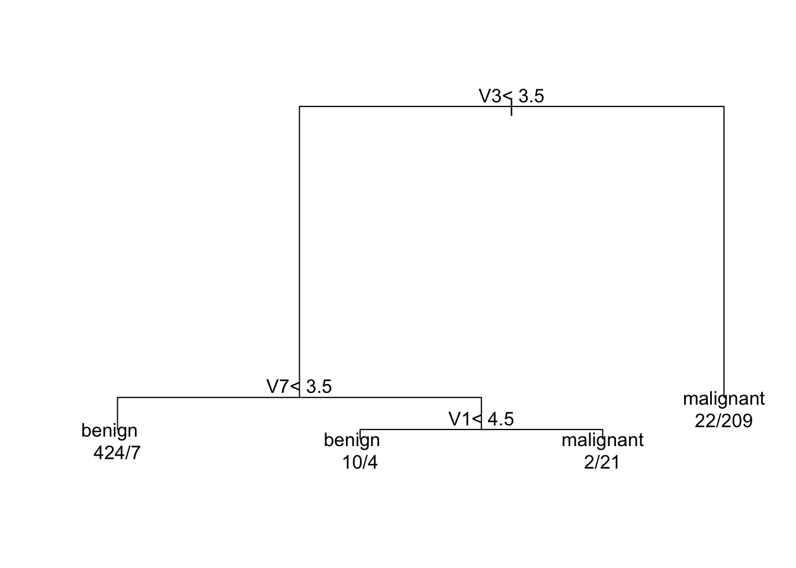

# Risk Prediction and Validation (Part II) {#risk-prediction2}


---

## The Brier Score

* **Binary outcomes** - $Y_{i}$ for individual $i$.

* Let $g(\mathbf{x}_{i})$ be a **risk score** for an individual with covariate vector $\mathbf{x}_{i}$.

* If $g(\mathbf{x}_{i})$ is interpreted as an estimate of the probability that $Y_{i} = 1$, the 
**Brier score** is a measure of the predictive accuracy of $g(\mathbf{x}_{i})$.

* For binary outcomes $Y_{i}$ and risk scores $g(\mathbf{x}_{i})$, the **Brier score** is defined as
\begin{equation}
BS(Y, g) = \frac{1}{n}\sum_{i=1}^{n} \{ Y_{i} - g(\mathbf{x}_{i}) \}^{2}
\end{equation}

* The Brier score is typically used to **compare** the accuracy of risk scores.
    + It is hard to tell if a risk score is good just by looking at the Brier score itself without comparing it with other methods.

---

* Even if $g(\mathbf{x}_{i})$ is a class prediction rather than a probability (i.e., $g(\mathbf{x}_{i}) = 0$ or $g(\mathbf{x}_{i}) = 1$), the Brier score can be interpreted as the proportion of **"misclassified"** outcomes 
\begin{equation}
BS(Y, g) = \frac{1}{n}\sum_{i=1}^{n} \{ Y_{i} - g(\mathbf{x}_{i}) \}^{2}
= \frac{1}{n} \sum_{i=1}^{n} I\{Y_{i} \neq g(\mathbf{x}_{i})   \}
\end{equation}

---

* The Brier score is a single measure that is affected by both the 
**discrimination** and **calibration** of the risk score.

* The usual justification for this is to look at the following approximation
of the Brier score
\begin{equation}
BS(Y, g) \approx \tilde{BS}(Y,g) = \frac{1}{n}\sum_{s=1}^{S} \sum_{i=1}^{n} a_{is}\{Y_{i} - \bar{g}_{s} \}^{2}  
\end{equation}

* This approximation assumes $S$ strata: $[s_{0}, s_{1}), [s_{1}, s_{2}), \ldots, [s_{S-1}, s_{S})$.

* $a_{is}$ is an indicator of whether or not the $i^{th}$ observation falls into the $s^{th}$ stratum:
    + That is, $a_{is} = 1$ if $s_{s-1} \leq g(\mathbf{x}_{i}) < s_{s}$

* $\bar{g}_{s}$ is the average value of the risk score within stratum $s$
\begin{equation}
\bar{g}_{s} = \frac{1}{n_{s}} \sum_{i=1}^{n} a_{is} g(\mathbf{x}_{i})
\end{equation}
and $n_{s}$ is the number of observation where the risk score is in stratum $s$.

---

* If we let $\bar{Y}_{s} = \frac{1}{n_{s}}\sum_{i=1}^{n} a_{is}Y_{i}$ be the proportion of 1's in stratum $s$, we can simplify the expression for the approximate Brier score as follows:
\begin{eqnarray}
\tilde{BS}(Y,g) &=& \frac{1}{n}\sum_{s=1}^{S} \sum_{i=1}^{n} a_{is}\{Y_{i} - \bar{Y}_{s} + \bar{Y}_{s} - \bar{g}_{s} \}^{2} \nonumber \\
&=& \frac{1}{n}\sum_{s=1}^{S} \sum_{i=1}^{n} a_{is}\{Y_{i} - \bar{Y}_{s} \}^{2} + \frac{1}{n}\sum_{s=1}^{S} n_{s}\{\bar{Y}_{s} - \bar{g}_{s} \}^{2} \nonumber \\
&=& \frac{1}{n}\sum_{s=1}^{S} n_{s}\bar{Y}_{s}(1 - \bar{Y}_{s}) + \frac{1}{n}\sum_{s=1}^{S} n_{s}\{\bar{Y}_{s} - \bar{g}_{s} \}^{2} \nonumber \\
&=& B_{D} + B_{C}
\end{eqnarray}

---

* The quantity $B_{D} = \frac{1}{n}\sum_{s=1}^{S} n_{s}\bar{Y}_{s}(1 - \bar{Y}_{s})$ is related to the **discrimination** of the risk score $g$.

* To get a sense of why $B_{D}$ measures discrimination, suppose $s$ is a stratum where $s_{s} \leq t$. 

* If the risk score has **good discrimination**, this threshold should **separate** most of the "successes" from the "failures".
    + That is most with $g(\mathbf{x}_{i}) \leq t$ has $Y_{i} = 0$ and most with $g(\mathbf{x}_{i}) > t$ has $Y_{i}=1$.
    + This $\bar{Y}_{s}(1 - \bar{Y}_{s})$ is close to $0$.
    + If this is close to $0$ for most threholds, $B_{D}$ will be small.

---

* The quantity $B_{C} = \frac{1}{n}\sum_{s=1}^{S} n_{s}\{\bar{Y}_{s} - \bar{g}_{s} \}^{2}$ is a measure of **calibration**. 
    
* For a well-calibrated risk score, the proportion of successes $\bar{Y}_{s}$ in stratum $s$ should be close to the 
average value of the risk score $g_{s}$ in stratum $s$. 


### Brier scores for biopsy data

* Let's compute the **Brier score** using the `biopsy` data again from the `MASS` package.


```r
library(rpart)
library(MASS)

data(biopsy)
# Create binary outcome for tumor class
biopsy$tumor.type <- ifelse(biopsy$class=="malignant", 1, 0)
head(biopsy)
```

```
##        ID V1 V2 V3 V4 V5 V6 V7 V8 V9     class tumor.type
## 1 1000025  5  1  1  1  2  1  3  1  1    benign          0
## 2 1002945  5  4  4  5  7 10  3  2  1    benign          0
## 3 1015425  3  1  1  1  2  2  3  1  1    benign          0
## 4 1016277  6  8  8  1  3  4  3  7  1    benign          0
## 5 1017023  4  1  1  3  2  1  3  1  1    benign          0
## 6 1017122  8 10 10  8  7 10  9  7  1 malignant          1
```


* Let's try constructing fitted probabilities using three approaches:
    + **logistic regression**
    + **CART**
    + **random forest**


```r
library(rpart)
library(randomForest)

# Fit CART, logistic regression, and random forest
cart.model <- rpart(class ~ V1 + V3 + V4 + V7 + V8, data=biopsy)
logreg.model <- glm(tumor.type ~ V1 + V3 + V4 + V7 + V8, family="binomial", data=biopsy)
RF.model <- randomForest(class ~ V1 + V3 + V4 + V7 + V8, data=biopsy, ntree = 500)
```

* Let's then compute "risk scores" from each method.

```r
probs.cart <- predict(cart.model)
head(probs.cart)
```

```
##      benign malignant
## 1 0.9837587 0.0162413
## 2 0.0952381 0.9047619
## 3 0.9837587 0.0162413
## 4 0.0952381 0.9047619
## 5 0.9837587 0.0162413
## 6 0.0952381 0.9047619
```

```r
# We want the second column of this matrix for the CART fitted probabilities
risk.cart <- probs.cart[,2]

# logistic regression 
risk.logreg <- predict(logreg.model, newdata=biopsy, type="response")

# random forest risk scores
risk.RF <- predict(RF.model, newdata=biopsy, type = "prob")[,2]
```

* The **in-sample** Brier scores for each method are:
    + "In-sample" here meaning we are computing the Brier score using the same outcomes we used to construct the risk scores.

```r
brier.cart <- mean((risk.cart - biopsy$tumor.type)^2)
brier.logreg <- mean((risk.logreg - biopsy$tumor.type)^2)
brier.RF <- mean((risk.RF - biopsy$tumor.type)^2)

round(c(brier.cart, brier.logreg, brier.RF), 4)
```

```
## [1] 0.0450 0.0280 0.0056
```

* When comparing **in-sample** Brier scores, CART is the worst, logistic regression is in the middle, and random forest is the best.


<div class="figure">

<p class="caption">(\#fig:unnamed-chunk-5)Fitted CART model for the biopsy data</p>
</div>

### Out-of-sample comparisons

* Looking at **out-of-sample** performance is a better way to **validate** our risk scores.

* Let's try a validation exercise by **"training"** our models on the first $400$ observations 
of `biopsy` and then testing relative performance on the remaining observations.

```r
# Create train/test splits for biopsy data
biopsy.train <- biopsy[1:400,]
biopsy.test <- biopsy[401:699,]
```


```r
# Now, use each type of method on this training data
cart.model.train <- rpart(class ~ V1 + V3 + V4 + V7 + V8, data=biopsy.train)
logreg.model.train <- glm(tumor.type ~ V1 + V3 + V4 + V7 + V8, family="binomial", 
                    data=biopsy.train)
RF.model.train <- randomForest(class ~ V1 + V3 + V4 + V7 + V8, data=biopsy.train, 
                         ntree = 500)
```

* Using these models built on the training data, get the fitted probabilities for the **test data**

```r
risk.cart.test <- predict(cart.model.train, newdata=biopsy.test)[,2]
risk.logreg.test <- predict(logreg.model.train, newdata=biopsy.test, type="response")
risk.RF.test <- predict(RF.model.train, newdata=biopsy.test, type = "prob")[,2]
```

* Now, using these fitted probabilities on the test data, compute the **Brier scores**:

```r
brier.cart.test <- mean((risk.cart.test - biopsy.test$tumor.type)^2)
brier.logreg.test <- mean((risk.logreg.test - biopsy.test$tumor.type)^2)
brier.RF.test <- mean((risk.RF.test - biopsy.test$tumor.type)^2)

round(c(brier.cart.test, brier.logreg.test, brier.RF.test), 4)
```

```
## [1] 0.0359 0.0135 0.0190
```

* For the out-of-sample Brier score, both logistic regression and random forest are notably
better than CART.

* Logistic regression is actually slightly **better** than random forest in out of sample performance with random forest (at least for this particular train/test split).

---

## Brier Scores with Longitudinal Data

* Let's revisit the `ohio` data again from the `geepack` package

```r
library(geepack)
data(ohio)
head(ohio, 10)
```

```
##    resp id age smoke
## 1     0  0  -2     0
## 2     0  0  -1     0
## 3     0  0   0     0
## 4     0  0   1     0
## 5     0  1  -2     0
## 6     0  1  -1     0
## 7     0  1   0     0
## 8     0  1   1     0
## 9     0  2  -2     0
## 10    0  2  -1     0
```

* Each individual has 4 follow-up visits.

* The variable `resp` is the wheezing status of the individual at each follow up.  

* The variable `smoke` is a **baseline** variable that does not change over time. This 
is an indicator of maternal smoking.

* `age` is a time-varying covariate.

### Option 1

* If we want to build a **risk score** for wheezing, evaluating the performance of this risk score
will depend on exactly what we are trying to predict.

* **Option 1:** We want to predict whether or not some someone is diagnosed with **wheezing** over some
time window, and we do not want to predict wheezing status at each time point. 

* As an example of this, let's build a risk score which:
    + Only uses `smoke` as a covariate.
    
    + Builds the risk score from the first two follow-up times.

---

* Let's first construct a dataset called `atleastone1` that records whether or not
an individual had at least one positive wheezing status over the first two visits:
   + `atleastone2` will record whether or not an individual has at least one positive wheezing status over the last two visits.
 

```r
data(ohio)
baseline.ohio <- subset(ohio, age== -1) # data from baseline visit
firsttwo.ohio <- subset(ohio, age== -1 | age == 0) # data from visits 1-2
lasttwo.ohio <- subset(ohio, age==1 | age==2) # data from visits 3-4

tmp <- aggregate(firsttwo.ohio$resp, by=list(id=firsttwo.ohio$id), FUN=max)
tmp2 <- aggregate(lasttwo.ohio$resp, by=list(id=lasttwo.ohio$id), FUN=max)
atleastone1 <- merge(tmp, baseline.ohio, by="id")
atleastone2 <- merge(tmp2, baseline.ohio, by="id")
head(atleastone1)
```

```
##   id x resp age smoke
## 1  0 0    0  -1     0
## 2  1 0    0  -1     0
## 3  2 0    0  -1     0
## 4  3 0    0  -1     0
## 5  4 0    0  -1     0
## 6  5 0    0  -1     0
```

```r
table(atleastone1$resp)
```

```
## 
##   0   1 
## 446  91
```

---

* Let's now build a risk score using only variable `smoke` as a covariate and a random choice of $300$ observations

```r
set.seed(1234)
train.ind <- sample(1:537, size=300)
atleastone1.train <- atleastone1[train.ind,]
mod1 <- glm(resp ~ smoke, family="binomial", data=atleastone1.train)
summary(mod1)
```

```
## 
## Call:
## glm(formula = resp ~ smoke, family = "binomial", data = atleastone1.train)
## 
## Deviance Residuals: 
##     Min       1Q   Median       3Q      Max  
## -0.5978  -0.5978  -0.5537  -0.5537   1.9754  
## 
## Coefficients:
##             Estimate Std. Error z value Pr(>|z|)    
## (Intercept)  -1.7979     0.2078  -8.653   <2e-16 ***
## smoke         0.1665     0.3311   0.503    0.615    
## ---
## Signif. codes:  0 '***' 0.001 '**' 0.01 '*' 0.05 '.' 0.1 ' ' 1
## 
## (Dispersion parameter for binomial family taken to be 1)
## 
##     Null deviance: 253.63  on 299  degrees of freedom
## Residual deviance: 253.37  on 298  degrees of freedom
## AIC: 257.37
## 
## Number of Fisher Scoring iterations: 4
```

---

* The risk scores for the hold-out individuals for the later follow-up times are given by


```r
risk1 <- predict(mod1, newdata=atleastone2[-train.ind,],
                 type="response")
```


* Now, let's look at the Brier score on the remaining individuals in the `atleast2` data set. 

```r
mean((risk1 - atleastone2[-train.ind,]$resp)^2)
```

```
## [1] 0.1574466
```

* An AUC probably does not make much sense here since there are only two possible values of the risk score.

* For calibration, we can just compare the predicted risk scores and the mean number of successes 
in each of the smoking categories in the hold-out sample:


```r
table(risk1)
```

```
## risk1
## 0.142105263157904 0.163636363636364 
##               160                77
```

```r
table(atleastone2[-train.ind,]$resp, atleastone2[-train.ind,]$smoke)
```

```
##    
##       0   1
##   0 135  56
##   1  25  21
```

```r
# Compare risk scores with 
25/(25 + 135)
```

```
## [1] 0.15625
```

```r
21/(21 + 56)
```

```
## [1] 0.2727273
```

* This risk score does not seem all that well-calibrated for later time points.
     + The overall prevalence of wheezing is a little bit higher in the hold-out sample.
     + There is a larger difference between the smoking and non-smoking groups in the hold-out sample.

---

### Option 2

* As another option, you may want to predict outcomes for each time point in the hold-out dataset.
   
* In this case, I would probably just compute a Brier score by just averaging over all time points.

* For example, with a **GEE**, you might do the following:

```r
ind <- c(1:400, 801:1200, 1601:2000) ## index of training set
ohio.train <- subset(ohio[ind,], age==-1 | age == 0)
ohio.test <- subset(ohio[-ind,], age==1 | age==2)
fit.ex <- geeglm(resp ~ age + smoke + age:smoke, id=id, data=ohio.train,
                 family=binomial, corstr="exch")
rs2 <- predict(fit.ex, newdata=ohio.test, type="response")

## Now, find Brier score that the takes average across all individuals and time points
mean((rs2 - ohio.test$resp)^2)
```

```
## [1] 0.1270949
```

---
