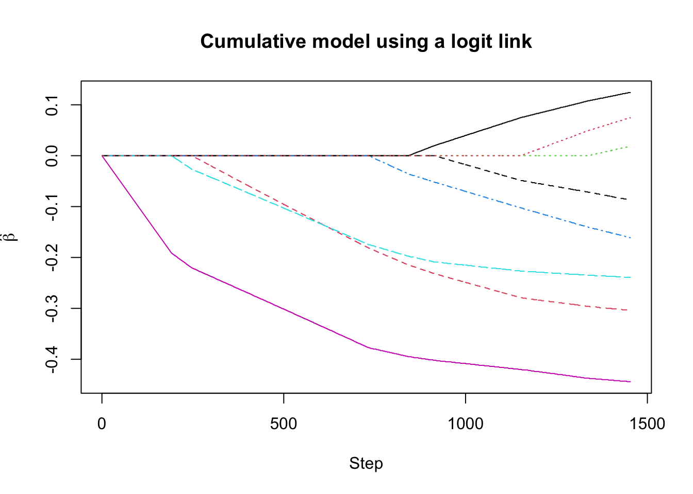

# Ordinal Regression {#ordinal-regression}

---

## Ordinal Logistic Regression

* In many applications, the possible values of the response should be thought of as **ordered categories**.

* **Examples:**
     + Survey ratings of a product: "poor", "good", "excellent".
     
     + Patient reported scale of pain from 1-10.
     
     + Different levels on a questionnaire.

## Ordinal Regression Details

* With **ordinal regression**, only the **ranking** of the different categories is relevant.

---

* Let $Y_{i}$ represent the ordinal response of interest.

* Assume $Y_{i}$ can take an integer value from 1 to C: $Y_{i} = 1$, or $Y_{i} = 2$, ..., or $Y_{i} = C$. 
    + Although we are assuming $Y_{i}$ takes numerical values, the ordinal regression analysis would be the 
      same if we assumed that $Y_{i}$ could take values $2, 4, 6, ..., 2C$.
      
---

* The most common regression model for ordinal data is an **ordinal logistic regression model**.

* The ordinal logistic regression model uses a regression model for the 
**"lesser-than probabilities"** $P( Y_{i} \leq c|\mathbf{x}_{i})$.

* Specifically,
\begin{equation}
P(Y_{i} \leq c|\mathbf{x}_{i}) = \frac{1}{1 + \exp(-\alpha_{c} + \mathbf{x}_{i}^{T}\boldsymbol{\beta})}, \quad c = 1, \ldots, C-1
\end{equation}

* This is equivalent to saying that the **log-odds** (for the the event $Y_{i} \leq j$) is a **linear function** of our covariates:
\begin{equation}
\log \{ \text{odds}_{c}( \mathbf{x}_{i} ) \} = \log\left( \frac{ P(Y_{i} \leq c|\mathbf{x}_{i}) }{ 1 - P(Y_{i} \leq c|\mathbf{x}_{i}) }  \right) = \alpha_{c} - \mathbf{x}_{i}^{T}\boldsymbol{\beta}
\end{equation}

---

* Note that the ordinal logistic regression model is often expressed using the probabilities $P(Y_{i} > c|\mathbf{x}_{i})$
instead of $P( Y_{i} > c|\mathbf{x}_{i})$ where it is assumed that
\begin{equation}
\log\left( \frac{ P(Y_{i} > c|\mathbf{x}_{i}) }{ 1 - P(Y_{i} > c|\mathbf{x}_{i}) }  \right) = \alpha_{c} + \mathbf{x}_{i}^{T}\boldsymbol{\beta}
(\#eq:ologist-model)
\end{equation}

---

* The regression model \@ref(eq:ologist-model) is often called a **proportional odds** model.
     + This is because the odds ratio for the probability $P(Y \leq c|\mathbf{x}_{i})$ vs. the probability $P(Y \leq c|\mathbf{z}_{i})$ does not depend on the value of $c$.


* To see the **proportional odds property**, note that 
\begin{equation}
\frac{ \text{odds}_{c}( \mathbf{x}_{i} ) }{ \text{odds}_{c}( \mathbf{z}_{i} ) }
= \frac{ \exp( \alpha_{c} - \mathbf{x}_{i}^{T}\boldsymbol{\beta} ) }{ \exp( \alpha_{c} - \mathbf{z}_{i}^{T}\boldsymbol{\beta} ) }
= \exp\left[ (\mathbf{z}_{i}^{T} - \mathbf{x}_{i}^{T})\boldsymbol{\beta} \right]
\end{equation}

* The odds ratio only depends on $\boldsymbol{\beta}$ and does not depend on the value of $\alpha_{c}$.

---

* The proportional odds assumption allows the elements of $\boldsymbol{\beta}$ to have an interpretation that **does not** depend on $c$.

* **Interpretation**: If you have only one covariate $x_{i}$, then 
a one-unit increase in $x_{i}$ leads to an increase of $\beta$ in the **log-odds ratio** (for the event $Y_{i}\leq c$):
\begin{equation}
\log\left( \frac{ \text{odds}_{c}( x_{i} + 1 ) }{ \text{odds}_{c}( x_{i} ) } \right)
=  -\beta
\end{equation}

---

* The model \@ref(eq:ologist-model) uses a **logit** link function, but it's possible to choose any other link function.
    + Common alternative choices are the **complementary log-log** and  **probit** link functions.

### Ordinal Logistic Regression in R

* The **polr** function in the **MASS** package let's you fit **ordered logistic** or **ordered probit** regression models. 

* The example dataset in the **polr** documentation is the `housing` data

```r
library(MASS)  # load MASS package
head(housing)  # look at first 6 rows
```

```
##      Sat   Infl  Type Cont Freq
## 1    Low    Low Tower  Low   21
## 2 Medium    Low Tower  Low   21
## 3   High    Low Tower  Low   28
## 4    Low Medium Tower  Low   34
## 5 Medium Medium Tower  Low   22
## 6   High Medium Tower  Low   36
```

```r
dim(housing)  # 72 rows and 5 variables
```

```
## [1] 72  5
```

---

* The syntax for using `polr` is similar to other common regression fitting functions in **R** such as `lm` or `glm`.

* The main thing to be aware of when using `polr` is that the response variable should be an **ordered factor**.

```r
str(housing)
```

```
## 'data.frame':	72 obs. of  5 variables:
##  $ Sat : Ord.factor w/ 3 levels "Low"<"Medium"<..: 1 2 3 1 2 3 1 2 3 1 ...
##  $ Infl: Factor w/ 3 levels "Low","Medium",..: 1 1 1 2 2 2 3 3 3 1 ...
##  $ Type: Factor w/ 4 levels "Tower","Apartment",..: 1 1 1 1 1 1 1 1 1 2 ...
##  $ Cont: Factor w/ 2 levels "Low","High": 1 1 1 1 1 1 1 1 1 1 ...
##  $ Freq: int  21 21 28 34 22 36 10 11 36 61 ...
```

* The **response variable** of interest here is `Sat` which represents householder satisfaction.
    + This has 3 possible responses: **"Low"**, **"Medium"**, or **"High"**. 
    
    + This is a categorical variable that has a natural ordering.

```r
table(housing$Sat)
```

```
## 
##    Low Medium   High 
##     24     24     24
```

---

* The categorial variables `Sat`, `Infl`, `Type`, and `Cont` don't have the "individual-level" data. 
    + Each row just represents one of the 72 possible configurations of these variables.

* The variable `Freq` actually tells us how many responses we had for each of the 72 categories.

* To fit this without using the individual-level data, we can use the values of `Freq`
as **weights** in the ordinal logistic regression.

---

* If we want to fit an ordinal logistic regression with `Sat` as the response and `Infl` as a covariate, we can use the following code:

```r
infl.plr <- polr(Sat ~ Infl, weight=Freq, data = housing)
```

* The above **R code** is going to fit the model
\begin{equation}
\log \left( \frac{ P(Y_{i} \leq c|\mathbf{x}_{i}) }{1 - P(Y_{i} \leq c|\mathbf{x}_{i})} \right) = \alpha_{c} - \beta_{1}x_{i1} - \beta_{2}x_{i2},
\end{equation}
    + $Y_{i}$ is the satisfaction level with three levels
    + $x_{i1} = 1$ if influence is medium and $0$ otherwise
    + $x_{i2} = 1$ if influence is high and $0$ otherwise.

---

* To see the **estimates** of these parameters use the `summary` function:

```r
summary(infl.plr)
```

```
## 
## Re-fitting to get Hessian
```

```
## Call:
## polr(formula = Sat ~ Infl, data = housing, weights = Freq)
## 
## Coefficients:
##             Value Std. Error t value
## InflMedium 0.5636     0.1036   5.441
## InflHigh   1.2487     0.1248  10.006
## 
## Intercepts:
##             Value   Std. Error t value
## Low|Medium  -0.2014  0.0766    -2.6280
## Medium|High  0.9485  0.0802    11.8199
## 
## Residual Deviance: 3543.416 
## AIC: 3551.416
```

* The above coefficient estimates tell us that the odds of **low satisfaction**
given **Medium** influence level vs. the odds of **low satisfaction** given a **Low** influence level is 
\begin{equation}
\frac{odds_{c}(\text{Medium Influence})}{odds_{c}(\text{Low Influence})} = \exp(-\hat{\beta}_{1}) = \exp(-0.563) \approx 0.57
\end{equation}
   + In other words, the odds of having **low satisfaction** are higher in the low influence group when compared to the high influence group. 

* Similarly, the **odds ratio** for the high influence group vs. the low influence group is given by
\begin{equation}
\frac{odds_{c}(\text{Medium Influence})}{odds_{c}(\text{Low Influence})} = \exp(-\hat{\beta}_{1}) = \exp(-1.248) \approx 0.29
\end{equation}

* From this, you can get the **odds ratio** for high vs. medium influence levels
\begin{equation}
\frac{odds_{c}(\text{High Influence})}{odds_{c}(\text{Medium Influence})} = \exp(-1.248) \exp(0.563) \approx 0.5
\end{equation}

---

* The summary output from a `polr` fit will also give 
estimates of the **"intercept terms"** $\alpha_{c}$. 

* Since there are only 3 possible levels of the response `Sat`, there
should only be two possible values of $\alpha_{c}$.

* The estimates $\hat{\alpha}_{c}$ are given in the `Intercepts` part of the
summary output. 

* The estimate of $\hat{\alpha}_{1}$ means that the probability that satisfaction is low (i.e., $Y_{i} \leq 1$) given low influence is
\begin{equation}
\hat{P}(Y_{i} \leq 1| \text{InflLow}) = 1/[1 + \exp(-\hat{\alpha}_{1})] \approx 0.45
\end{equation}

* Similarly, the estimated probability that satisfaction is low 
given medium influence is
\begin{equation}
\hat{P}(Y_{i} \leq 1| \text{InflMed}) = 1/[1 + \exp(-\hat{\alpha}_{1} + \hat{\beta}_{1})] \approx 0.31
\end{equation}

---

* In this case, because we are only looking at a single covariate, we can verify these probability estimates with a direct calculation.

* The estimate of $P(Y_{i} \leq 1| \text{InflLow})$ should be equal 
to the following ratio
\begin{equation}
\hat{P}(Y_{i} \leq 1| \text{InflLow}) = \frac{ N_{satlow, infllow} }{ N_{infllow} }
\end{equation}

* This can be computed with the **R** code

```r
N_ll <- sum(housing$Freq[housing$Sat=="Low" & housing$Infl=="Low"])
N_l <- sum(housing$Freq[housing$Infl=="Low"])
N_ll/N_l
```

```
## [1] 0.4497608
```

* A direct estimate of $\hat{P}(Y_{i} \leq 1| \text{InflMed})$ can be computed
with the following **R** code

```r
N_lm <- sum(housing$Freq[housing$Sat=="Low" & housing$Infl=="Medium"])
N_m <- sum(housing$Freq[housing$Infl=="Medium"])
N_lm/N_m
```

```
## [1] 0.3125948
```

## Generalized Estimating Equations 

* For longitudinal data, you can fit **random effects** ordinal regression models with the `repolr` package.

* A GEE approach for ordinal outcomes can be done with the `ordgee` function
from the `geepack` package. 

---

* For longitudinal data, let $Y_{ij}$ be the ordinal response for individual $i$ at time $t_{ij}$.

* The GEE approach described in (@heagerty) assumes the **"mean part"** of the model has the form
\begin{equation}
P(Y_{ij} > c|\mathbf{x}_{i}) = \frac{1}{1 + \exp(-\alpha_{c} - \mathbf{x}_{i}^{T}\boldsymbol{\beta})}
\end{equation}

* The above equation handles the **marginal distribution** of $Y_{ij}$ at a specific time point. 

* For a GEE, the only remaining part is how to handle the **"correlation" structure** between observations from individual $i$.

---

* Setting up a **"correlation" structure** for ordinal outcomes is not that straightforward. The approach described below is that described in (@heagerty1996).
    + You don't want to work with the usual definition of correlation because we are not treating these outcomes as **numeric outcomes**.
    
    + Instead the **dependence** is expressed through different **joint probabilities**.

* The dependence between ordinal outcomes $Y_{ij}$ and $Y_{ik}$ is measured by the **"marginal odds ratios"**
\begin{equation}
\psi_{i(j,k)(c_{1},c_{2})} = \frac{P(Y_{ij} > c_{1}, Y_{ik} > c_{2}|\mathbf{x}_{ij},\mathbf{x}_{ij}) P(Y_{ij} \leq c_{1}, Y_{ik} \leq c_{2}|\mathbf{x}_{ij},\mathbf{x}_{ij})}{P(Y_{ij} > c_{1}, Y_{ik} \leq c_{2}|\mathbf{x}_{ij},\mathbf{x}_{ij}) P(Y_{ij} \leq c_{1}, Y_{ik} > c_{2}|\mathbf{x}_{ij},\mathbf{x}_{ij})}
\end{equation}

* If $Y_{ij}$ and $Y_{ik}$ have high dependence, then $\psi_{i(j,k)(c_{1},c_{2})}$ should be large.

---

* The "**exchangeable**" correlation structure assumes that the odds-ratio
parameter is constant 
\begin{equation}
\log\left( \psi_{i(j,k)(c_{1},c_{2})} \right) = \alpha
\end{equation}
for all $(j,k)$ and $(c_{1}, c_{2})$. 

* The "**independent**" correlation structure assumes that $\alpha = 0$ since
$\psi_{i(j,k)(c_{1},c_{2})} = 1$ if we assume that $Y_{ij}$ and $Y_{ik}$ are independent.


### Using geepack and ordgee

* The `ordgee` function from the `geepack` package allows you to fit a GEE with **ordinal responses**.

* To show how to use `ordgee`, we can look at the `respdis` dataset from 
the `geepack` package

```r
library(geepack)
data(respdis)
resp.l <- reshape(respdis, varying =list(c("y1", "y2", "y3", "y4")),
                  v.names = "resp", direction = "long")
resp.l <- resp.l[order(resp.l$id, resp.l$time),]
head(resp.l)
```

```
##     trt time resp id
## 1.1   1    1    1  1
## 1.2   1    2    1  1
## 1.3   1    3    1  1
## 1.4   1    4    1  1
## 2.1   0    1    1  2
## 2.2   0    2    1  2
```

* The response of interest here is the variable `resp` which has
3 possible values:

```r
table(resp.l$resp)
```

```
## 
##   1   2   3 
##  80 212 152
```

---

* The syntax for `ordgee` is basically the same as `geeglm`.
    + Just make sure the response is an **ordered factor**.
    
    + The main available correlation structures are **"independence"** and **"exchangeable"**.


```r
## Fit GEE with just trt as a covariate
fit.indep <- ordgee(ordered(resp) ~ trt, id=id, corstr="independence",
                    data=resp.l)
summary(fit.indep)
```

```
## 
## Call:
## ordgee(formula = ordered(resp) ~ trt, id = id, data = resp.l, 
##     corstr = "independence")
## 
## Mean Model:
##  Mean Link:                 logit 
##  Variance to Mean Relation: binomial 
## 
##  Coefficients:
##          estimate    san.se      wald            p
## Inter:1  1.139907 0.2365456 23.222502 1.442990e-06
## Inter:2 -1.139907 0.2417271 22.237619 2.409072e-06
## trt      0.976700 0.3161920  9.541586 2.008680e-03
## 
## Scale is fixed.
## 
## Correlation Model:
##  Correlation Structure:     independence 
## 
## Returned Error Value:    0 
## Number of clusters:   111   Maximum cluster size: 4
```

* The terms `Inter:1`, `Inter:2` in the summary output represent the estimates
of the intercept parameters $\alpha_{1}$ and $\alpha_{2}$.

* The estimate of the `trt` regression coefficient implies that the odds ratio (between `trt = 1` and `trt = 0`) for having a positive outcome is roughly $2.6$
\begin{equation}
\frac{\text{odds}_{Y_{i} > c}(trt=1) }{\text{odds}_{Y_{i} > c}(trt=0) } = \exp(0.97) \approx 2.65
\end{equation}

---

* To fit the same model with an **exchangeable** correlation structure, just
use the `corstr = exchangeable` argument:

```r
## Fit GEE with just trt as a covariate
fit.ex <- ordgee(ordered(resp) ~ trt, id=id, corstr="exchangeable",
                    data=resp.l)
summary(fit.ex)
```

```
## 
## Call:
## ordgee(formula = ordered(resp) ~ trt, id = id, data = resp.l, 
##     corstr = "exchangeable")
## 
## Mean Model:
##  Mean Link:                 logit 
##  Variance to Mean Relation: binomial 
## 
##  Coefficients:
##          estimate    san.se      wald            p
## Inter:1  1.140030 0.2369495 23.148392 1.499686e-06
## Inter:2 -1.140030 0.2421280 22.168817 2.496965e-06
## trt      1.012671 0.3357436  9.097488 2.559608e-03
## 
## Scale is fixed.
## 
## Correlation Model:
##  Correlation Structure:     exchangeable 
##  Correlation Link:          log 
## 
##  Estimated Correlation Parameters:
##       estimate    san.se     wald p
## alpha 2.456858 0.2752256 79.68609 0
## 
## Returned Error Value:    0 
## Number of clusters:   111   Maximum cluster size: 4
```

## Penalized Regression with Ordinal Outcomes

* The `ordinalgmifs` package fits L1-penalized regression with **ordinal** outcomes.
    + `ordinalNet` is another package that performs penalized regression for **ordinal** outcomes.  

* To use `ordinalgmifs`, we will use the `eyedisease` dataset in the package.

```r
library(ordinalgmifs)
```

```
## Loading required package: survival
```

```r
data(eyedisease)
names(eyedisease)
```

```
##  [1] "rme"  "lme"  "rre"  "lre"  "riop" "liop" "age"  "diab" "gh"   "sbp" 
## [11] "dbp"  "bmi"  "pr"   "sex"  "prot" "dose" "rerl" "lerl" "id"
```

* A variable of interest is `rerl`.
    + This is right eye severity of retinopathy.
    
    + This is an **ordered factor** with levels "None", "Mild", "Moderate", and "Proliferative".
    

```r
table( eyedisease$rerl )
```

```
## 
##          None          Mild      Moderate Proliferative 
##           275           270           128            47
```

---

* To fit a **penalized ordinal regression** where we can penalize all variables, use the following code:

```r
## Fit ordinal logistic regression with covariates 
## dose, prot, sex, bmi, dbp, sbp, pr, age
eye.fit <- ordinalgmifs(rerl ~ 1, x=c("dose", "prot", "sex", 
                        "bmi", "dbp", "sbp", "pr", "age"), data=eyedisease)
```

* If we look at a `summary` of `eye.fit` it will display the 
best regression coefficient estimates according to an **AIC** criterion:

```r
summary(eye.fit)
```

```
## Cumulative model using a  logit  link 
## at step    =  1339 
## logLik     =  -813.1043 
## AIC        =  10358.21 
## BIC        =  22327.05
```

```
## (Intercept):1 (Intercept):2 (Intercept):3          dose          prot 
##    -0.5779889     1.2531085     2.9824752     0.1080000    -0.2960000 
##           sex           bmi           dbp           sbp            pr 
##     0.0000000    -0.1410000    -0.2350000    -0.4370000    -0.0720000 
##           age 
##     0.0500000
```

* According to **AIC**, all variables are selected except for `sex`.

---

* To get the "full path" of coefficient solutions, look at the `beta` component of `eye.fit`.

* `eye.fit$beta` is a 1453 x 8 matrix.
    + Row $k$ of `eye.fit$beta` has the value of the regression coefficients at step $k$
    
    + Row $k$ of `eye.fit$alpha` has the value of the intercept coefficient at step $k$


```r
dim(eye.fit$beta)
```

```
## [1] 1453    8
```

```r
## Look at an "early" row of eye.fit$beta
## Most of the coefficients here should be zero
eye.fit$beta[10,]
```

```
##  dose  prot   sex   bmi   dbp   sbp    pr   age 
##  0.00  0.00  0.00  0.00  0.00 -0.01  0.00  0.00
```

* If we look at a later row, we should have more non-zero coefficients

```r
eye.fit$beta[800,]
```

```
##   dose   prot    sex    bmi    dbp    sbp     pr    age 
##  0.000 -0.202  0.000 -0.022 -0.188 -0.388  0.000  0.000
```

* The `model.select` component gives the row index of the **selected model**

```r
eye.fit$model.select 
```

```
## [1] 1339
```

```r
eye.fit$beta[eye.fit$model.select,]
```

```
##   dose   prot    sex    bmi    dbp    sbp     pr    age 
##  0.108 -0.296  0.000 -0.141 -0.235 -0.437 -0.072  0.050
```

---

* You can plot the "lasso path" for the regression coefficient estimates:

```r
plot( eye.fit )
```


