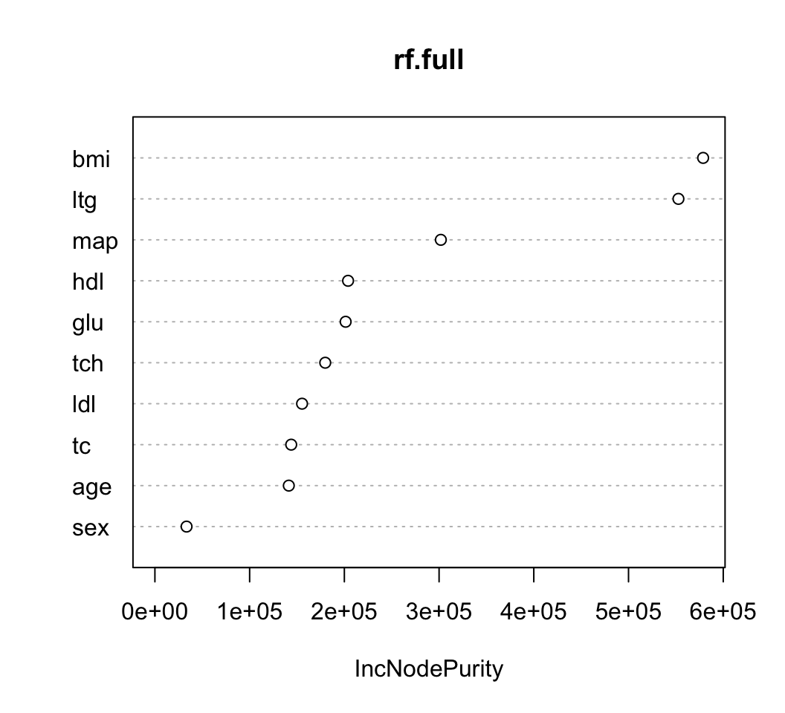
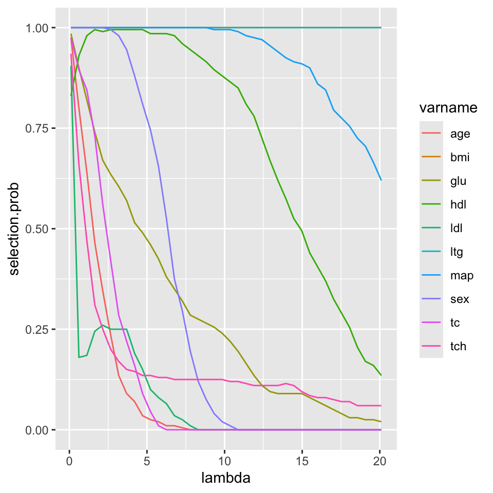

# Variable Importance Measures {#extra-topics}

---


## Partial Dependence Plots

- Beyond variable importance, assessing the impact of a particular covariate can be tricky with
more "black box" prediction method.

-  For these situations, [**partial dependence plots**]{style="color:#D96716"} are a useful way tool. 

- Suppose we have a method that takes covariate vector $\mathbf{x}$ as input and generates a prediction $\hat{f}(\mathbf{x})$.
     - For example, $\hat{f}(\mathbf{x})$ could be the output of random forest or from a boosting method

-  For this method, the [**partial dependence function**]{style="color:#D96716"} for variable $k$ at point $u$ is defined as 
\begin{equation}
    \rho_{k}( u ) = \frac{1}{n}\sum_{i=1}^{n}\hat{f}(\mathbf{x}_{i,-k}, u)
\end{equation}

-   $\mathbf{x}_{i,-k}$ - all of the covariates for person $i$ [**except**]{style="color:#D96716"} for covariate $k$.

-   $(\mathbf{x}_{i,-k}, u)$ - setting $x_{ik} = u$ and using the observed values for all other covariates.

---

- The partical dependence function of $u$ is the "effect" of setting $x_{ik} = u$, while accounting
for the average effect of all the other variables.

- Plotting $\rho_{k}(u)$ versus $u$ captures how changing $x_{ik}$ influences the estimated prediction.

- Note that partial dependence plots are mostly useful for **continuous covariates**. 


## Variable Importance Measures in Gradient Tree Boosting


- Gradient tree boosting builds an ensemble of decision trees sequentially to minimize a loss function.

- Variable importance measures help quantify the contribution of features to the model's predictive performance.


- With boosting, the fitted values $\hat{y}_{i}$ are given by:
$$
\hat{y}_i = \sum_{m=1}^M f_m(\mathbf{x}_i),
$$

where:
  - $f_m(\mathbf{x}_i)$: Prediction from the \(m\)-th decision tree,
  - \(M\): Total number of trees.

- Variable importance measures assess the impact of the $j^{th}$ covariate \(x_{ij} \) on the splits in 
the decision tree \(f_m(x_i)\).

---

- There are a number of different ways to assess this impact.

- **Predictive Gain** (Split Importance)

This measures the **improvement** in the loss function due to splits involving a particular covariate
$$
\text{Gain}(x_j) = \sum_{m=1}^M \sum_{s \in S_{jm}} \Delta L_{sm},
$$

where:
  - \(S_{jm}\): Set of splits in tree $m$ involving the $j^{th}$ covariate \(x_j\),
  - \(\Delta L_{sm}\): Reduction in loss at split \(s\) in tree $m$.

- The reduction in loss is found by comparing, for example, squared error loss from
splitting on $x_{j}$ versus squared error loss over a constant region.

- **Split Counting**

- This simply **counts** how often a particular covariate is used for splitting:

$$
\text{Frequency}(x_j) = \sum_{m=1}^M |S_{jm}|,
$$

where:
  - \(|S_{jm}|\): Number of splits involving covariate \(x_j\) in tree $m$.


| Measure     | Formula                                   | Pros                             | Cons                         |
|-------------|-------------------------------------------|----------------------------------|-----------------------------|
| **Gain**    | $$ \text{Gain}(x_j) = \sum_{s} \Delta L_s $$ | Focuses on predictive power     | May favor high-cardinality covariates |
| **Frequency** | $$ |S_j| = \text{Count of Splits} $$       | Easy to compute                 | Ignores impact on loss      |


## Uncertainty in Variable Importance Measures

* Many machine learning/penalized regression methods generate
measures of variable importance.
    + Random forests and boosting with trees both generate variable importance scores.
    
    + Partial dependence plots are useful for assessing the impact of a covariate for any learning method.
    
    + Lasso has selection/magnitude of regression coefficients.
    
* These variable importance measures do not usually come
with a measure of uncertainty for each variable importance score.

* For example, you may want to report a confidence interval 
for the VIMP scores.

### Subsampling for Random Forest VIMP scores

* A general approach to assessing the **uncertainty** of a variable importance measure
is to use some form of repeated **subsampling/sample splitting**.

* The basic idea is to draw subsamples, and for each subsample
compute variable importance scores. Then, estimate the variance
of each variable importance score using their variation across different subsamples
    + See @ishwaran2019 for more details of this approach. 

---

* Steps in subsampling approach:
    1. Draw a subsample of **size b** from the **original** dataset. Call it $D_{s}$.
    
    2. Using random forest on dataset $D_{s}$, compute VIMP scores $I_{s,j}$ for variables $j=1,\ldots,p$.
    
    3. Repeat steps 1-2 $S$ times. This will produce $I_{s,j}$ for all subsamples $s = 1, \ldots, S$ and all variables $j = 1, \ldots, p$.
    
    4. Estimate the **variance** of $I_{s,j}$ with the quantity
    \begin{equation}
       \hat{v}_{j} = \frac{b}{nK} \sum_{s=1}^{S}\Big( I_{s,j} - \bar{I}_{.,j}  \Big)^{2}
    \end{equation}

* A $95\%$ **confidence interval** for the variable importance of variable $j$ will then be
\begin{equation}
I_{j} \pm 1.96 \times \sqrt{\hat{v}_{j}}
\end{equation}
   + Here, $I_{j}$ is the variable importance score from the full dataset.

---

* To test this out, we will use the **diabetes** data. 
     + This can be obtained from https://hastie.su.domains/CASI/data.html
     


* This dataset has 442 **observations** and 10 **covariates**

* The outcome variable of interest is **prog**


``` r
dim(diabetes)
```

```
## [1] 442  11
```

``` r
head(diabetes)
```

```
##   age sex  bmi map  tc   ldl hdl tch      ltg glu prog
## 1  59   1 32.1 101 157  93.2  38   4 2.110590  87  151
## 2  48   0 21.6  87 183 103.2  70   3 1.690196  69   75
## 3  72   1 30.5  93 156  93.6  41   4 2.029384  85  141
## 4  24   0 25.3  84 198 131.4  40   5 2.123852  89  206
## 5  50   0 23.0 101 192 125.4  52   4 1.863323  80  135
## 6  23   0 22.6  89 139  64.8  61   2 1.819544  68   97
```

---

* Let's first fit a **randomForest** to the entire dataset and plot
the variable importance measures

``` r
library(randomForest)
```

```
## randomForest 4.7-1.2
```

```
## Type rfNews() to see new features/changes/bug fixes.
```

``` r
rf.full <- randomForest(prog ~ ., data=diabetes)
varImpPlot(rf.full)
```



* You can extract the actual values of the variable importance scores by
using the `importance` function.

``` r
Imp.Full <- importance(rf.full)
Imp.Full ## This is a 10 x 1 matrix
```

```
##     IncNodePurity
## age     141357.24
## sex      33414.93
## bmi     578759.39
## map     301857.93
## tc      143894.88
## ldl     155355.63
## hdl     203925.38
## tch     179812.73
## ltg     552688.68
## glu     201364.20
```


---

* Now, let's compute variable importance scores across $S = 100$ subsamples (each of size 50)
and store it in a $10 \times S$ matrix called `Imp.Subs`

``` r
S <- 5
b <- 100
Imp.Subs <- matrix(0, nrow=nrow(Imp.Full), ncol=S)
rownames(Imp.Subs) <- rownames(Imp.Full)
for(k in 1:S) {
    ## sample without replacement
    subs <- sample(1:nrow(diabetes), size=b)
    diabetes.sub <- diabetes[subs,]
    rf.sub <- randomForest(prog ~ ., data=diabetes.sub)
    Imp.Subs[,k] <- importance(rf.sub)
}
```

* From `Imp.Subs`, we can compute the **variance estimates** $\hat{v}_{j}$.

``` r
imp.mean <- rowMeans(Imp.Subs)
vhat <- (b/nrow(diabetes))*rowMeans((Imp.Subs - imp.mean)^2)  
print(vhat)
```

```
##      age      sex      bmi      map       tc      ldl      hdl      tch 
##  4250284  1043966 70933662 71145070  6975246  2343048 12691686 14640782 
##      ltg      glu 
## 41071217 15121111
```

---

* We can now report **confidence intervals** for the variable importance scores:

``` r
vi.upper <- Imp.Full[,1] + 1.96*sqrt(vhat)
vi.lower <- Imp.Full[,1] - 1.96*sqrt(vhat)
VIMP_CI <- cbind(Imp.Full[,1], vi.lower, vi.upper)
colnames(VIMP_CI) <- c("estimate", "lower", "upper")
VIMP_CI[order(-VIMP_CI[,1]),]
```

```
##      estimate     lower     upper
## bmi 578759.39 562251.85 595266.92
## ltg 552688.68 540127.67 565249.70
## map 301857.93 285325.81 318390.05
## hdl 203925.38 196942.80 210907.96
## glu 201364.20 193742.56 208985.83
## tch 179812.73 172313.13 187312.33
## ldl 155355.63 152355.45 158355.80
## tc  143894.88 138718.39 149071.38
## age 141357.24 137316.46 145398.02
## sex  33414.93  31412.31  35417.55
```

### Stability Selection for Penalized Regression

* Let's use the **lasso** with penalty $\lambda = 10$ on the `diabetes` data:

``` r
library(glmnet)
```

```
## Loading required package: Matrix
```

```
## Loaded glmnet 4.1-10
```

``` r
diabet.mod <- glmnet(x=diabetes.sub[,1:10],y=diabetes.sub$prog, 
                     lambda=20)
```

* We can look at the estimated coefficients to see which variables were **selected**

``` r
coef(diabet.mod)
```

```
## 11 x 1 sparse Matrix of class "dgCMatrix"
##                     s0
## (Intercept) -58.914329
## age           .       
## sex           .       
## bmi           4.178952
## map           .       
## tc            .       
## ldl           .       
## hdl           .       
## tch           .       
## ltg          47.806234
## glu           .
```

* The **selected** variables are those with nonzero coefficients:

``` r
# Look at selected coefficients ignoring the intercept:
selected <- abs(coef(diabet.mod)[-1]) > 0
selected
```

```
##  [1] FALSE FALSE  TRUE FALSE FALSE FALSE FALSE FALSE  TRUE FALSE
```

---

* When thinking about how certain you might be about a given set of selected variables, one
natural question is how would this set of selected variables change if
you re-ran the lasso on a different subset.

* You might have more confidence in a variable that is consistently selected
across random subsets of your data.

---

* For a given choice of $\lambda$, the **stability** of variable $j$ is 
defined as
\begin{equation}
\hat{\pi}_{j}(\lambda) = \frac{1}{S}\sum_{s=1}^{S} I( A_{j,s}(\lambda) = 1),
\end{equation}
where ...

* $A_{j,s}(\lambda) = 1$ if variable $j$ in data subsample $s$ is **selected** and

* $A_{j,s}(\lambda) = 0$ if variable $j$ in data subsample $s$ is **not selected**

* @meinshausen2010 recommend drawing subsamples of size $n/2$.

---

* The quantity $\hat{\pi}_{j}(\lambda)$ can be thought of as an 
estimate of the **probability** that variable $j$ is in the "selected set" of variables. 

* Variables with a large value of $\hat{\pi}_{j}(\lambda)$ have a greater **"selection stability"**.

* You can plot $\hat{\pi}_{j}(\lambda)$ across different values of $\lambda$ to get 
a sense of the range of selection stability. 

---

* For the `diabetes` data, let's first compute an $S \times m \times 10$ array,
where the $(k, h, j)$ element of this array equals $1$ if variable $j$ 
was selected in subsample $k$ with penalty term $\lambda_{h}$:

``` r
nsamps <- 200
b <- floor(nrow(diabetes)/2)
nlambda <- 40 ## 40 different lambda values
lambda.seq <- seq(0.1, 20.1, length.out=nlambda)
## Create an nsamps x nlambda x 10 array
SelectionArr <- array(0, dim=c(nsamps, nlambda, 10))
for(k in 1:nsamps) {
   subs <- sample(1:nrow(diabetes), size=b)
   diabetes.sub <- diabetes[subs,]
   for(h in 1:nlambda) {
      sub.fit <- glmnet(x=diabetes.sub[,1:10],y=diabetes.sub$prog, 
                        lambda=lambda.seq[h])
      selected <- abs(coef(sub.fit)[-1]) > 0
      SelectionArr[k,h,] <- selected
   }
}
```

* From this **array**, we can compute a matrix containing
selection probability estimates $\hat{\pi}_{j}(\lambda)$.
   + The $(j, h)$ component of this matrix has the value $\hat{\pi}_{j}(\lambda_{h})$


``` r
SelectionProb <- matrix(0, nrow=10, ncol=nlambda)
rownames(SelectionProb) <- names(diabetes)[1:10]
for(h in 1:nlambda) {
   SelectionProb[,h] <- colMeans(SelectionArr[,h,]) 
}
```

* The first few columns of `SelectionProb` look like the following:

``` r
SelectionProb[,1:5]
```

```
##      [,1]  [,2]  [,3]  [,4]  [,5]
## age 0.975 0.795 0.655 0.485 0.340
## sex 1.000 1.000 1.000 1.000 0.995
## bmi 1.000 1.000 1.000 1.000 1.000
## map 1.000 1.000 1.000 1.000 1.000
## tc  0.955 0.890 0.835 0.735 0.630
## ldl 0.925 0.140 0.150 0.175 0.220
## hdl 0.885 0.935 0.990 0.995 1.000
## tch 0.935 0.705 0.495 0.325 0.195
## ltg 1.000 1.000 1.000 1.000 1.000
## glu 0.985 0.925 0.825 0.735 0.705
```

---

* We can now plot the stability measures as a function of $\lambda$

``` r
## Convert to long form:
df <- data.frame(varname=rep(names(diabetes)[1:10], each=nlambda),
                 selection.prob=c(t(SelectionProb)), lambda=rep(lambda.seq, 10))
head(df)
```

```
##   varname selection.prob    lambda
## 1     age          0.975 0.1000000
## 2     age          0.795 0.6128205
## 3     age          0.655 1.1256410
## 4     age          0.485 1.6384615
## 5     age          0.340 2.1512821
## 6     age          0.225 2.6641026
```


``` r
library(ggplot2)
```

```
## 
## Attaching package: 'ggplot2'
```

```
## The following object is masked from 'package:randomForest':
## 
##     margin
```

``` r
ggplot(df) + aes(x=lambda, y=selection.prob, 
                 group=varname, color=varname) + geom_line()
```



