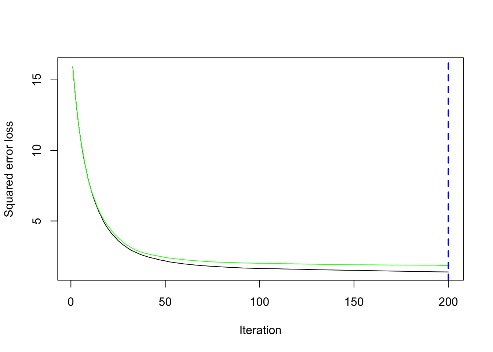

# Conformal Prediction {#conformal-prediction}

---


## Confidence Intervals and Prediction Intervals

- **Confidence Intervals** are intervals constructed to "cover" the parameter of a statistical model.

- For example, consider a regression setting with data $(Y_{i}, x_{i})$ for $i = 1, \ldots, n$ whose distribution is
assumed to be determined by
\begin{equation}
Y_{i} = \beta_{0} + \beta_{1}x_{i} + \varepsilon_{i},
\end{equation}
where $\varepsilon_{i} \sim \textrm{Normal}(0, \sigma^{2})$.

- The usual $95\%$ **confidence interval** for $\beta_{1}$ is:
\begin{equation}
\hat{CI}(Y_{1}, \ldots, Y_{n}) = \Big[ \hat{\beta}_{1} - 1.96 \times \frac{\hat{\sigma}}{\sqrt{\sum_{i}x_{i}^{2} - n\bar{x}^{2}}}, \hat{\beta}_{1} + 1.96 \times \frac{\hat{\sigma}}{\sqrt{\sum_{i}x_{i}^{2} - n\bar{x}^{2}}} \Big]
\end{equation}

- This has $95\%$ **"coverage"** of $\beta_{1}$ in the sense that
\begin{equation}
P\Big\{ \beta_{1} \in \hat{CI}(Y_{1}, \ldots, Y_{n}) \Big\} = 0.95
\end{equation}

- Practically, if you imagine that you had **replicated** outcomes $Y_{1s}, \ldots, Y_{ns}$ for $s = 1, \ldots, S$
generated from the same model, you should expect that your series 
of constructed confidence intervals $\hat{CI}(Y_{1s}, \ldots, Y_{ns})$ should satisfy:
\begin{equation}
\frac{1}{S}\sum_{j=1}^{S} I\Big( \beta_{1} \in \hat{CI}(Y_{1s}, \ldots, Y_{ns}) \Big) \approx 1 - \alpha
\end{equation}

---

- A quick simulation which confirms the coverage property of confidence intervals is:

```r
nsims <- 1000 ## number of simulated data sets
n <- 100
xx <- runif(n)
beta0 <- 0.5
beta1 <- 1

cover <- rep(NA, nsims)
for(s in 1:nsims) {
  Y <- beta0 + beta1*xx + rnorm(n)
  
  mod_fit <- lm(Y ~ xx)
  ## Use method confint to get 95% confidence intervals for regression coefficients:
  lower_ci <- confint(mod_fit)[2,1]
  upper_ci <- confint(mod_fit)[2,2]  
    
  cover[s] <- ifelse(beta1 >= lower_ci & beta1 <= upper_ci, 1, 0)
}
mean(cover) ## Should be close to 0.95
```

```
## [1] 0.95
```

---

* **Prediction intervals** for regression are a bit different than confidence intervals.

* For prediction intervals, you usually imagine a **"future observation"** $Y_{n+1}$ that come from 
the model
\begin{equation}
Y_{n+1} = \beta_{0} + \beta_{1}x_{n+1} + \varepsilon_{n+1},
\end{equation}


* A $100 \times (1 - \alpha)$ **prediction interval** $\hat{PI}(x_{n+1})$ constructed from data $(Y_{1}, \mathbf{x}_{1}), \ldots, (Y_{n}, \mathbf{x}_{n})$
is supposed to have the following property:
\begin{equation}
P\Big( Y_{n+1} \in \hat{PI}(x_{n+1}) \Big) = 1 - \alpha
\end{equation}

* For the linear regression model with a single covariate, the standard $95\%$ prediction interval has the form
\begin{equation}
\hat{\beta}_{0} + \hat{\beta}_{1}x_{n+1} \pm 1.96 \times \hat{\sigma}\sqrt{1 + (1,x_{n+1})^{T}(\mathbf{X}^{T}\mathbf{X})^{-1}(1, x_{n+1})}
\end{equation}


---

## Conformal Inference Procedure for Prediction Intervals

* The **split-sample conformal inference** procedure works for the setting where you're thinking of
outcomes $Y_{i}$ coming from the following model:
\begin{equation}
Y_{i} = f(\mathbf{x}_{i}) + \varepsilon_{i}
\end{equation}

* You **do not** need to know the form of $f$.

* $f$ can just be the fitted values returned by a black box machine learning procedure.
    - For example, $f(\mathbf{x}_{i})$ could be the fitted values returned by running boosting or random forest.

---

* Let $\mathcal{D}$ denote the **training set**.
    + This contains data of the form $(\mathbf{x}_{i}, Y_{i})$

1. The first step is to **split** this training set further into **non-overlapping** sets:
     + $\mathcal{D}_{1}$ - the indeces of a **"proper"** training set with $n_{1}$ observations.
     + $\mathcal{D}_{2}$ - the indeces of a **"calibration"** set with $n_{2}$ observations.
     
     
2. Using **only data** from $\mathcal{D}_{1}$ apply your machine learning procedure to build
a function $\hat{f}_{\mathcal{D}_{1}}(\mathbf{x}_{i})$ that predicts $Y_{i}$ from $\mathbf{x}_{i}$.

3. For $i \in \mathcal{D}_{2}$, define the calibration set **absolute residuals** $R_{i}$ as
\begin{equation}
R_{i} = | Y_{i} - \hat{f}_{\mathcal{D}_{1}}(\mathbf{x}_{i})|
\end{equation}


4. Compute the $100 \times (1 - \alpha)$ quantile (usually $\alpha = 0.05$) of these calibration residuals
\begin{equation}
\hat{q}_{\mathcal{D}_{2}, \alpha} = \textrm{$1 - \alpha$ quantile from residuals} R_{i} \textrm{ such that } i \in \mathcal{D}_{2}.
\end{equation}

5. Then, use the quantile $\hat{q}_{\mathcal{D}_{2}}$ to form the conformal $(1 - \alpha)$ prediction set
\begin{equation}
\hat{C}_{n}( \mathbf{x} ) = \Big[\hat{f}_{\mathcal{D}_{1}}(\mathbf{x}) - \hat{q}_{\mathcal{D}_{2}, \alpha},\hat{f}_{\mathcal{D}_{1}}(\mathbf{x}) + \hat{q}_{\mathcal{D}_{2}, \alpha}\Big]
\end{equation}

---

* Applying the **above 5 steps** results in **conformal prediction intervals** that satisfies the following property
\begin{equation}
1 - \alpha \leq P\Big( Y_{n+1} \in \hat{C}_{n}(\mathbf{x}_{n+1}) \Big| \textrm{obs. in proper train set}) < 1 - \alpha + \frac{1}{n_{2} + 1}
\end{equation}

* Remarkably, this interval is "**distribution free**".
      - It does not assume that one has correctly specified the model for the outcomes.

* The main assumption are that $(Y_{n+1}, \mathbf{x}_{n+1})$ is independent from $((Y_{1}, \mathbf{x}_{1}), \ldots, (Y_{n+1}, \mathbf{x}_{n}))$
and that the joint distribution of $(Y_{n+1}, \mathbf{x}_{n+1})$ is the same as $(Y_{i}, \mathbf{x}_{i})$.


---

* As an example, let's try to generate a conformal prediction interval for a **linear regression** example:

* First generate the data

```r
n <- 100
xx <- runif(n)
beta0 <- 0.5
beta1 <- 1

Y <- beta0 + beta1*sqrt(xx) + rnorm(n)
```
    - Note that the data are generate from the model $Y_{i} = \beta_{0} + \beta_{1}\sqrt{x_{i}} + \varepsilon_{i}$.
    
    - We will fit the **"misspecified"** model $Y_{i} = \beta_{0} + \beta_{1}x_{i} + \varepsilon_{i}$, but the conformal inference procedure should still work. 
    
    
* Split this data set into a "proper" training set and calibration set

```r
D1 <- sample(1:n, size=50)
D2 <- setdiff(1:n, D1)

proper_dat <- data.frame(Y=Y[D1], xx=xx[D1])
calibration_dat <- data.frame(Y=Y[D2], xx=xx[D2])
```

* Using `D1`, fit a linear regression model

```r
proper_mod <- lm(Y ~ xx, data=proper_dat)
```

* Get absolute residuals on calibration dataset

```r
calibration_fitted <- predict(proper_mod, newdat=calibration_dat)
calibration_resids <- abs(calibration_dat$Y - calibration_fitted)
```

* Get 95th quantile of these residuals

```r
qhat <- quantile(calibration_resids, probs=0.95)
```

* We can now use `qhat` to get prediction intervals for a "new dataset"

```r
## Generate new dataset
n <- 100
xx_new <- runif(n)
beta0 <- 0.5
beta1 <- 1

Y_new <- beta0 + beta1*sqrt(xx) + rnorm(n)
newdataset <- data.frame(Y=Y_new, xx=xx_new)

### Construct prediction intervals as a n x 2 matrix
ConformalInterval <- matrix(NA, nrow=n, ncol=2)
ConformalInterval[,1] <- predict(proper_mod, newdat=newdataset) - qhat
ConformalInterval[,2] <- predict(proper_mod, newdat=newdataset) + qhat

print(head(ConformalInterval))
```

```
##            [,1]     [,2]
## [1,] -0.5975258 2.894972
## [2,] -0.6498182 2.842679
## [3,] -0.4983627 2.994135
## [4,] -0.1504342 3.342063
## [5,] -0.5103764 2.982121
## [6,] -0.3879992 3.104498
```

* Plot fitted values and prediction intervals:


* You can check the **prediction coverage** of these intervals with the following code:

```r
## This shouldn't be that far off 0.95, but there will be 
## considerable variability since this is not a very large dataset
mean(Y_new > ConformalInterval[,1] & Y_new < ConformalInterval[,2])
```

```
## [1] 0.94
```

## Why does this work?

* The main justification for the validity of this procedure comes from 
looking at the **calibration residuals** $R_{i}$, for $i \in \mathcal{D}_{2}$ 
and the **test residual** $R_{n + 1} = | Y_{n+1} - \hat{f}_{\mathcal{D}_{1}}(\mathbf{x}_{n+1})|$.

* Specifically, $R_{n+1}, R_{i}, i \in \mathcal{D}_{2}$ is a collection of **i.i.d random variables**.
    - This is true because $\hat{f}_{\mathcal{D}_{1}}(\mathbf{x})$ was built from the **proper training set** and ...
    
    - The values of $R_{i}$, for $i \in \mathcal{D}_{2}$ only uses outcomes from the **calibration dataset**.
    

* Because of the i.i.d. property the probability that $R_{n+1}$ is **less than the $100(1 - \alpha)$ quantile**
of the residuals is very close to $1 - \alpha$. 

* Because of this:
\begin{eqnarray}
P\Big( Y_{n+1} \in \hat{C}_{n}(\mathbf{x}_{n+1}) \Big| \mathcal{D}_{1} \Big)
&=& P(\hat{f}_{\mathcal{D}_{1}} - \hat{q}_{\mathcal{D}_{2}, \alpha} \leq Y_{n+1} \leq \hat{f}_{\mathcal{D}_{1}} + \hat{q}_{\mathcal{D}_{2}, \alpha} \Big| \mathcal{D}_{1} \Big) \nonumber \\
&=& P(- \hat{q}_{\mathcal{D}_{2}, \alpha} \leq Y_{n+1} - \hat{f}_{\mathcal{D}_{1}} \leq \hat{q}_{\mathcal{D}_{2}, \alpha} \Big| \mathcal{D}_{1} \Big) \nonumber \\
&=& P( R_{n+1} \leq \hat{q}_{\mathcal{D}_{2}, \alpha} \Big| \mathcal{D}_{1} \Big) \nonumber \\
&\approx& 1 - \alpha
\end{eqnarray}
    
    
## An example with Boosting.

* First, generate example data:

```r
n <- 2000
p <- 20

X0 <- matrix(rnorm(n*p), nrow=n, ncol=p)

## Baseline outcomes
beta0 <- c(1, -1, 2, -2, rep(0, 16))
Y0 <- X0%*%beta0 + rnorm(n)


## Outcomes at week x:
Y <- 0.3*Y0 + X0%*%beta0 + rnorm(n)

#########################
### Design matrix, we can use for analysis
X <- cbind(Y0, X0)
```


* Split this data set into a "proper" training set and calibration set

```r
D1 <- sample(1:n, size=1000)
D2 <- setdiff(1:n, D1)

proper_dat <- data.frame(Y=Y[D1], X[D1,])
calibration_dat <- data.frame(Y=Y[D2], X[D2,])
```

* Using `D1`, use boosting to 

```r
library(gbm)
```

```
## Loaded gbm 2.1.9
```

```
## This version of gbm is no longer under development. Consider transitioning to gbm3, https://github.com/gbm-developers/gbm3
```

```r
gbm_mod <- gbm(Y ~ ., data = proper_dat, 
           distribution = "gaussian", n.trees = 200, cv.folds=5)

## Find the best number of trees using cross-validation
best.iter <- gbm.perf(gbm_mod, method = "cv")
```



```r
print(best.iter)
```

```
## [1] 186
```

```r
## Use boosting with best number of trees
gbm_mod_final <- gbm(Y ~ ., data = proper_dat, 
                     distribution = "gaussian", n.trees = best.iter)
```

* Get absolute residuals on calibration dataset

```r
calibration_fitted <- predict(gbm_mod_final, newdat=calibration_dat)
```

```
## Using 186 trees...
```

```r
calibration_resids <- abs(calibration_dat$Y - calibration_fitted)
```

* Get 95th quantile of these residuals

```r
qhat <- quantile(calibration_resids, probs=0.95)
```

* We can now use `qhat` to get prediction intervals for a "new dataset"

```r
X0 <- matrix(rnorm(n*p), nrow=n, ncol=p)

## Baseline outcomes
beta0 <- c(1, -1, 2, -2, rep(0, 16))
Y0 <- X0%*%beta0 + rnorm(n)

## Outcomes at week x:
Y_new <- 0.3*Y0 + X0%*%beta0 + rnorm(n)
X_new <- cbind(Y0, X0)

##
newdataset <- data.frame(Y=Y_new, X_new)

### Construct prediction intervals as a n x 2 matrix
ConformalInterval <- matrix(NA, nrow=n, ncol=2)
ConformalInterval[,1] <- predict(gbm_mod_final, newdat=newdataset) - qhat
```

```
## Using 186 trees...
```

```r
ConformalInterval[,2] <- predict(gbm_mod_final, newdat=newdataset) + qhat
```

```
## Using 186 trees...
```


* Check the **prediction coverage**:

```r
## This shouldn't be that far off 0.95, but there will be 
## considerable variability since this is not a very large dataset
mean(Y_new > ConformalInterval[,1] & Y_new < ConformalInterval[,2])
```

```
## [1] 0.958
```


---
